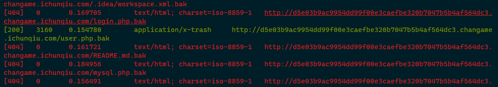
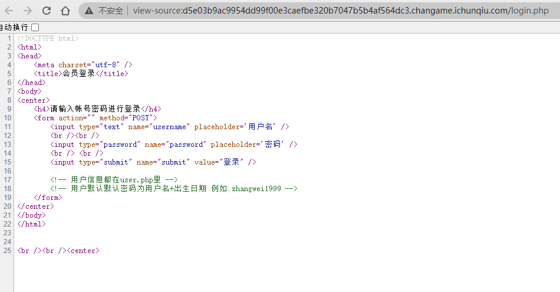
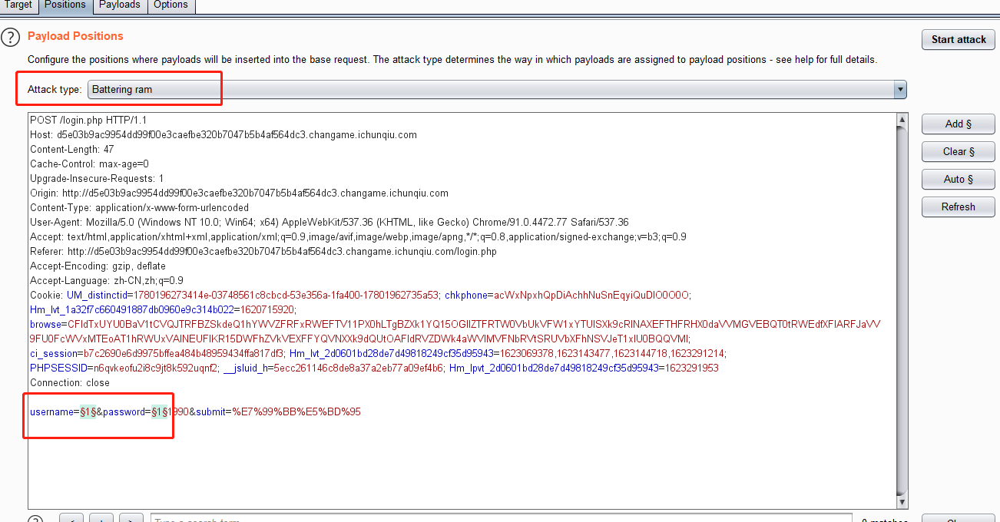
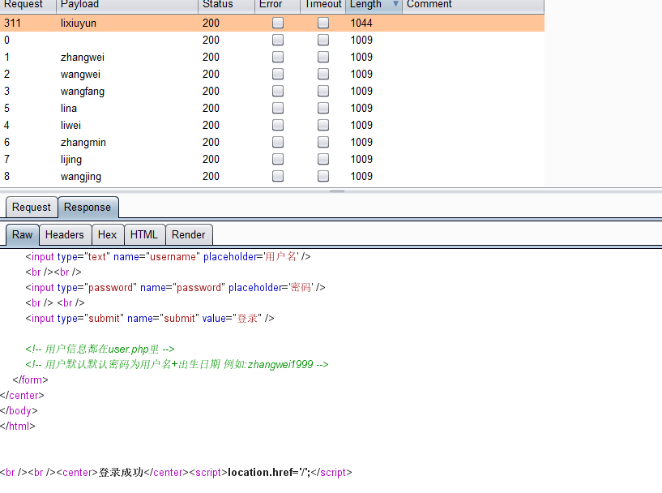
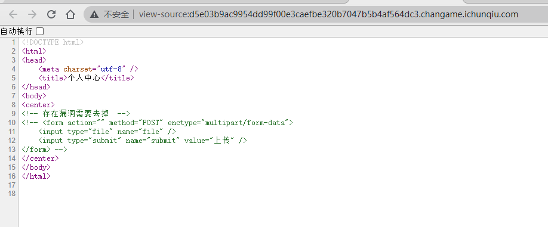
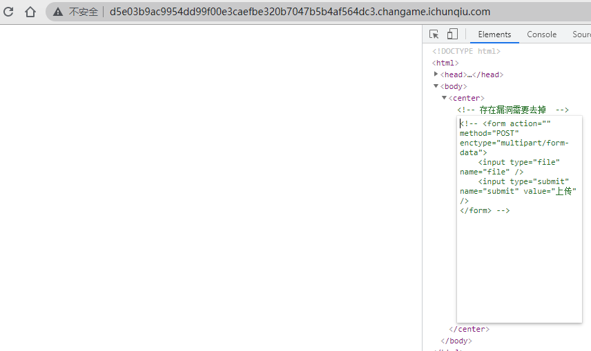
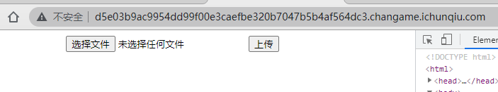
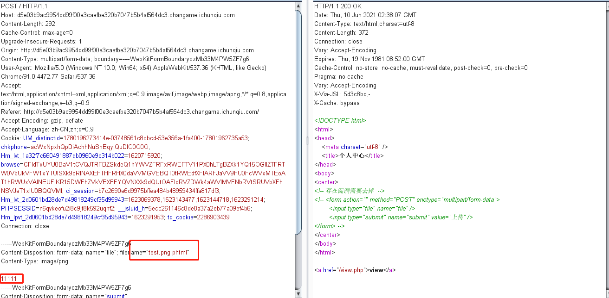
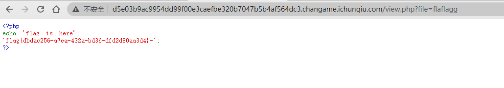

# 123

## 题目描述
---
```
12341234，然后就解开了
```

## 题目来源
---
“百度杯”CTF比赛 九月场

## 主要知识点
---


## 题目分值
---
50

## 部署方式
---


## 解题思路
---

寻找敏感文件时找到了`user.php`的备份文件，下载



文件内容是如下的用户名信息

```php
zhangwei
wangwei
wangfang
liwei
lina
zhangmin
lijing
wangjing
liuwei
wangxiuying
zhangli
lixiuying
wangli
zhangjing
zhangxiuying
liqiang
wangmin
limin
wanglei
liuyang
wangyan
wangyong
lijun
zhangyong
lijie
zhangjie
zhanglei
wangqiang
lijuan
wangjun
zhangyan
zhangtao
wangtao
liyan
wangchao
liming
liyong
wangjuan
liujie
liumin
lixia
lili
zhangjun
wangjie
zhangqiang
wangxiulan
wanggang
wangping
liufang
zhangyan
liuyan
liujun
liping
wanghui
wangyan
chenjing
liuyong
liling
liguiying
wangdan
ligang
lidan
wangbin
lipeng
zhangping
zhangli
zhanghui
zhangyu
liujuan
libin
wanghao
chenjie
wangkai
chenli
chenmin
wangxiuzhen
liyulan
liuxiuying
wangping
wangping
zhangbo
liuguiying
yangxiuying
zhangying
yangli
zhangjian
lijun4
lili
wangbo
zhanghong
liudan
lixin
wangli
yangjing
liuchao
zhangjuan
yangfan
liuyan
liuying
lixue
lixiuzhen
zhangxin
wangjian
liuyulan
liuhui
liubo
zhanghao
zhangming
chenyan
zhangxia
chenyan
yangjie
wangshuai
lihui
wangxue
yangjun
zhangxu
liugang
wanghua
yangmin
wangning
lining
wangjun
liuguilan
liubin
zhangping
wangting
chentao
wangyumei
wangna
zhangbin
chenlong
lilin
wangyuzhen
zhangfengying
wanghong
lifengying
yangyang
liting
zhangjun
wanglin
chenying
chenjun
liuxia
chenhao
zhangkai
wangjing
chenfang
zhangting
yangtao
yangbo
chenhong
liuhuan
wangyuying
chenjuan
chengang
wanghui
zhangying
zhanglin
zhangna
zhangyumei
wangfengying
zhangyuying
lihongmei
liujia
liulei
zhangqian
liupeng
wangxu
zhangxue
liyang
zhangxiuzhen
wangmei
wangjianhua
liyumei
wangying
liuping
yangmei
lifei
wangliang
lilei
lijianhua
wangyu
chenling
zhangjianhua
liuxin
wangqian
zhangshuai
lijian
chenlin
liyang
chenqiang
zhaojing
wangcheng
zhangyuzhen
chenchao
chenliang
liuna
wangqin
zhanglanying
zhanghui
liuchang
liqian
yangyan
zhangliang
zhangjian
liyun
zhangqin
wanglanying
liyuzhen
liuping
chenguiying
liuying
yangchao
zhangmei
chenping
wangjian
liuhong
zhaowei
zhangyun
zhangning
yanglin
zhangjie
gaofeng
wangjianguo
yangyang
chenhua
yanghua
wangjianjun
yangliu
liuyang
wangshuzhen
yangfang
lichunmei
liujun
wanghaiyan
liuling
chenchen
wanghuan
lidongmei
zhanglong
chenbo
chenlei
wangyun
wangfeng
wangxiurong
wangrui
liqin
liguizhen
chenpeng
wangying
liufei
wangxiuyun
chenming
wangguirong
lihao
wangzhiqiang
zhangdan
lifeng
zhanghongmei
liufengying
liyuying
wangxiumei
lijia
wanglijuan
chenhui
zhangtingting
zhangfang
wangtingting
wangyuhua
zhangjianguo
lilanying
wangguizhen
lixiumei
chenyulan
chenxia
liukai
zhangyuhua
liuyumei
liuhua
libing
zhanglei
wangdong
lijianjun
liuyuzhen
wanglin
lijianguo
liying
yangwei
liguirong
wanglong
liuting
chenxiulan
zhangjianjun
lixiurong
liuming
zhoumin
zhangxiumei
lixuemei
huangwei
zhanghaiyan
wangshulan
lizhiqiang
liuli
likai
zhangyu
zhangfeng
liuxiulan
zhangzhiqiang
lilong
lixiuyun
lixiufang
lishuai
lixin
liuyun
zhanglili
lijie
zhangxiuyun
wangshuying
wangchunmei
wangxin
wangguizhi
zhaoli
zhangxiuhua
zhanglin
huangmin
yangjuan
wangjinfeng
zhoujie
wanglei
chenjianhua
liumei
yangguiying
lishuying
chenyuying
yangxiuzhen
sunxiuying
zhaojun
zhaoyong
liubing
yangbin
liwen
chenlin
chenping
sunwei
zhangli
chenjun
zhangnan
liuguizhen
liuyu
liujianjun
zhangshuying
lihongxia
zhaoxiuying
libo
wangli
zhangrong
```

在`login.php`页面中还发现注释`用户默认默认密码为用户名+出生日期 例如:zhangwei1999`



所以可以使用爆破尝试登录，不想写代码了，使用笨一点的方法，遍历年份



`lixiuyun`登录成功



登录后存在下面的页面，使用chrome直接将html中的注释去掉





得到页面



上传时，有各种过滤，这样过了过滤，给出了新页面`view.php`



`view.php`让使用`file`参数进行文件读取，且过滤了`flag`字符串，这里`flag`值过滤了一次，使用`flaflagg`即可绕过，这题脑洞有点呆，访问其他页面什么东西都不给



flag{dbdac256-a7ea-432a-bd36-dfd2d80aa3d4}-


## 参考
---
