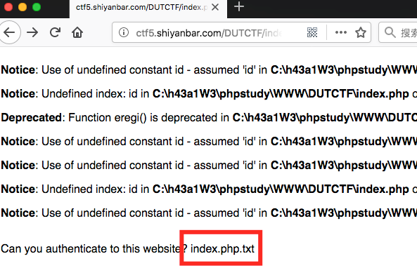
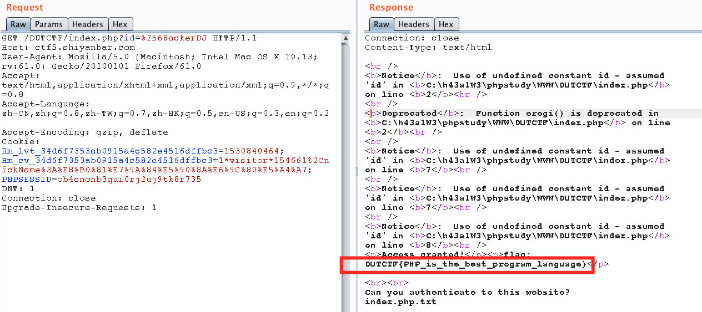

# PHP大法

## 题目链接
http://shiyanbar.com/ctf/54

## 题目描述

```
注意备份文件

```



## 解题思路

打开题目看到备份文件`index.php.txt`。

```php
<?php
if(eregi("hackerDJ",$_GET[id])) {
  echo("<p>not allowed!</p>");
  exit();
}

$_GET[id] = urldecode($_GET[id]);
if($_GET[id] == "hackerDJ")
{
  echo "<p>Access granted!</p>";
  echo "<p>flag: *****************} </p>";
}
?>

<br><br>
Can you authenticate to this website?
```

从源代码可以看到，当输入是`hackerDJ`时，题目会返回`not allowed`，当输入经过url解码时是`hackerDJ`时，返回flag。这里使用两次url编码，就可以绕过第一个条件，在第二个条件经过ruldecode后，两次编码的输入id转化为正常的ascii。payload `%2568ackerDJ`。



DUTCTF{PHP_is_the_best_program_language}
