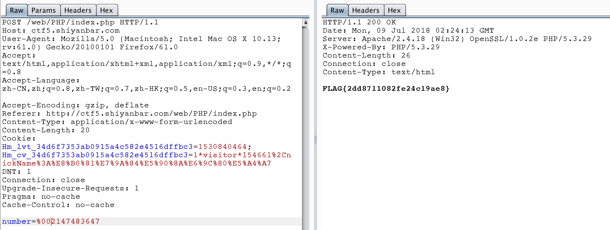
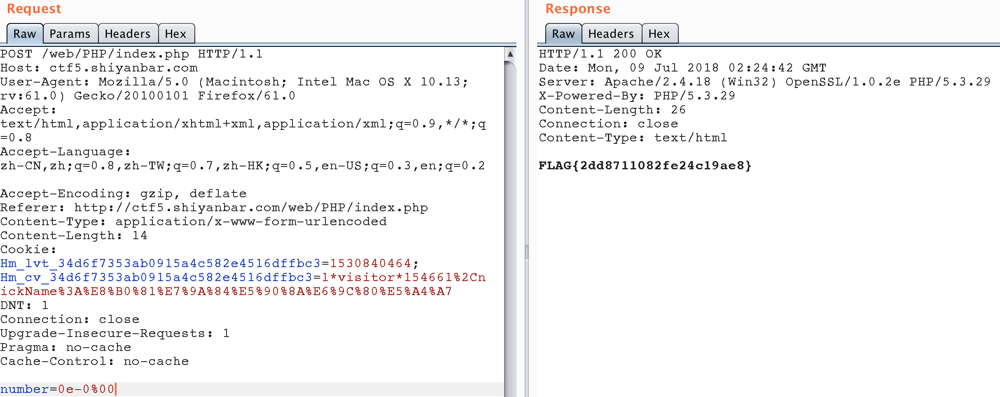

经过审计我们可以发现如果我们要拿到flag，POST的number需要满足以下条件：

1. 不为空，且不能是一个数值型数字，包括小数。(由is_numeric函数判断) 。
2. 不能是一个回文数。（is_palindrome_number判断）。
3. 该数的反转的整数值应该和它本身的整数值相等。

下面给出两种解法：

## 利用intval函数溢出绕过

Intval函数获取变量整数值。

Intval最大的值取决于操作系统。 32 位系统最大带符号的 integer 范围是 -2147483648 到 2147483647。举例，在这样的系统上， intval(‘1000000000000’) 会返回 2147483647。64 位系统上，最大带符号的 integer 值是 9223372036854775807。

通过上面我们知道服务器的操作系统是32位的，所以我们构造2147483647就可以同时满足2，3条件。通过把空字符可以绕过is_numeric的判断（如%00,%20）,所以我们构造以下poc，number=2147483647%00 和number=2147483647%20都可。

对于第一个条件，我们需要构造是让我们的poc被函数判断为非数值，但又不影响它值的构造，理所当然想到空格字符和空字符。

而经过测试我发现is_numeric函数对于空字符%00，无论是%00放在前后都可以判断为非数值，而%20空格字符只能放在数值后。所以，查看函数发现该函数对对于第一个空格字符会跳过空格字符判断，接着后面的判断！！ 

## 用科学计数法构造0=0

因为要求不能为回文数，但又要满足intval($req[“number”])=intval(strrev($req[“number”]))，所以我们采用科学计数法构造poc为number=0e-0%00，这样的话我们就可以绕过。

