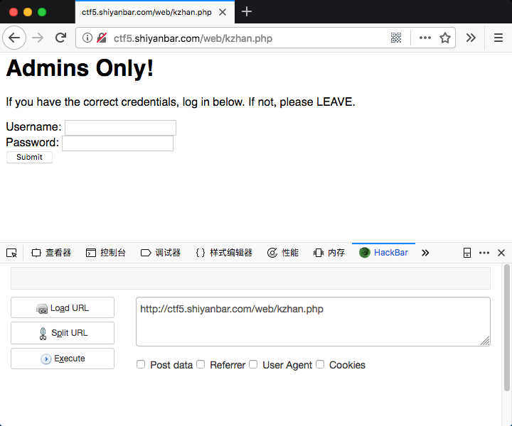
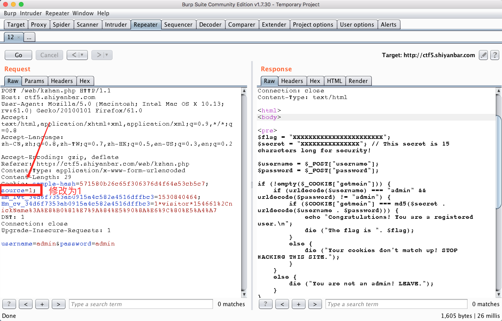
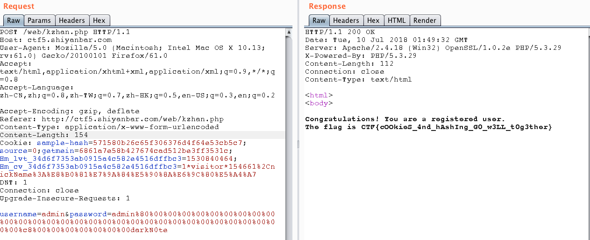

# 让我进去

## 题目链接

http://shiyanbar.com/ctf/1848



## 题目描述
```
相信你一定能拿到想要的
Hint:你可能希望知道服务器端发生了什么。。

格式：CTF{}
```

## 解题思路

用burpsuite抓包后，发现cookie里有一个字段`source=0`，修改为1后获取源码。



源码内容

```php
<html>
<body>

<pre>
$flag = "XXXXXXXXXXXXXXXXXXXXXXX";
$secret = "XXXXXXXXXXXXXXX"; // This secret is 15 characters long for security!

$username = $_POST["username"];
$password = $_POST["password"];

if (!empty($_COOKIE["getmein"])) {
    if (urldecode($username) === "admin" && urldecode($password) != "admin") {
        if ($COOKIE["getmein"] === md5($secret . urldecode($username . $password))) {
            echo "Congratulations! You are a registered user.\n";
            die ("The flag is ". $flag);
        }
        else {
            die ("Your cookies don't match up! STOP HACKING THIS SITE.");
        }
    }
    else {
        die ("You are not an admin! LEAVE.");
    }
}

setcookie("sample-hash", md5($secret . urldecode("admin" . "admin")), time() + (60 * 60 * 24 * 7));

if (empty($_COOKIE["source"])) {
    setcookie("source", 0, time() + (60 * 60 * 24 * 7));
}
else {
    if ($_COOKIE["source"] != 0) {
        echo ""; // This source code is outputted here
    }
}
    </pre>
<h1>Admins Only!</h1>
<p>If you have the correct credentials, log in below. If not, please LEAVE.</p>
<form method="POST">
    Username: <input type="text" name="username"> <br>
    Password: <input type="password" name="password"> <br>
    <button type="submit">Submit</button>
</form>

</body>
</html>
```

从源码分析，可以看到flag的获取要求是：传进一个cookie `getmein` ,使其等于 `secret+urldecode($username . $password)` MD5 加密后的结果且要求username为admin，password不能为admin。所以这里利用了hash长度扩展攻击，具体原理请参考[文章0](https://blog.csdn.net/syh_486_007/article/details/51228628)、[文章1](http://www.freebuf.com/articles/web/69264.html)、[文章2](http://www.freebuf.com/articles/web/31756.html)、[文章3](https://blog.skullsecurity.org/2012/everything-you-need-to-know-about-hash-length-extension-attacks)，推荐查看文章0和3。

这里我给出一个最简单的方式，使用工具`hashpumpy`进行hash值进行构造，给出代码

```python
#!/usr/bin/env python
#-*- coding: utf-8 -*-
"""
@Author : darkN0te
@Create date : 2018-07-10
@description : 哈希长度攻击
@Update date :   
"""  

import hashpumpy

# def hashpump(hexdigest, original_data, data_to_add, key_length)
aaa = hashpumpy.hashpump("571580b26c65f306376d4f64e53cb5c7","admin","darkN0te",20)
print aaa
```



