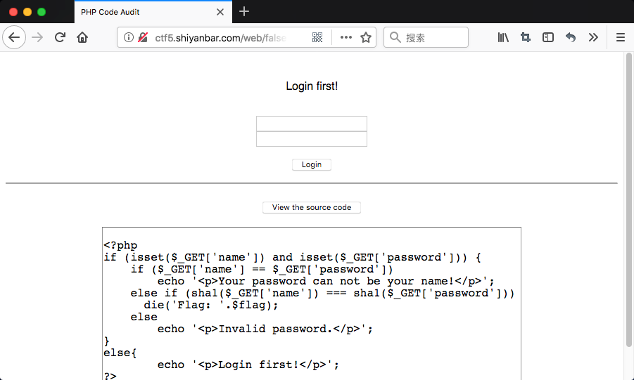
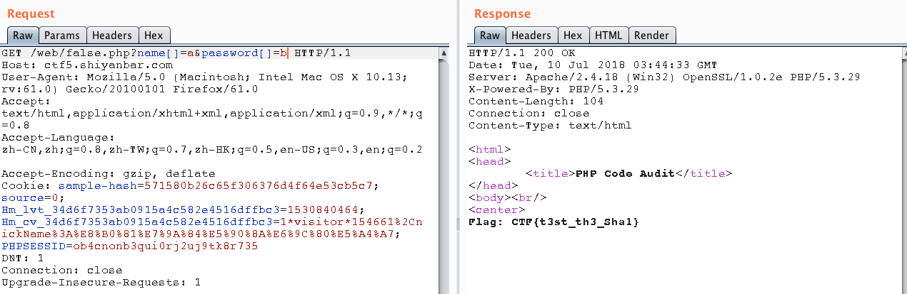

# FALSE

## 题目链接

http://shiyanbar.com/ctf/1787



## 题目描述

```
PHP代码审计
hint：sha1函数你有认真了解过吗？听说也有人用md5碰撞o(╯□╰)o
格式：CTF{}
```

## 解题思路

点击题目页面`View the source code`，看到源码。

```php
<?php
if (isset($_GET['name']) and isset($_GET['password'])) {
    if ($_GET['name'] == $_GET['password'])
        echo '<p>Your password can not be your name!</p>';
    else if (sha1($_GET['name']) === sha1($_GET['password']))
      die('Flag: '.$flag);
    else
        echo '<p>Invalid password.</p>';
}
else{
	echo '<p>Login first!</p>';
?>
```

本题目给出了两个条件

1. 用户名密码不能相等
2. 用户名密码的sha1()要`===`

`===`只有在相同类型下,才会比较其值。sha1()函数默认的传入参数类型是字符串型，可以传入其他类型，使其返回值为false。如数组类型。

所以给出payload为，`name[]=a&password[]=b`。



Flag: CTF{t3st_th3_Sha1}