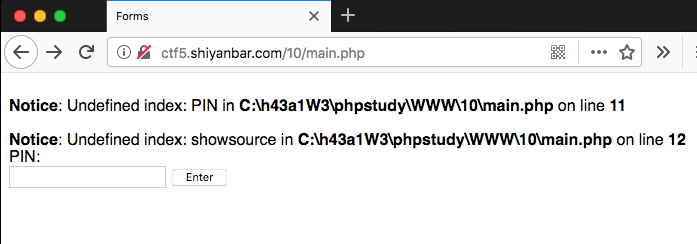
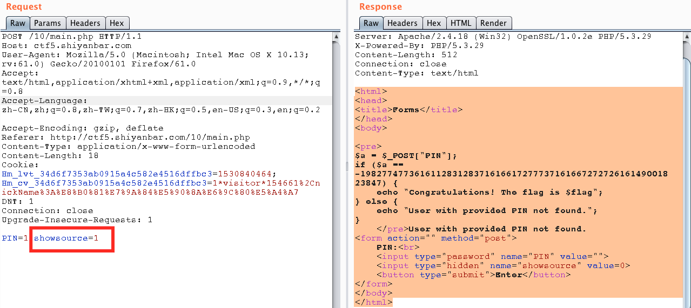

# Forms

## 题目链接
http://shiyanbar.com/ctf/1819

## 题目描述
```
似乎有人觉得PIN码是不可破解的，让我们证明他是错的。
格式：ctf{}
```


## 主要知识点

隐藏字段

## 题目分值

50

## 部署方式

单独放在php服务器中即可

## 解题思路

进入题目后，点击提交，使用bp拿到包后，发现有一个`showsource`字段，修改为1然后看到源码，直接把`-19827747736161128312837161661727773716166727272616149001823847`填入pin提交拿到Flag。



```html
<html>
<head>
<title>Forms</title>
</head>
<body>

<pre>
$a = $_POST["PIN"];
if ($a == -19827747736161128312837161661727773716166727272616149001823847) {
    echo "Congratulations! The flag is $flag";
} else {
    echo "User with provided PIN not found."; 
}
    </pre>User with provided PIN not found.
<form action="" method="post">
    PIN:<br>
    <input type="password" name="PIN" value="">
    <input type="hidden" name="showsource" value=0>
    <button type="submit">Enter</button>
</form>
</body>
</html>
```
