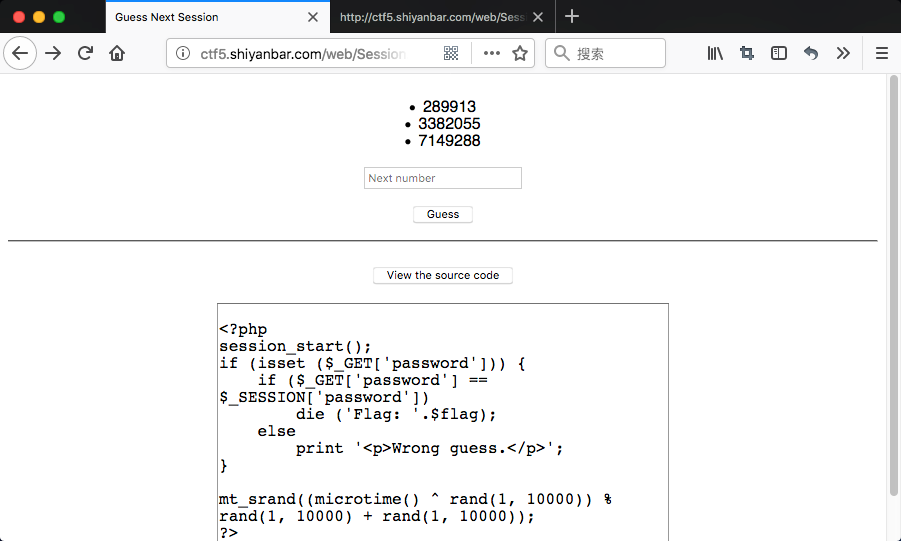
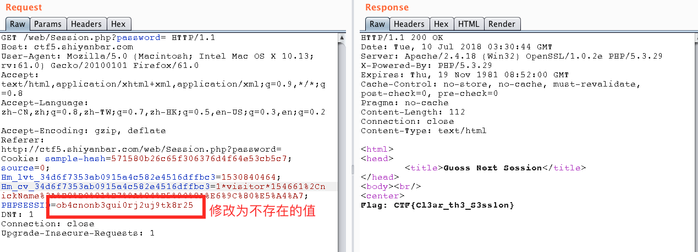

# Guess Next Session

# 题目链接

http://shiyanbar.com/ctf/1788



# 题目描述

```
写个算法没准就算出来了，23333
hint：你确定你有认真看判断条件？
格式：CTF{}
```

# 解题思路# 

点击题目页面`View the source code`，看到源码。

```php
<?php
session_start(); 
if (isset ($_GET['password'])) {
    if ($_GET['password'] == $_SESSION['password'])
        die ('Flag: '.$flag);
    else
        print '<p>Wrong guess.</p>';
}

mt_srand((microtime() ^ rand(1, 10000)) % rand(1, 10000) + rand(1, 10000));
?>

```
看一下按条件语句，需要session中的password值和用户传的一样，就可以打印flag，所以只需要删掉session值，或者修改session值为一个不存在的session，服务器获取不到session，则password为空，用户传一个空的password的进去即可拿到flag。



Flag: CTF{Cl3ar_th3_S3ss1on}