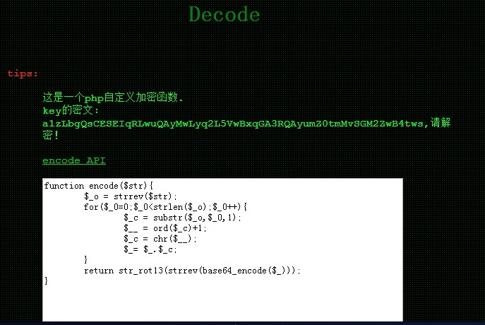

# NSCTF web200

## 题目链接
http://shiyanbar.com/ctf/1760

## 题目描述

```
密文：a1zLbgQsCESEIqRLwuQAyMwLyq2L5VwBxqGA3RQAyumZ0tmMvSGM2ZwB4tws
格式：flag:{}
```



## 解题思路

```
a1zLbgQsCESEIqRLwuQAyMwLyq2L5VwBxqGA3RQAyumZ0tmMvSGM2ZwB4tws
=》rot13解码：
n1mYotDfPRFRVdEYjhDNlZjYld2Y5IjOkdTN3EDNlhzM0gzZiFTZ2MjO4gjf
=>reverse:
fjg4OjM2ZTFiZzg0MzhlNDE3NTdkOjI5Y2dlYjZlNDhjYEdVRFRPfDtoYm1n
=》base64解码：
~88:36e1bg8438e41757d:29cgeb6e48c`GUDTO|;hbmg
```

```php
<?php
$_o="~88:36e1bg8438e41757d:29cgeb6e48c`GUDTO|;hbmg";
$_="";
for($_0=0;$_0<strlen($_o);$_0++){
    $_c=substr($_o,$_0,1);
    $__=ord($_c)-1;
    $_c=chr($__);
    $_=$_.$_c;
}
$_=strrev($_);
echo $_;
?>
```

flag:{NSCTF_b73d5adfb819c64603d7237fa0d52977}