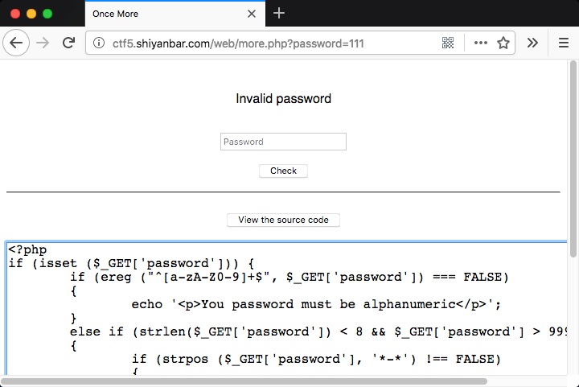
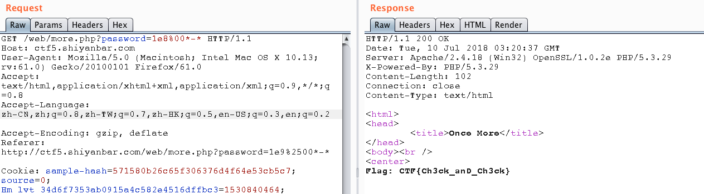

# Once More

## 题目链接#

http://shiyanbar.com/ctf/1805



## 题目描述#

```
啊拉？又是php审计。已经想吐了。
hint：ereg()函数有漏洞哩；从小老师就说要用科学的方法来算数。
格式：CTF{
```

## 解题思路

点击题目页面`View the source code`，看到源码。

```php
<?php
if (isset ($_GET['password'])) {
	if (ereg ("^[a-zA-Z0-9]+$", $_GET['password']) === FALSE)
	{
		echo '<p>You password must be alphanumeric</p>';
	}
	else if (strlen($_GET['password']) < 8 && $_GET['password'] > 9999999)
	{
		if (strpos ($_GET['password'], '*-*') !== FALSE)
		{
			die('Flag: ' . $flag);
		}
		else
		{
			echo('<p>*-* have not been found</p>');
		}
	}
	else
	{
		echo '<p>Invalid password</p>';
	}
}
?>
```

本题目一共有三个条件限制，看如何绕过。

1. ereg ("^[a-zA-Z0-9]+$", $_GET['password']) === FALSE

===类型恒等于

== 和 != 比较若类型不同，先偿试转换类型，再作值比较，最后返回值比较结果 。
而

=== 和 !== 只有在相同类型下,才会比较其值。

ereg()函数用指定的模式搜索一个字符串中指定的字符串,如果匹配成功返回true,否则,则返回false

这个判断限制了输入只能为只能输入字符和数字，但是该函数存在`00`截断漏洞。
 
2. strlen($_GET['password']) < 8 && $_GET['password'] > 9999999，限制字符串长度小于8，值大于9999999。

3. strpos ($_GET['password'], '*-*') !== FALSE，限制输入的值必须包含`*-*`。

所以给出paylload，`1e8%00*-*`，`1e9%00*-*`。



Flag: CTF{Ch3ck_anD_Ch3ck}