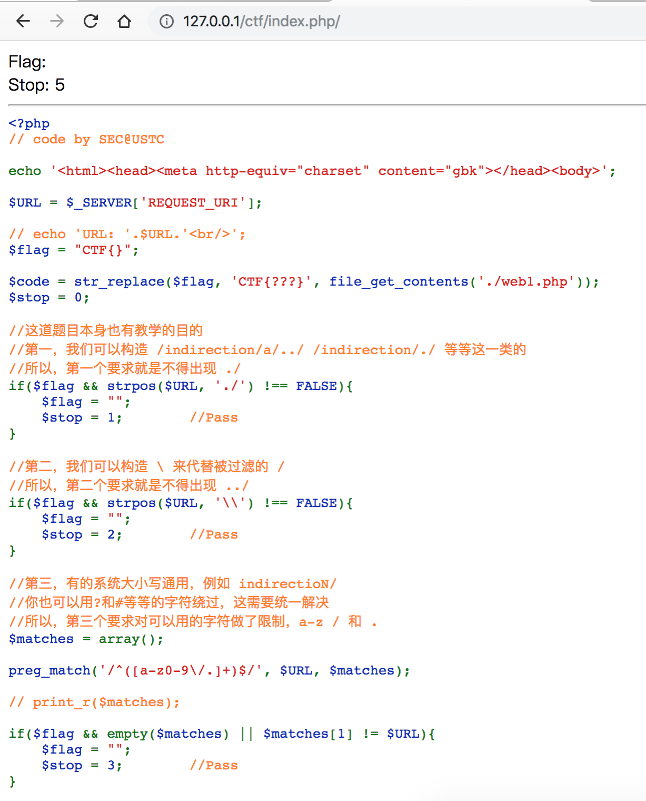
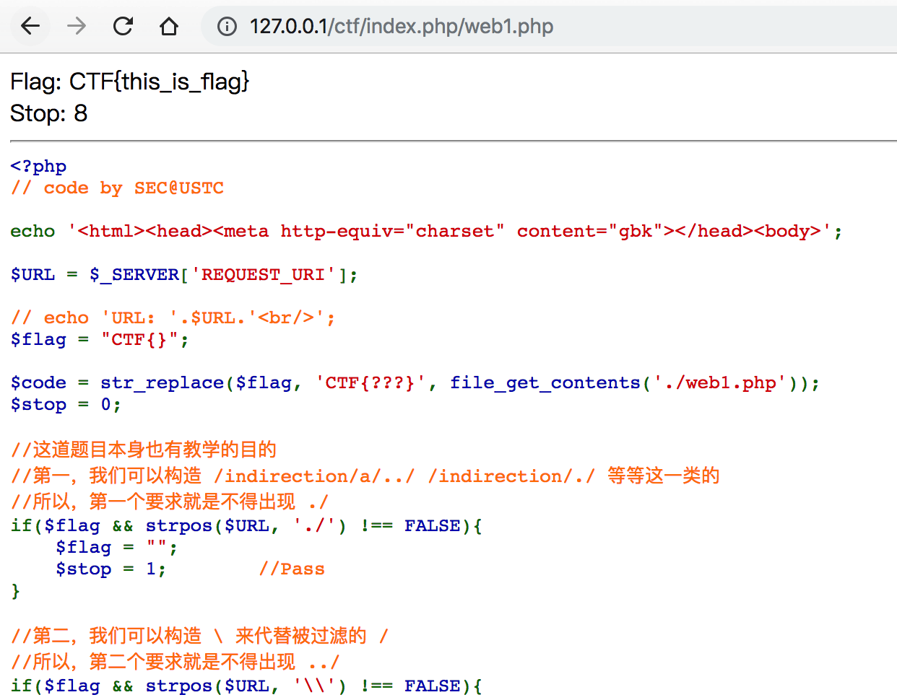

# 拐弯抹角

## 题目链接
http://ctf5.shiyanbar.com/10/indirection/index.php

## 题目描述
```

```


## 主要知识点

URL重写

## 题目分值

50

## 部署方式

单独放在php服务器中即可

## 解题思路

不能用 ./ // ../而且还不能在index.php后面加.而且结尾必须是index.php而且不能用正常的访问路径。。有同学发现，其实index.php后面加“/乱七八糟，没有也成/index.php”就可以啦。原因是服务器解析到.php后就把后面的东西当作参数处理了

`http://127.0.0.1/ctf/index.php/web1.php`


