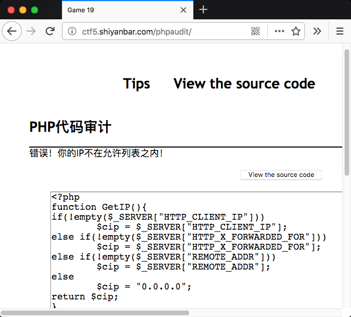
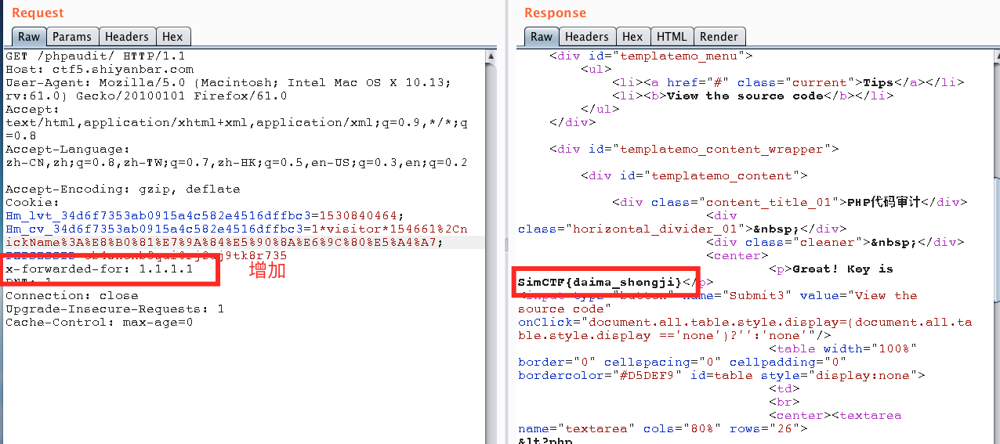

# 貌似有点难

## 题目链接
http://shiyanbar.com/ctf/32

## 题目描述
```
不多说，去看题目吧。
```


## 主要知识点

更改IP，判定来源

## 题目分值

50

## 部署方式

单独放在php服务器中即可

## 解题思路
进入题目后，直接点开`View the source code`查看源代码。

```php
<?php
function GetIP(){
if(!empty($_SERVER["HTTP_CLIENT_IP"]))
	$cip = $_SERVER["HTTP_CLIENT_IP"];
else if(!empty($_SERVER["HTTP_X_FORWARDED_FOR"]))
	$cip = $_SERVER["HTTP_X_FORWARDED_FOR"];
else if(!empty($_SERVER["REMOTE_ADDR"]))
	$cip = $_SERVER["REMOTE_ADDR"];
else
	$cip = "0.0.0.0";
return $cip;
}

$GetIPs = GetIP();
if ($GetIPs=="1.1.1.1"){
echo "Great! Key is *********";
}
else{
echo "错误！你的IP不在访问列表之内！";
}
?>
```

看源码，发现直接修改ip就可以了，抓包重放。

SimCTF{daima_shengji}