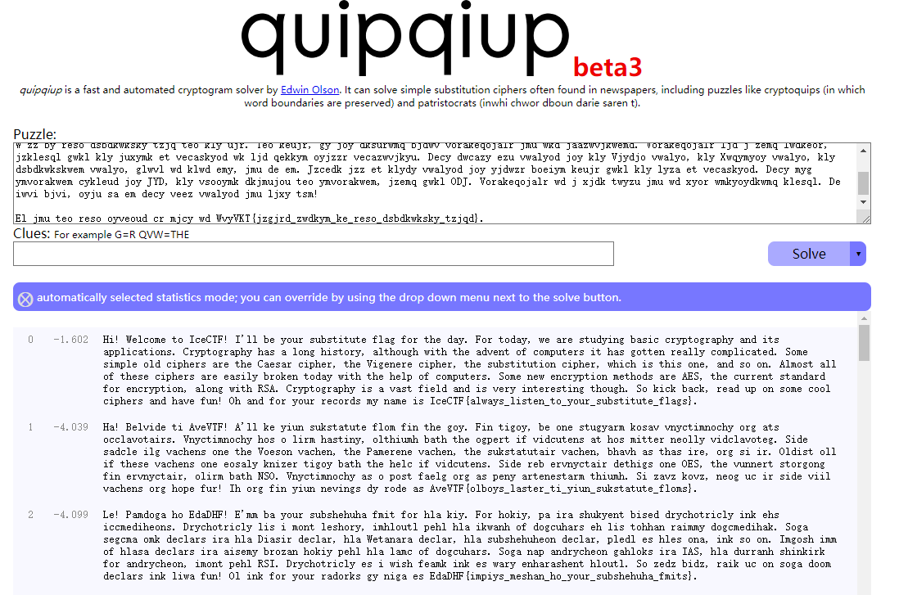

# Substituted

## 题目描述
---
```
We got a substitute flag, I hear they are pretty lax on the rules...[flag.txt]
```

## 题目来源
---
IceCTF

## 主要知识点
---
词频分析

## 题目分值
---
20

## 部署方式
---


## 解题思路
---

密文内容

```
Lw!

Gyzvecy ke WvyVKT!

W'zz by reso dsbdkwksky tzjq teo kly ujr. Teo keujr, gy joy dksurwmq bjdwv vorakeqojalr jmu wkd jaazwvjkwemd. Vorakeqojalr ljd j zemq lwdkeor, jzklesql gwkl kly juxymk et vecaskyod wk ljd qekkym oyjzzr vecazwvjkyu. Decy dwcazy ezu vwalyod joy kly Vjydjo vwalyo, kly Xwqymyoy vwalyo, kly dsbdkwkskwem vwalyo, glwvl wd klwd emy, jmu de em. Jzcedk jzz et klydy vwalyod joy yjdwzr boeiym keujr gwkl kly lyza et vecaskyod. Decy myg ymvorakwem cykleud joy JYD, kly vsooymk dkjmujou teo ymvorakwem, jzemq gwkl ODJ. Vorakeqojalr wd j xjdk twyzu jmu wd xyor wmkyoydkwmq klesql. De iwvi bjvi, oyju sa em decy veez vwalyod jmu ljxy tsm!

El jmu teo reso oyveoud cr mjcy wd WvyVKT{jzgjrd_zwdkym_ke_reso_dsbdkwksky_tzjqd}.
```

WvyVKT  57 76 79 56 4b 54
IceCTF  49 63 65 43 54 46
        14 19 20 19 17 14

没找到规律

是一道字符频率统计题目，在http://quipqiup.com/可以直接进行分析



IceCTF{always_listen_to_your_substitute_flags}

## 参考
---
http://quipqiup.com/