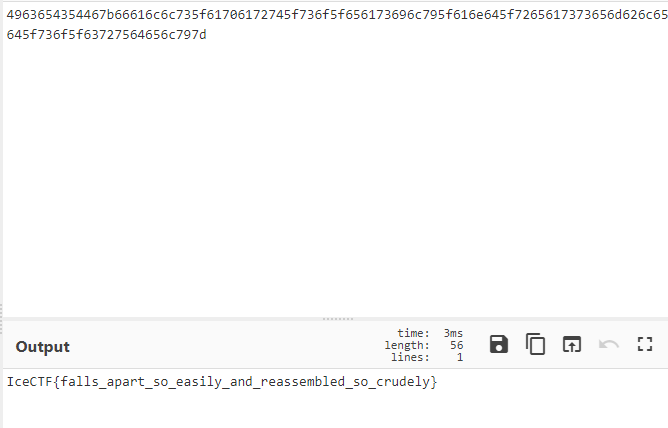

# RSA?

## 题目描述
---
```
John was messing with RSA again... he encrypted our flag! I have a strong feeling he had no idea what he was doing however, can you get the flag for us?[flag.txt]
```

## 题目来源
---
IceCTF

## 主要知识点
---
RSA

## 题目分值
---
40

## 部署方式
---


## 解题思路
---

```
N=0x180be86dc898a3c3a710e52b31de460f8f350610bf63e6b2203c08fddad44601d96eb454a34dab7684589bc32b19eb27cffff8c07179e349ddb62898ae896f8c681796052ae1598bd41f35491175c9b60ae2260d0d4ebac05b4b6f2677a7609c2fe6194fe7b63841cec632e3a2f55d0cb09df08eacea34394ad473577dea5131552b0b30efac31c59087bfe603d2b13bed7d14967bfd489157aa01b14b4e1bd08d9b92ec0c319aeb8fedd535c56770aac95247d116d59cae2f99c3b51f43093fd39c10f93830c1ece75ee37e5fcdc5b174052eccadcadeda2f1b3a4a87184041d5c1a6a0b2eeaa3c3a1227bc27e130e67ac397b375ffe7c873e9b1c649812edcd

e=0x1

c=0x4963654354467b66616c6c735f61706172745f736f5f656173696c795f616e645f7265617373656d626c65645f736f5f63727564656c797d
```

题目给出的e为1，根据公式密文`c = (m ^ e) % n`，这里 e 为1

所以 `c = m % n`

所以 `m = c + k*n`

把`k=0`是， m = c ，我们将题目给出的`c`直接转为字符串



IceCTF{falls_apart_so_easily_and_reassembled_so_crudely}

## 参考
---
