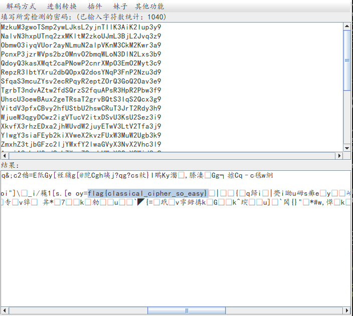

# classical

## 题目描述
---
```
Download
```

## 题目来源
---
第三届上海市大学生网络安全大赛

## 主要知识点
---


## 题目分值
---
50

## 部署方式
---


## 解题思路
---

题目给出的密文

```
Ld hcrakewcfaxr, f hofjjlhfo hlaxuc lj f krau ev hlaxuc kxfk zfj tjui xljkeclhfoor gtk dez xfj vfooud, vec kxu pejk afck, ldke iljtju. Ld hedkcfjk ke peiucd hcrakewcfaxlh foweclkxpj, pejk hofjjlhfo hlaxucj hfd gu acfhklhfoor hepatkui fdi jeoyui gr xfdi. Xezuyuc, OrmkO3vydJCoe2qyNLmcN2qlpJXnM3SxM2Xke3q9 kxur fcu foje tjtfoor yucr jlpaou ke gcufn zlkx peiucd kuhxdeoewr. Kxu kucp ldhotiuj kxu jlpaou jrjkupj tjui jldhu Wcuun fdi Cepfd klpuj, kxu uofgecfku Cudfljjfdhu hlaxucj, Zecoi Zfc LL hcrakewcfaxr jthx fj kxu Udlwpf pfhxldu fdi guredi. F btlhn gcezd veq mtpa eyuc kxu ofsr iew.
```

在站点http://quipqiup.com/解析后得到明文

```
In cryptography, a classical cipher is a type of cipher that was used historically but now has fallen, for the most part, into disuse. In contrast to modern cryptographic algorithms, most classical ciphers can be practically computed and solved by hand. However, LyjtL3fvnSRlo2xvKIjrK2ximSHkJ3ZhJ2Hto3x9 they are also usually very simple to break with modern technology. The term includes the simple systems used since Greek and Roman times, the elaborate Renaissance ciphers, World War II cryptography such as the Enigma machine and beyond. A quick brown fox jump over the lazy dog.
```

在明文中发现一串`LyjtL3fvnSRlo2xvKIjrK2ximSHkJ3ZhJ2Hto3x9`这样的字符

弄了很长时间不知道是什么密码，最后发现需要两步，首先进行一次凯撒解密，然后再将凯撒解密的内容进行base64解码



flag{classical_cipher_so_easy}

## 参考
---
