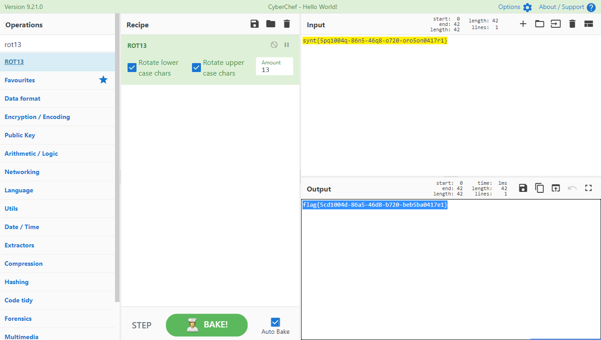

# 回旋13踢

## 题目描述
---
```
看我回旋13踢
synt{5pq1004q-86n5-46q8-o720-oro5on0417r1}
```

## 题目来源
---
2015广州强网杯

## 主要知识点
---
rot13

## 题目分值
---
50

## 部署方式
---


## 解题思路
---



flag{5cd1004d-86a5-46d8-b720-beb5ba0417e1}

## 参考
---
