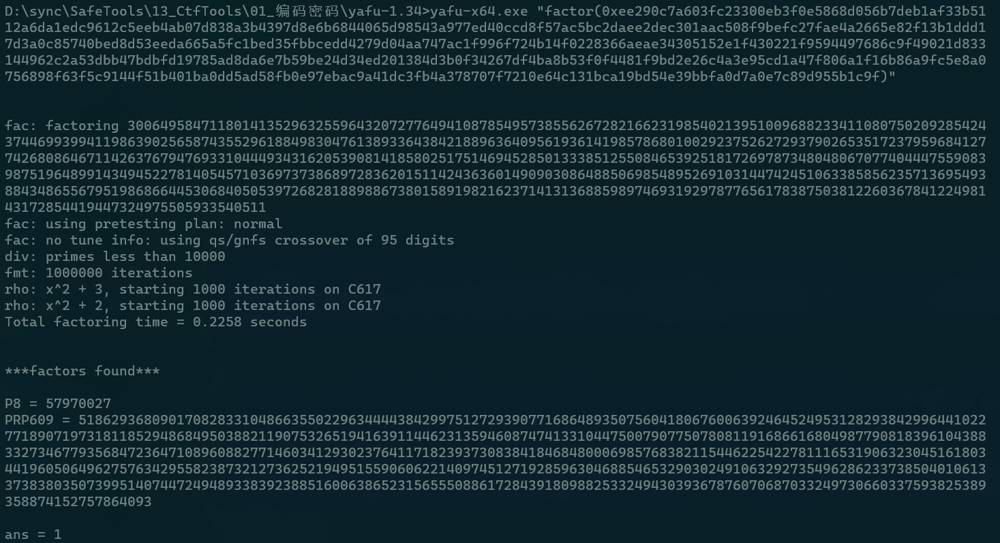
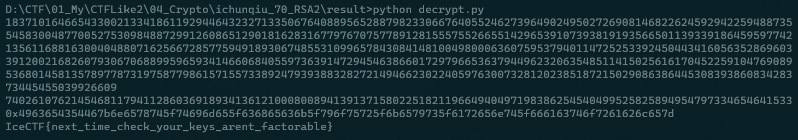

# RSA2

## 题目描述
---
```
I guess the 3rd time is the charm? Or not...[flag.txt]

N=0xee290c7a603fc23300eb3f0e5868d056b7deb1af33b5112a6da1edc9612c5eeb4ab07d838a3b4397d8e6b6844065d98543a977ed40ccd8f57ac5bc2daee2dec301aac508f9befc27fae4a2665e82f13b1ddd17d3a0c85740bed8d53eeda665a5fc1bed35fbbcedd4279d04aa747ac1f996f724b14f0228366aeae34305152e1f430221f9594497686c9f49021d833144962c2a53dbb47bdbfd19785ad8da6e7b59be24d34ed201384d3b0f34267df4ba8b53f0f4481f9bd2e26c4a3e95cd1a47f806a1f16b86a9fc5e8a0756898f63f5c9144f51b401ba0dd5ad58fb0e97ebac9a41dc3fb4a378707f7210e64c131bca19bd54e39bbfa0d7a0e7c89d955b1c9f

e=0x10001

c=0x3dbf00a02f924a70f44bdd69e73c46241e9f036bfa49a0c92659d8eb0fe47e42068eaf156a9b3ee81651bc0576a91ffed48610c158dc8d2fb1719c7242704f0d965f8798304925a322c121904b91e5fc5eb3dc960b03eb8635be53b995217d4c317126e0ec6e9a9acfd5d915265634a22a612de962cfaa2e0443b78bdf841ff901423ef765e3d98b38bcce114fede1f13e223b9bd8155e913c8670d8b85b1f3bcb99353053cdb4aef1bf16fa74fd81e42325209c0953a694636c0ce0a19949f343dc229b2b7d80c3c43ebe80e89cbe3a3f7c867fd7cee06943886b0718a4a3584c9d9f9a66c9de29fda7cfee30ad3db061981855555eeac01940b1924eb4c301

```

## 题目来源
---
IceCTF

## 主要知识点
---
RSA

## 题目分值
---
70

## 部署方式
---


## 解题思路
---

分解N。

```
yafu-x64.exe "factor(0xee290c7a603fc23300eb3f0e5868d056b7deb1af33b5112a6da1edc9612c5eeb4ab07d838a3b4397d8e6b6844065d98543a977ed40ccd8f57ac5bc2daee2dec301aac508f9befc27fae4a2665e82f13b1ddd17d3a0c85740bed8d53eeda665a5fc1bed35fbbcedd4279d04aa747ac1f996f724b14f0228366aeae34305152e1f430221f9594497686c9f49021d833144962c2a53dbb47bdbfd19785ad8da6e7b59be24d34ed201384d3b0f34267df4ba8b53f0f4481f9bd2e26c4a3e95cd1a47f806a1f16b86a9fc5e8a0756898f63f5c9144f51b401ba0dd5ad58fb0e97ebac9a41dc3fb4a378707f7210e64c131bca19bd54e39bbfa0d7a0e7c89d955b1c9f)"
```



得到p、q的值

```
q = 57970027
p = 518629368090170828331048663550229634444384299751272939077168648935075604180676006392464524953128293842996441022771890719731811852948684950388211907532651941639114462313594608747413310447500790775078081191686616804987790818396104388332734677935684723647108960882771460341293023764117182393730838418468480006985768382115446225422781116531906323045161803441960506496275763429558238732127362521949515590606221409745127192859630468854653290302491063292735496286233738504010613373838035073995140744724948933839238851600638652315655508861728439180988253324943039367876070687033249730660337593825389358874152757864093
```

开始计算

```python
#!/usr/bin/env python
#-*- coding: utf-8 -*-
"""
@Author : darkN0te
@Create date : 2021年5月31日17:07:20
@description : RSA解密
@Update date :   
"""  

import gmpy2
q = 57970027
p = 518629368090170828331048663550229634444384299751272939077168648935075604180676006392464524953128293842996441022771890719731811852948684950388211907532651941639114462313594608747413310447500790775078081191686616804987790818396104388332734677935684723647108960882771460341293023764117182393730838418468480006985768382115446225422781116531906323045161803441960506496275763429558238732127362521949515590606221409745127192859630468854653290302491063292735496286233738504010613373838035073995140744724948933839238851600638652315655508861728439180988253324943039367876070687033249730660337593825389358874152757864093
e = 0x10001
c = 0x3dbf00a02f924a70f44bdd69e73c46241e9f036bfa49a0c92659d8eb0fe47e42068eaf156a9b3ee81651bc0576a91ffed48610c158dc8d2fb1719c7242704f0d965f8798304925a322c121904b91e5fc5eb3dc960b03eb8635be53b995217d4c317126e0ec6e9a9acfd5d915265634a22a612de962cfaa2e0443b78bdf841ff901423ef765e3d98b38bcce114fede1f13e223b9bd8155e913c8670d8b85b1f3bcb99353053cdb4aef1bf16fa74fd81e42325209c0953a694636c0ce0a19949f343dc229b2b7d80c3c43ebe80e89cbe3a3f7c867fd7cee06943886b0718a4a3584c9d9f9a66c9de29fda7cfee30ad3db061981855555eeac01940b1924eb4c301
n = 0xee290c7a603fc23300eb3f0e5868d056b7deb1af33b5112a6da1edc9612c5eeb4ab07d838a3b4397d8e6b6844065d98543a977ed40ccd8f57ac5bc2daee2dec301aac508f9befc27fae4a2665e82f13b1ddd17d3a0c85740bed8d53eeda665a5fc1bed35fbbcedd4279d04aa747ac1f996f724b14f0228366aeae34305152e1f430221f9594497686c9f49021d833144962c2a53dbb47bdbfd19785ad8da6e7b59be24d34ed201384d3b0f34267df4ba8b53f0f4481f9bd2e26c4a3e95cd1a47f806a1f16b86a9fc5e8a0756898f63f5c9144f51b401ba0dd5ad58fb0e97ebac9a41dc3fb4a378707f7210e64c131bca19bd54e39bbfa0d7a0e7c89d955b1c9f
d = gmpy2.invert(e, (p-1)*(q-1))
print d
# m = pow(c,d,n)
m = gmpy2.powmod(c,d,n)
print m

import binascii
print str(hex(m))
print binascii.unhexlify(str(hex(m))[2:])
```



IceCTF{next_time_check_your_keys_arent_factorable}

## 参考
---
