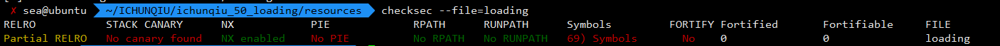

# loading

## 题目描述
---
```
nc 106.75.2.53 10009

附件下载
```

## 题目来源
---
“百度杯”CTF比赛 十一月场

## 主要知识点
---


## 题目分值
---
50


## 解题思路
---

32位ELF，查看安全机制



反编译main函数

```c
int __cdecl main(int argc, const char **argv, const char **envp)
{
  int v4; // [esp+24h] [ebp-Ch] BYREF
  int i; // [esp+28h] [ebp-8h]
  int (*v6)(void); // [esp+2Ch] [ebp-4h]

  v6 = (int (*)(void))mmap(0, 0x8000u, 7, 34, -1, 0);
  for ( i = 0; i <= 0x1FFF && __isoc99_scanf(&unk_80485F0, &v4); ++i )
    *((float *)v6 + i) = (long double)v4 / 2333.0;
  write(1, "try to pwn\n", 0xBu);
  return v6();
}
```

首先，了解一下 mmap 函数是干什么的：

推荐一个网址：https://www.cnblogs.com/huxiao-tee/p/4660352.html

我们可以发现这里的v6指向的内存区域经过mmap函数之后拥有了可执行权限，将代码写入数据之后就可以执行，

下面的for循环中 unk_80485F0 指向的内存值为“%d”，故从键盘读入的数据是以整数形式，然后转换为浮点数，再除以“2333.0”，写入v6指向的内存

因此，可以通过构造shellcode使其执行，拿到shell，这里附上大佬写的脚本：

https://github.com/rick2600/writeups/blob/master/PlaidCTF2016/fixedpoint.md


## 参考
---
