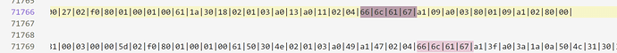

# 工业信息安全技能大赛2019_哈尔滨站

## 地址

https://www.wolai.com/ctfhub/odVhAsawDumxzTQ5m7yUuF

# 简单的APK分析

## WriteUp来源

[https://www.cnpanda.net/ctf/415.html](https://www.cnpanda.net/ctf/415.html)

## 题目描述

> 工控移动终端逆向，找到apk中的flag

## 题目考点

- APK逆向

## 解题思路

这是去年比赛的旧题修改了flag，解包apk得到`multiprotocol.tesla.scada`文件。反编译该文件通过对比正版软件，很容易得到flag（为混淆前的类名）。


## Flag

```text
Flag{ft-dt-src-2019-8}
```

# 窃取数据的黑客

## WriteUp来源

来自`MO1N`战队

## 题目描述

> 黑客在入侵了工业上位机后试图用网络中合规通信信道传输敏感文件来躲避流量审计设备对异常流量的告警。分析黑客通过工业协议窃取了什么敏感文件。flag格式{}

## 题目考点

- MMS规约

## 解题思路

打开是MMS规约。为2018年原题，

对比发现多读了一个flag.7z，把这个文件提取出来


```Python
import pyshark

try:
    captures = pyshark.FileCapture("1.pcap")
    flag_frsm = False
    flag_frsm_id = None
    flag_read = False
    for capture in captures:
        for pkt in capture:
            if pkt.layer_name == "mms":
                # file open
                if hasattr(pkt, "confirmedservicerequest") and int(pkt.confirmedservicerequest) == 72:
                    if hasattr(pkt, "filename_item"):
                        filename_items = pkt.filename_item.fields
                        for f in filename_items:
                            file_name = str(f.get_default_value())
                            if file_name == "flag.7z":
                                flag_frsm = True
                if hasattr(pkt, "confirmedserviceresponse") and int(pkt.confirmedserviceresponse) == 72 and flag_frsm:
                    # print(pkt.field_names)
                    if hasattr(pkt, "frsmid"):
                        flag_frsm_id = pkt.frsmid
                    flag_frsm = False
                # file read
                if hasattr(pkt, "confirmedservicerequest") and int(pkt.confirmedservicerequest) == 73 and flag_frsm_id:
                    if hasattr(pkt, "fileread"):
                        if str(pkt.fileread) == str(flag_frsm_id):
                            flag_read = True
                    flag_frsm_id = None
                if hasattr(pkt, "confirmedserviceresponse") and int(pkt.confirmedserviceresponse) == 73 and flag_read:
                    if hasattr(pkt, "filedata"):
                        data = str(pkt.filedata).replace(":", "")
                        print(data)
                    flag_read = False
except Exception as e:
    print(e)

```


然后写入hex为7z文件打开即为flag


## Flag

```text
flag{flag.txt.flag.txt}
```

# Tesla工业APP分析

## WriteUp来源

[https://www.cnpanda.net/ctf/415.html](https://www.cnpanda.net/ctf/415.html)

## 题目描述

> 某安全团队捕获间谍发送的工业APP，安全人员怀疑间谍以某种方式将机密信息传递出去，尝试分析该文件，找出flag。

## 题目考点

## 解题思路

题目为TeslaMultiSCADA软件，版本号已经被修改，以免参赛者快速找到对应版本的正版app。同时对该apk和1.10.3版本的正版软件进行反编译对比，很快可以发现有一个apk被伪装成字体文件。发现该apk已经被加固保护，使用IDA或DexHunter等工具对其脱壳，反编译的java层代码如下图：


需要识别出java层的加密算法为base85，关键反编译代码如下：


java层要求我们输入一行字符串，进行base85算法编码后传入so层，将`libnative-lib.so`拖入IDA进行反汇编操作，从函数`Java_bin_crack_easyandroid_MainActivity_stringFromJNI`开始分析。


该函数并没有关键逻辑，值得提醒的是，so进行了字符串加密保护，选择手动逆向`datadiv_decode10352206657073544814`函数并解密字符串，或者直接动态调试apk。

当apk运行起来后，字符串会自动解密，接下来重点关注sub_2E74函数。


该函数流程已经被高度混淆，可以有选择的对其调用的子函数进行断点跟踪（需要注意apk的断点扫描检测，发现断点会直接崩溃），根据动态调试的数据分析并识别出重点函数sub_1228（变异SM4算法ECB模式），sub_DA4（变异base91算法）。分析出SM4魔改的数据如下：


Base91魔改的数据如下：


至此了解了程序加密流程以及加密算法，但依然缺少SM4加密密钥和最终的密文，对apk进行res资源反混淆，发现如下图文件：


爆破解密脚本如下：

```Python
data = "D4E8E5A0EBE5F9A0E9F3A0D9EFF5F2E5DFF6E5F2F9DFF3EDE1F2F4ACC3E9F0E8E5F2F4E5F8F4A0E3EFEEF3E9F3F4F3A0EFE6A0F4E8F2E5E5A0F0E1F2F4F3ACC3EFEDE5A0EFEEA1".decode("hex")
for i in range(256):
    string = ''
    for j in data:
        string += chr(ord(j)-i)
    print string
```


得到key为`Youre_very_smart`，密文分为三部分，通过文件比对软件很容易找到三处位置

- `functions_fr.properties`文件

- `smali/d/a/a/a/b/a`

- `smali/android/support/v7/internal/view/menu/ActionMenuItemView`

逐个进行查看

`s_fr.properties`文件


看着像摩尔斯电码，其实是brainfuck，‘/‘对应’!‘，’-’对应’?‘。解密结果为


`smali/d/a/a/a/b/a`文件


看着像brainfuck，其实是摩尔斯电码，`!`对应`-`，`?`对应`/`。

解密结果如下（摩尔斯电码不分字母大小写，其实正确的结果为全部字母小写）


`smali/android/support/v7/internal/view/menu/ActionMenuItemView`文件

看着像brainfuck，其实就是brainfuck，`!`对应`?`，`?`对应`!`。解密结果如下


接下来就是三部分密文的排列组合问题，必有一个字符串可以通过base91解密->SM4解密->base85

解密即可得到正确的flag

## Flag

```text
flag{Andr01dReMi3clsS0Ea5y!!!}
```

# flag在哪

## WriteUp来源

[https://www.cnpanda.net/ctf/415.html](https://www.cnpanda.net/ctf/415.html)

## 题目描述

> 某队在审核一起工业间谍案件中的邮件收发记录时，发现一张可疑图片，初步怀疑这张图片中隐藏了关键秘钥信息，你能找出隐藏的秘钥信息吗？找出的秘钥信息即为 flag。

## 题目考点

- 图片隐写

## 解题思路

使用 binwalk查看图片，发现存在隐藏的 ZIP 文件，再使用 foremost 分离出来：


得到一个 PNG 图片和压缩包：


打开压缩包发现存在另一张图片，且需要解压密码

观察另一张图片发现存在残缺的条形码图文：


使用 PS 工具将其修复完整：


发现熊猫的颜色颠倒过来，因此对图片进行反相处理：


扫描可得到字符串：`This_n0t_fl4g`


使用该字符串解压刚才的压缩包，得到3.jpg文件，使用 binwalk 查看依旧存在 ZIP 文件，于是继续分离出来：


最终得到两个一模一样的图片，使用Stegsolve工具进行图片对比：


发现出现很多像素点，确定是像素隐写，保存该图片为：solved.bmp，发现和原图对比数据杂乱因此尝试使用像素隐写解密工具进行解密

GitHub 搜索尝试几个工具后，最终发现此工具可以成功解密：[https://github.com/HFO4/HideByPixel](https://github.com/HFO4/HideByPixel)


之后somd5解密即可


## Flag

```text
flag{this_is_fl4g_icsc-^_^}
```

# 协议分析又来了

## WriteUp来源

[https://www.cnpanda.net/ctf/415.html](https://www.cnpanda.net/ctf/415.html)

## 题目描述

> 某安全团队捕获黑客滥用工业互联网协议，分析协议内容，找出flag。

## 题目考点

## 解题思路

从wireshark中发现是LSIS PLC的相关通信内容。在数据包中可观察到对plc的寄存器进行遍历读取，但中间会参杂一些其他的读取。以100为长度。


通过程序对相关数据进行筛选


对数据进行`xor 0xFF`还原并修整提取


使用dnspy对程序进行反编译，找到其中的资源mainwindow.baml  
复制其中的Grid元素中的RadioButton的所有标签。


通过visual studio新建一个WPF工程，把上述内容贴入工程的xaml中即可见到flag


```C#
private void Btnreadfile_Click(object sender, EventArgs e)
{
    byte[] read = new byte[9999];
    OpenFileDialog fileDialog = new OpenFileDialog();
    fileDialog.Multiselect = true;
    fileDialog.Title = "请选择文件";
    fileDialog.Filter = "所有文件|*.*"; //设置要选择的文件的类型
    if (fileDialog.ShowDialog() == DialogResult.OK)
    {
        string file = fileDialog.FileName;//返回文件的完整路径
        PcapNGFileReader packetReader = new PcapNGFileReader(FileToStream(file));
        var packets= packetReader.ReadPackets();
        bool isRead = false;
        byte[] readbyte = new byte[65500];
        int iterCount = 100;
        foreach(var item in packets)
        {
            var data = item.Payload.ToArray();
            //读取数据
            if (isRead)
            {
                for(int j = 99; j >= 0; j--)
                {
                    int sub = 99 - j;
                    readbyte[iterCount + j] = (byte)(data[data.Length-sub-1]);

                }
                iterCount += 100;
                isRead = false;
            }
            //处理是否读取保存下一个包
            if (data.Length > 91&&data.Length<95 && data[data.Length - 4] == 0x30 && data[data.Length - 3] == 0x30 && data[data.Length - 2] == 0x64 && data[data.Length - 1] == 0x00)
            {
                isRead = true;
            }
            else
            {
                isRead = false;
            }
        }
        int endloc = 100;
        int count = 1000;
        for (int i = 100; i < 65500; i++)
        {
            if (readbyte[i] == 0)
            {
                endloc = i;
                count--;
                if (count == 0)
                {
                    break;
                }
            }
            else
            {
                count = 1000;
                endloc = 100;
            }
        }
        byte[] getval = new byte[endloc - 1100];
        for (int i = 0; i < getval.Length; i++)
        {
            getval[i] = (byte)(readbyte[i + 100] ^ 0xFF);
        }

        StreamToFile(BytesToStream(getval), file + ".exe");
    }
}

/// <summary>
/// byte[]转换成Stream
/// </summary>
/// <param name="bytes"></param>
/// <returns></returns>
public Stream BytesToStream(byte[] bytes)
{
    Stream stream = new MemoryStream(bytes);
    return stream;
}

/// <summary>
/// Stream转换成byte[]
/// </summary>
/// <param name="stream"></param>
/// <returns></returns>
public byte[] StreamToBytes(Stream stream)
{
    byte[] bytes = new byte[stream.Length];
    stream.Read(bytes, 0, bytes.Length);
    stream.Seek(0, SeekOrigin.Begin); // 设置当前流的位置为流的开始
    return bytes;
}

/// <summary>
/// 从文件读取Stream
/// </summary>
/// <param name="path"></param>
/// <returns></returns>
public Stream FileToStream(string path)
{
    FileStream fileStream = new FileStream(path, FileMode.Open, FileAccess.Read, FileShare.Read); // 打开文件
    byte[] bytes = new byte[fileStream.Length]; // 读取文件的byte[]
    fileStream.Read(bytes, 0, bytes.Length);
    fileStream.Close();
    Stream stream = new MemoryStream(bytes); // 把byte[]转换成Stream
    return stream;
}

/// <summary>
/// 将Stream写入文件
/// </summary>
/// <param name="stream"></param>
/// <param name="path"></param>
public void StreamToFile(Stream stream, string path)
{
    byte[] bytes = new byte[stream.Length]; // 把Stream转换成byte[]
    stream.Read(bytes, 0, bytes.Length);
    stream.Seek(0, SeekOrigin.Begin); // 设置当前流的位置为流的开始
    FileStream fs = new FileStream(path, FileMode.Create); // 把byte[]写入文件
    BinaryWriter bw = new BinaryWriter(fs);
    bw.Write(bytes);
    bw.Close();
    fs.Close();
}
```

## Flag

```text
flag{ICSC-F1A!}
```

# 西门子DOS攻击事件

## WriteUp来源

[https://www.cnpanda.net/ctf/415.html](https://www.cnpanda.net/ctf/415.html)

`shuaitong`提供补充

## 题目描述

> 样本中包含针对西门子工控设备的DOS攻击模式，请分析出发送怎样的UDP数据会使设备宕机。flag格式flag{}

## 题目考点

- CVE-2015-5374

## 解题思路

使用IDA反汇编题目文件，发现可疑字符串crash，共两处引用


从该文件无法得到题目要求的UDP数据流


搜索西门子Dos攻击事件，找到了这篇文章[https://zhuanlan.zhihu.com/p/27428923](https://zhuanlan.zhihu.com/p/27428923)

经过分析得知题目中给的是Launcher模块，题目要求是宕机，根据文章中

> 攻击者武器库中的另一工具是拒绝服务（DoS）工具，可以用来对付西门子SIPROTEC设备，该工具利用了CVE-2015-5374漏洞，目标是使设备无法响应。一旦漏洞被成功利用，目标机器将会停止任何命令响应，直到手动重启。

留意到此处代码，确定题目文件为`Industroyer`工控恶意软件`Launcher模块`。而其中的udp包发生在利用DOS攻击漏洞`CVE-2015-5374`阶段，去GitHub搜索了[CVE-2015-5374的Payload](https://github.com/can/CVE-2015-5374-DoS-PoC/blob/master/Siemens_SIPROTEC_DoS.py)，从而得到最终答案。


## Flag

```text
flag{11490000000000000000000000000000289E}
```

# 黑客的大意

## WriteUp来源

[https://www.cnpanda.net/ctf/415.html](https://www.cnpanda.net/ctf/415.html)

## 题目描述

> 黑客在入侵后不小心留下了这样一个文件，请分析文件进行溯源，找到黑客的邮箱。flag格式为flag{邮箱账号}

## 题目考点

- 代码审计

## 解题思路


从图片中可见 WATCHIN YUR SCREENZ的字样，在github中搜索可知图来源于`gcat`这个程序。


任意点进一个，找到里面的gcat.py可见：


Flag就是在这里写着： gcat.is.the.shit@gmail.com

## Flag

```text
flag{gcat.is.the.shit@gmail.com}
```

# 智能变电站设备异常诊断

## WriteUp来源

[https://www.cnpanda.net/ctf/415.html](https://www.cnpanda.net/ctf/415.html)

## 题目描述

> 在电力安全巡检工作中，发现了一个110Kv变电站存在运行异常，经过初步分析问题来源可能是线路智能终端设备。通过分析工作人员导出的变电站基础配置信息文件，分析存在问题根源。flag格式{}

## 题目考点

- zip文件
- 凯默scd分析软件kscd文件

## 解题思路

一眼看出题目将ZIP文件头前四个字节倒序了，翻转过来即可解压


得到dcs.dcs文件


这其实是凯默scd分析软件的kscd文件，文件头还加了两字节垃圾数据。出题人将所有的00都修改为了20，导致文件无法被凯默scd软件正常解析，因此只能从字符串中寻找规律。


然后纯粹靠眼力，使用正则表达式将其筛选出来，得到flag

## Flag

```text
flag{scdisbad}
```

# 神奇的数据

## WriteUp来源

[https://www.cnpanda.net/ctf/415.html](https://www.cnpanda.net/ctf/415.html)

## 题目描述

> 通过网络分析仪器采集的电力传输网络通信数据，请分析出数据中的异常。flag格式{}

## 题目考点

## 解题思路

使用搜索引擎搜了下ETHER没搜出什么有价值的信息，看见一堆ACSII码，不管这么多，先来一发ASCII变成标准字符.


逻辑为提取|0开始的行，然后把后面的ASCII转换为标准的byte。  
然后看了下，这包很像MMS的数据包。


联想到第2题。根据MMS的协议规则，有效的数据包都是成对出现的：


而且在其中找到了flag字样，因此把flag转换为66|6c|61|67|


在原始的stream.exe中搜索可见



直接把71769这行flag后面那一节通过转换工具查看


```text
flag¡? :
PL1012{ROT
PL1012CTRL    PL1012LD0
PL1012MEAS    PL1012RC}
```

看了下结构，然后猜了下，删除掉`PL1012`，flag就出来了

## Flag

```text
flag{ROTCTRLLD0MEASRC}
```

# 异常的S7数据

## WriteUp来源

[https://www.cnpanda.net/ctf/415.html](https://www.cnpanda.net/ctf/415.html)

## 题目描述

> 这是一个S7comm协议的数据包。但是流量中存在一条异常写入的数据。找出异常流量的ascii数据流。flag格式为flag{ascii数据流}

## 题目考点

- 流量分析
- S7Comm协议分析

## 解题思路

下载题目所给的flag.pcapng，发现有57万个包，还是蛮多的。


在过滤器中输入s7comm


过滤后数量没什么变化，还是57万多个


然后观察包内容，使用过滤语句

```Python
s7comm.header.rosctr == 3 & s7comm.data.returncode == 0xff
```

发现包数量为288305


然后加上初始化通信的包，刚好占一半，说明所有发送都是成功接收的。


因此就不需要看Ack_Data。使用s7comm.header.rosctr == 1过滤语句，查看ROSCTR为Job的Write Var的数据包，发现写的数据长度均为10。基于这些信息，开始进入写代码筛选阶段。


编写了下面的筛选代码：对所有长度113的包进行过滤，最开始走了不少弯路，以为是把后面变化的字节过滤出来，进行合并，然后还原flag的。


从过滤出来的数据中还真看到和flag字样有关的信息，在这浪费了不少时间。


没看出个所以然后，突然灵光一现，是不是前面的0xffff会有不同的呢，于是写了下面的代码：


经过验证，只有一个包符合这个条件。


flag即为这串数据

## Flag

```text
flag{FFAD28A0CE69DB34751F}
```