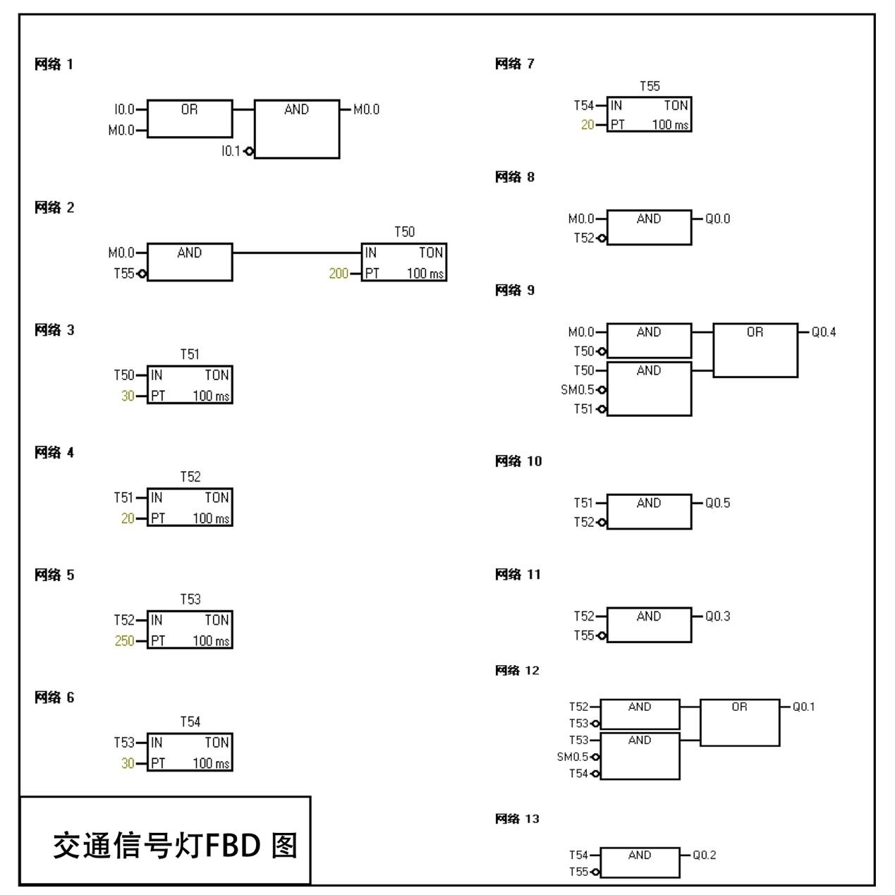
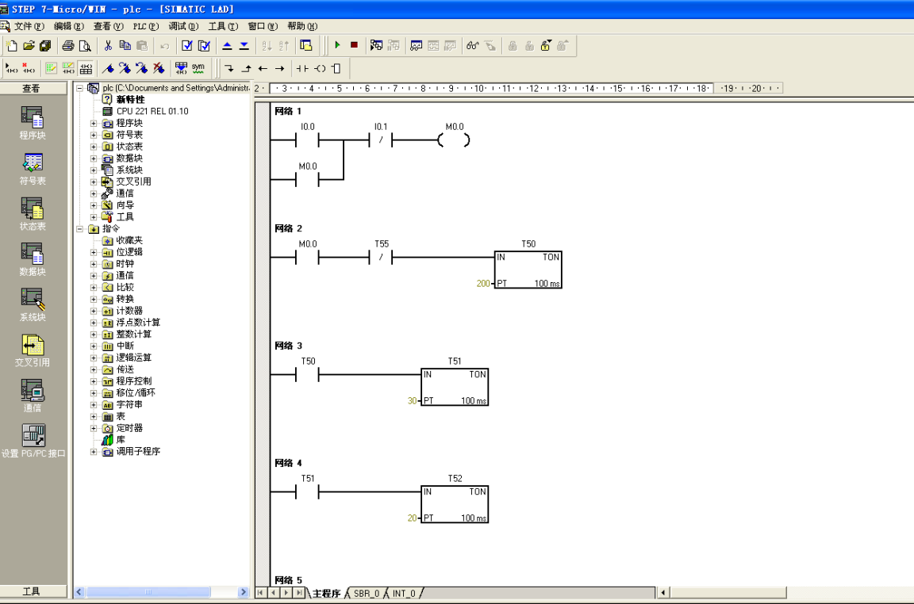
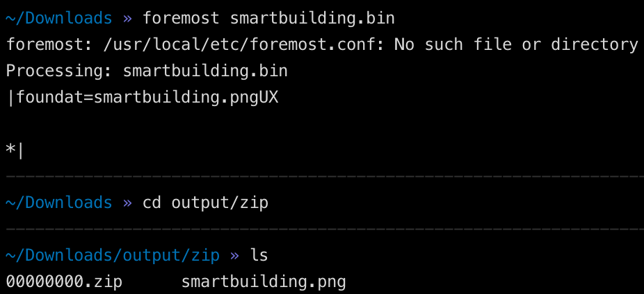
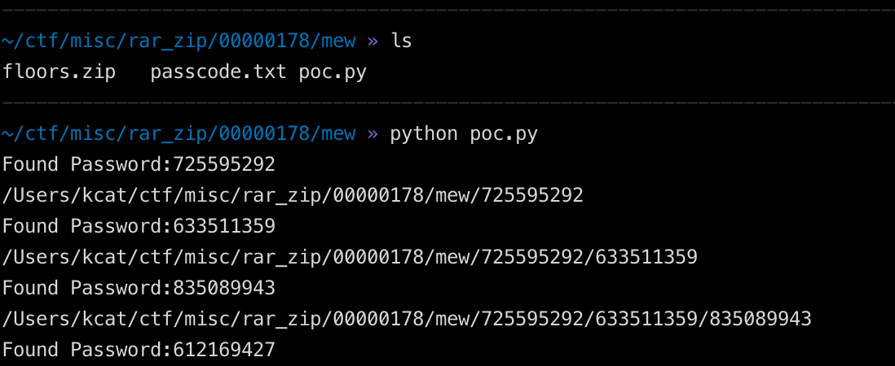
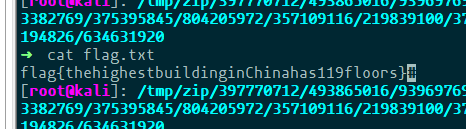

# 工业信息安全技能大赛2019_宁波站

## 地址

https://www.wolai.com/ctfhub/fBVcz1G5whGSkEqKrA3Dbf

# 交通控制系统灯

## WriteUp来源

[纵横网络靶场社区](https://game.fengtaisec.com/)

## 题目描述

> 附件是一个交通信号灯的 FBD 图以及其部分工程文件，请你分析出当按下启动按钮后，信号灯起动控制过程中，信号灯亮，闪，灭的情况。方向及状态代号如下： 
东西：EW
南北：SN
红灯：R
绿灯：G
黄灯：Y
亮：T
闪：L
灭：F
如流程：南北红灯亮→东西绿灯亮 →东西绿灯闪 →东西黄灯亮 →南北红灯灭
可写为：SNRT-EWGT-EWGL-EWYT-SNRF
注：正确答案写成XXXX-XXXX……XXXX-XXXX（正确答案共计 15 组）后，转为 32 位小写 md5值，该md5值为正确的 flag。Flag格式为:flag{}

## 题目考点

- 梯形图分析

## 解题思路



该图为交通信号灯的 FBD 图，可以打开压缩包中的工程文件，将其转换为梯形图：



分析梯形图，可得到以下流程：

- 按下启动按钮后

  I0.0 常开触点闭合→辅助继电器 M0.0 线圈得电→M0.0 自锁触点闭合，锁定 M0.0 线圈供
电→M0.0 常开触点闭合，线圈 Q0.0 得电→`南北红灯亮`→M0.0 常开触点闭合，线圈 Q0.4
得电→`东西绿灯亮`

- 20s 后，定时器 T50 激活

  T50 常开触点闭合→SM0.5 继电器触点以 0.5 秒通， 0.5 秒断的频率工作→Q0.4 线圈以同
样的频率得电和失电，导致`东西绿灯闪烁`→T50 常开触点闭合，定时器 T51 开始 3 秒计时

- 3 秒后，定时器 T51 激活

  T51 常开触点闭合→Q0.5 线圈得电→`东西黄灯亮`→T51 常开触点闭合，定时器 T52 开始 2
秒计时

- 2 秒后，定时器 T52 激活

  T52 常开触点断开， Q0.0 线圈失电→`南北红灯灭`→T52 常开触点断开， Q0.5 线圈失电→`东
西黄灯灭`→T52 常开触点闭合， Q0.3 线圈得电 → `东西红灯亮` →T52 常开触点闭合， Q0.1
线圈得电 → `南北绿灯亮` → T52 常开触点闭合，定时器 T53 开始 25 秒计时

- 25 秒后，定时器 T53 激活

  T53 常开触点闭合→SM0.5 继电器触点以 0.5 秒通， 0.5 秒断的频率工作→Q0.1 线圈以
同样的频率得电和失电，导致`南北绿灯闪烁`→T53 常开触点闭合，定时器 T54 开始 3 秒
计时

- 3 秒后，定时器 T54 激活

  T54 常开触点断开→Q0.1 线圈失电→ `南北绿灯灭`→ T54 常开触点闭合 →Q0.2 线圈得
电→`南北黄灯亮`→T54 常开触点闭合，定时器 T55 开始 2 秒计时

- 2 秒后，定时器 T55 激活：

  T55 常开触点断开→Q0.3 线圈失电→`东西红灯灭`→T55 常开触点断开， Q0.2 线圈失
电 → `南北黄灯灭` →T55 常闭触点断开，定时器 T50 复位， T50 所有触点复位→T50 常
开触点复位断开使定时器 51 复位→T51 常开触点复位断开使定时器 T52 复位→以此
类图， T53、 T54、 T55 以此复位→在定时器 T50 复位以后， T50 常闭触点闭合， Q0.4 线
圈得电→`东西绿灯亮`→在定时器 T52 复位以后， T52 常闭触点闭合， Q0.0 线圈得电→`南北红灯亮` → 在定时器 T55 复位以后， T55 常闭触点闭合,定时器 T50 开始 20s 计时，重复前述过程。

因此整个信号灯对应状态如下：


```text
南北红灯亮--东西绿灯亮--东西绿灯闪烁--东西黄灯亮--南北红灯灭--东西黄灯灭--东西红灯
亮--南北绿灯亮--南北绿灯闪烁--南北绿灯灭--南北黄灯亮--东西红灯灭--南北黄灯灭--东西绿
灯亮--南北红灯亮

```

即

```text
SNRT-EWGT-EWGT-EWYT-SNRF-EWYF-EWRT-SNGT-SNGL-SNGF-SNYT-EWRF-SNYF-EWYT-SNRT
```

对应的 MD5 为 `24fd2870b2e3e5791072ab5082918e69`

## Flag

```text
flag{24fd2870b2e3e5791072ab5082918e69}
```

# 智能楼宇系统

## WriteUp来源

[纵横网络靶场社区](https://game.fengtaisec.com/)

## 题目描述

> 请尝试分析出当前文件的flag。Flag格式为:flag{}

## 题目考点


## 解题思路

解压出来是⼀个sm.bin，使⽤foremost解出来⼀个png



继续对png进⾏foremost 最后得到floors和passcode


floors是不知道多少层的zip套娃，上脚本。



解密脚本poc.py

```Python
import zipfile
import re
import os

name = 'floors'
table = "012345679"

def get_dic(passcode_file):
    dic = []
    with open(passcode_file, "r") as f:
        line = f.read()[25:]
        for i in table:
            dic.append(line.replace("?", i))
    return dic

while True:
    new_path = ""
    fz = zipfile.ZipFile(os.getcwd() + "/floors.zip", "r")
    for pwd in get_dic(os.getcwd() + "/passcode.txt"):
        try:
            fz.extractall(pwd=pwd, path=pwd)
            print("Found Password: " + pwd)
            new_path = pwd
            break
        except RuntimeError:
            pass
    fz.close()
    cmd = "cd " + new_path + "/"
    new_path = os.getcwd() + "/" + new_path
    os.chdir(new_path)
```

中间爆出差不多三⼗层的时候python脚本会报错，到了报错的地⽅就⾃⼰⼿动爆⼀次，然后再上脚本


⾃⼰⼿动爆三次就会出结果了。



## Flag

```text
flag{thehighestbuildinginChinahas119floors}
```

