# 工业信息安全技能大赛2019_成都站

## 地址

https://www.wolai.com/ctfhub/aF5bWiCbuCN8B17AhaCz9m

# TCP-urgent-pointer

## WriteUp来源

[纵横网络靶场社区](https://game.fengtaisec.com/)

## 题目描述

> 这是一点流量分析题。所有的提示都在流量里，想要拿到flag的话就来分析一下它。flag形式为 flag{}

## 题目考点

- 流量分析

## 解题思路

根据题目要求，打开是一个pcapng包思路：是个流量分析题，题目名称又是关键字段，

用wireshark打开，对数据包进行筛选`tcp.urgent_pointer > 0`

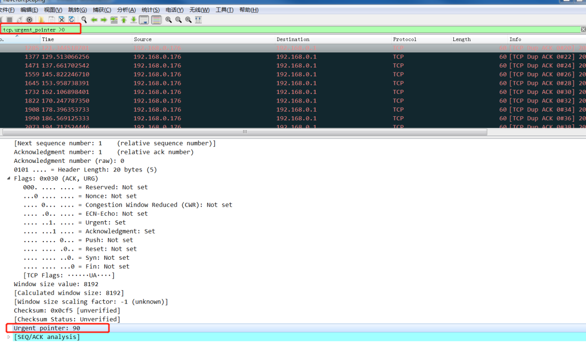

筛选出28条数据，把这28条数据中的`Uregent pointer`的值依次取出

```text
90 109 120 104 90 51 116 106 97 68 73 121 99 106 86 102 90 106 66 121 88 51 107 119 100 88 48 61
```

DEC转HEX得到`5A6D78685A33746A61444979636A56665A6A427958336B776458303D`

HEX转Ascii，得到：`ZmxhZ3tjaDIycjVfZjByX3kwdX0=`

一看就是BASE64格式的密文，再次解密即可得到flag

## Flag

```text
flag{ch22r5_f0r_y0u}
```

# 工业梯形图分析1

## WriteUp来源

[纵横网络靶场社区](https://game.fengtaisec.com/)

## 题目描述

> 这是一个常见的工控梯形图。当PIW的值为4096时，DB2.DBD0的值为多少？

## 题目考点

- 梯形图编辑

## 解题思路

首先安装好西门子编程软件 STEP7,软件版本随意， 我安装的版本是 V5.4

第二是需要安装西门子的仿真 PLC 程序， S7-PLCSIM

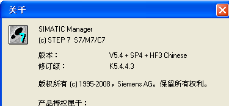

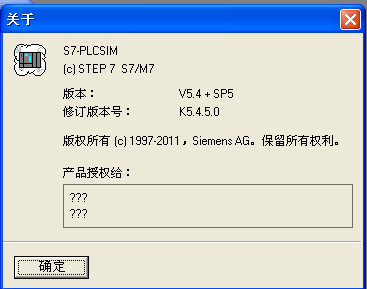

以上两个软件安装完成后， 使用 SIMATIC Manager 打开题目附件，步骤，文件—打开—浏览—， 找到题目附件

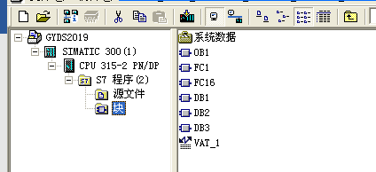

打开后， 可以看到有几个功能块， 其中 0B 是主程序， FC 是功能块（子程序）， DB 是数据块， OB 和 FC 里面找，程序很简单，根据题目说明， 在 OB1 中找到了 PIW 和 DB2.DBD0  

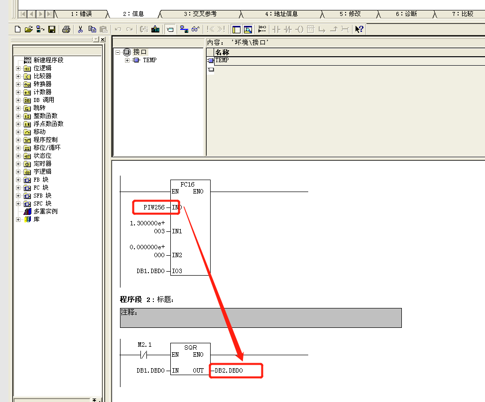

直接把 PIW256 改成 4096，接下来，启动模块仿真：

S7-PLCSIM 会自动弹出来

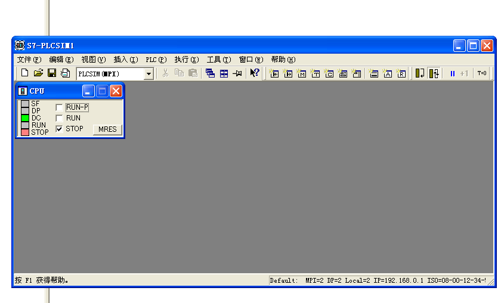

注意： 这里需要把仿真 PLC 设置为 STOP 模式才能下载程序

然后把程序下载到仿真 PLC

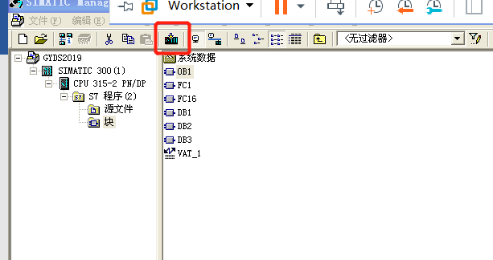

如果有弹出窗口，点击`是`

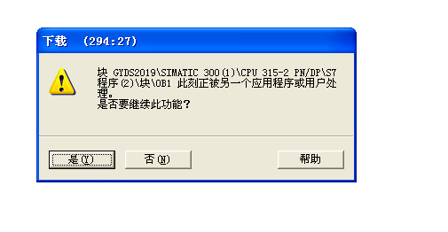

接下来把仿真 PLC 切换到 RUN 模式，下一步， 连线 PLC， 并在线监视

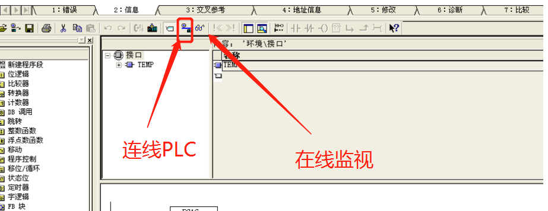

因为最开始我们已经把 PIW256 值改为了 4096， 所以程序会自动计算结果，在 DB2.DBD0 上显示的值即为 flag。  

注意： flag 格式为自动计算的结果，不是 16 进制，也不是10 进制

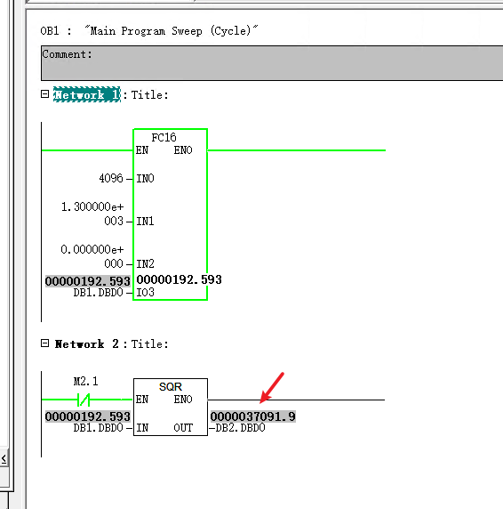

## Flag

```text
flag{37091.9}
```

# 工业梯形图分析2

## WriteUp来源

[纵横网络靶场社区](https://game.fengtaisec.com/)

## 题目描述

> 这是一个常见的工控梯形图程序，当DB8.DBX0.0为1时，DB20.DBW0的值是多少？以十六进制表示。

## 题目考点

梯形图编辑

## 解题思路

首先安装好西门子编程软件 STEP7,软件版本随意， 我安装的版本是 V5.4

第二是需要安装西门子的仿真 PLC 程序， S7-PLCSIM


以上两个软件安装完成后， 使用 SIMATIC Manager 打开题目附件，步骤，文件—打开—浏览—， 找到题目附件

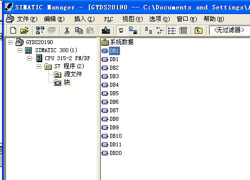

打开后， 可以看到有几个功能块， 其中 0B 是主程序， DB 是数据块， OB 里面找，程序很简单，根据题目说明， 在 OB1 中搜索找到了 DB8.DBX0.0

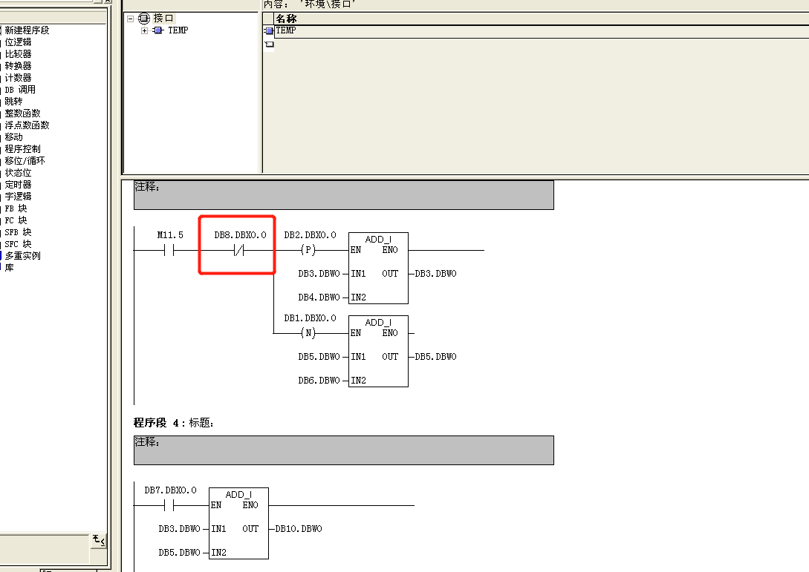

接下来，启动模块仿真：

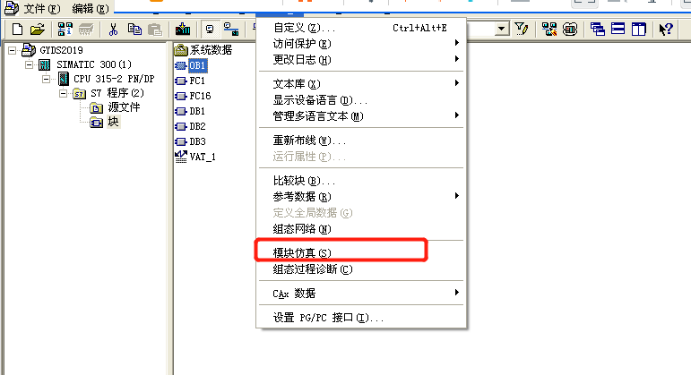

S7-PLCSIM 会自动弹出来


注意： 这里需要把仿真 PLC 设置为 STOP 模式才能下载程序。  

然后把程序下载到仿真 PLC，接下来把仿真 PLC 切换到 RUN 模式

下一步， 连线 PLC， 并在线监视


然后找到 DB8.DBX0.0,右键

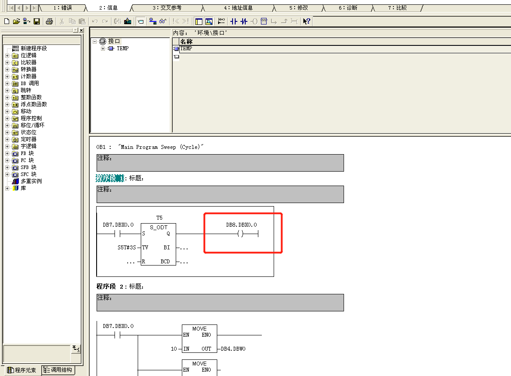

要使其为 1， 就需要让其运行，所以，需要把 DB7.DBX0.0 设置为 1

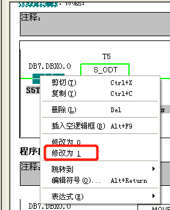

修改后，直接搜索 DB20.DBW0,查看程序计算结果即可  

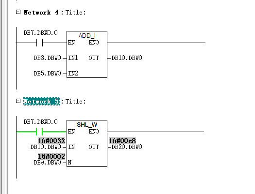

注意： flag 格式为自动计算的结果，是 16 进制,字母需要大写。

## Flag

```text
flag{C8}
```

# 虚拟PLC

## WriteUp来源

[纵横网络靶场社区](https://game.fengtaisec.com/)

## 题目描述

> 虚拟PLC是基于组态软件的仿真系统实现的原理，在于PLC内部各种继电器的状态与组态软件数据库中数据的链接以及该数据与计算机界面上图形对象的链接。通过修复该文件，分析虚拟PLC工作原理并发现文件中隐藏的flag。

## 题目考点

- 文件修复
- 西门子PLC编程软件
- PLC仿真

## 解题思路

先通过西门子 S7-PLCSIM 仿真软件，生成一个*.plc 的仿真程序文件，使用正常文件的文件头对题目附件进行修复。  

使用 S7-PLCSIM 打开修复好的*.PLC 文件,  

使用西门子 STEP7 编程软件连接虚拟 PLC 并从中读取程序，最后可以在 DB 块中对数据  

进行转码，最后得到 flag

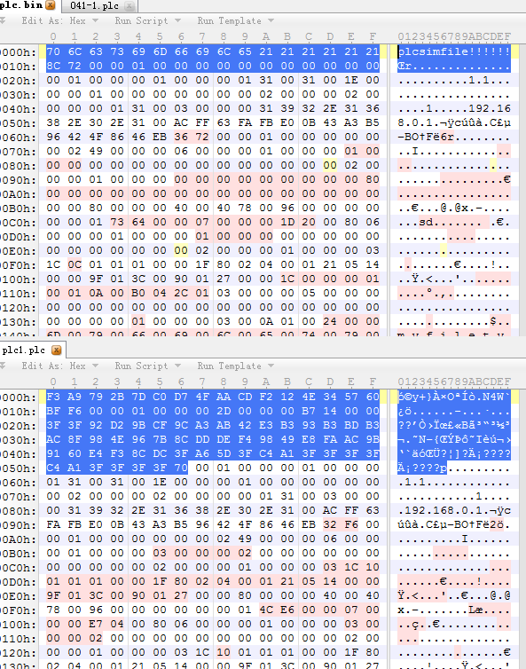

不过最后千辛万苦解出来的答案，竟然直接就明文显示在文件里面。 何必费时间绕这么大一圈， 没达到知识点考察的目的

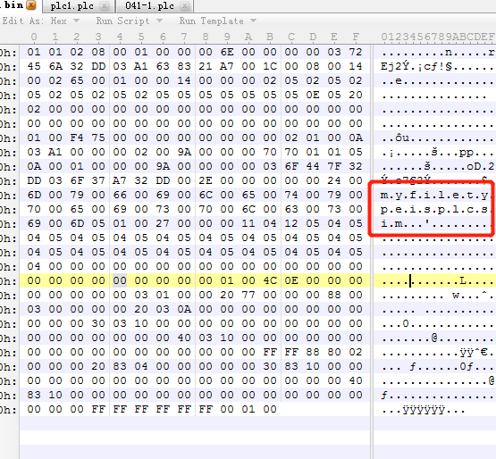


## Flag

```text
flag{myfiletypeisplcsim}
```