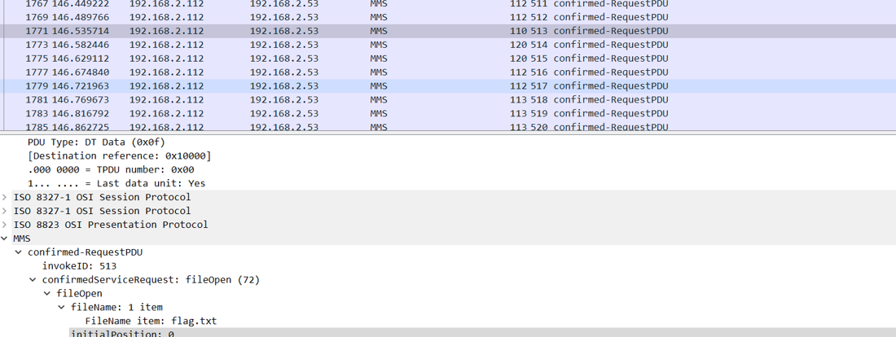
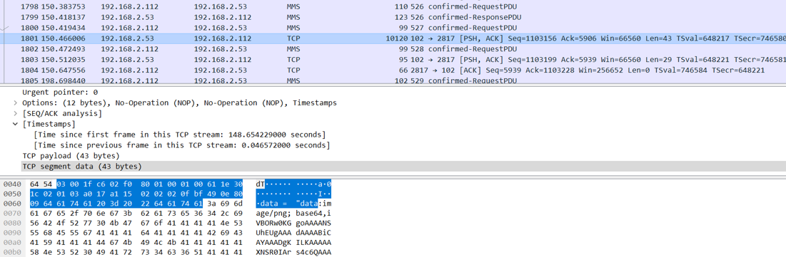
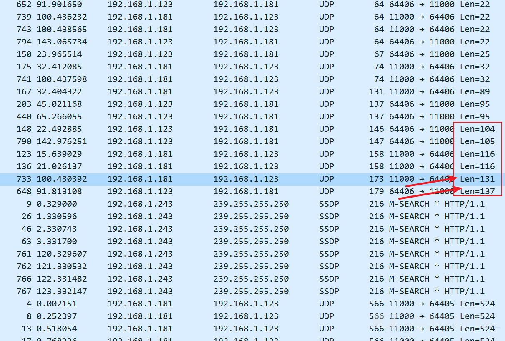

# 工业信息安全技能大赛2020 深圳站

## 地址

https://www.wolai.com/ctfhub/odVhAsawDumxzTQ5m7yUuF


# Modbus协议分析

## 题目描述
>黑客通过外网进入一家工厂的控制网络，之后对工控网络中的操作员站系统进行了攻击，最终通过工控协议破坏了真唱业务，我们得到了操作员站在攻击前后的流量数据包，我们需要分析流量中的蛛丝马迹，找到FLAG

## 题目考点

- Modbus协议

## 来源
https://xz.aliyun.com/t/5960

## 解题思路
首先打开流量包，数据包都是关于Modbus/TCP的流量。


运行脚本，分析流量包中Modbus/TCP的协议功能码，脚本和运行结果如下：

```python
import pyshark
def get_code():
     captures = pyshark.FileCapture("question_1564353677_modbus1.pcap")
     func_codes = {}
     for c in captures:
         for pkt in c:
             if pkt.layer_name == "modbus":
                 func_code = int(pkt.func_code)
                 if func_code in func_codes:
                     func_codes[func_code] += 1
                 else:
                     func_codes[func_code] = 1
     print(func_codes)
if __name__ == '__main__':
    get_code()
```


根据modbus的常见功能码


根据[modbus常见功能码分析](https://wenku.baidu.com/view/8e6cc5f9b4daa58da1114a20.html)，分析结果我们可以知道

`1`（读取线圈状态）

`2`（读取输入内容）

`3`（读多个寄存器）

`4`（读输入寄存器）

四个功能码都出现了702次，唯独16（预置多个寄存器）功能码只出现了两次，所以猜测与16功能码相关的流量可能存在关键数据，于是运行脚本分析与16功能码相关的流量，提取其中的数据，脚本和运行结果如下：

```python
import pyshark

def find_flag():
    cap = pyshark.FileCapture("question_1564353677_modbus1.pcap")
    idx = 1
    for c in cap:
        for pkt in c:
            func_code = int(pkt.func_code)
            if pkt.layer_name == "modbus" and if func_code == 16:
                payload = str(c["TCP"].payload).replace(":", "")
                print(hex_to_ascii(payload))
                print("{0} *".format(idx))
        idx += 1
def hex_to_ascii(payload):
    data = payload
    flags = []
    for d in data:
        _ord = ord(d)
        if (_ord > 0) and (_ord < 128):
            flags.append(chr(_ord))
    return ''.join(flags)

if __name__ == '__main__':
    find_flag()
```


提出的数据存在一个16进制字符串`00000000003901100001001932005400680065004d006f006400620075007300500072006f0074006f0063006f006c0049007300460075006e006e00790021`，将16进制字符串在线转换对应的ASII码，得到`TheModbusProtocolIsFunny!`，提交成功，Flag为`TheModbusProtocolIsFunny!`。


## Flag

```text
flag{TheModbusProtocolIsFunny!}
```

# 工业协议分析1

## WriteUp来源

[https://www.jianshu.com/p/008e08547ae5](https://www.jianshu.com/p/008e08547ae5)

## 题目描述

> 工业网络中存在异常流量，尝试通过分析pcap流量包，分析出流量中的异常数据点，拿到flag

## 题目考点

- 流量分析
- MMS规约

## 解题思路

打开pacp文件，看到有mms协议，先过滤一下mms协议，同时搜索flag字符串


看到NO.1764里有flag.txt，功能码是fileDirectory


猜测有可能会用fileopen打开该文件，所以对fileopen进行过滤



第`1771`、`1798`、`1813`、`4034`条都对`flag.txt`进行了打开操作。接下来去每条报文后边一条看是否有fileread进行了读取。最终在1800处发现，其读取了flag.txt，1801是回复报文



内容是一张base64编码的图片，对其进行解码得到flag


## Flag

```text
flag{ICS-mms104}
```

# 工业协议分析2

## WriteUp来源

[https://xz.aliyun.com/t/5960](https://xz.aliyun.com/t/5960)

## 题目描述

> 在进行工业企业检查评估工作中，发现了疑似感染恶意软件的上位机。现已提取出上位机通信流量，尝试分析出异常点，获取FLAG。

## 题目考点

- UDP数据包分析

## 解题思路

打开流量包，发现存在关于ARP、UDP、SNA协议的流量包，其中存在大量的UDP流量，如图所示：


首先对UDP流量包进行分析，分析发现UDP流量包的长度存在大量相同，一共出现的长度分别为`16` `17` `12` `14` `10` `18` `19` `20` `22` `25` `32` `89` `95` `104` `105` `116` `131` `137` `524` `528`，在这些长度中仅`12` `89` `104` `105` `131` `137`出现一次，其余长度多次出现，于是猜测这仅出现一次的流量包存在异常，于是分别分析`12` `89` `104` `105` `131` `137`对应的流量包，发现`131`，`137`对应的流量包存在异常的字符串，如图所示：




提取出字符串`666c61677b37466f4d3253746b6865507a7d`，并转换成对应ACII码，得到Flag,

## Flag

```text
flag{7FoM2StkhePz}
```

# 组态软件安全分析

## WriteUp来源

[https://xz.aliyun.com/t/5960](https://xz.aliyun.com/t/5960)

## 题目描述

> 一些组态软件中进行会配置连接很多PLC设备信息。我们在SCADA工程中写入了flag字段，请获取该工程flag

## 题目考点

- 力控组态PCZ格式分析

## 解题思路

解压附件，发现得到一个.PCZ的文件，用记事本打开发现文件头为PK，于是将.PCZ的文件后缀改为.zip，解压后得到一个演示工程的文件夹，里面包含了很多文件，如图所示：


题目表明Flag就在文件夹中的某一个文件中，一个个打开审计过于麻烦，可以利用linux系统的grep指令，帮助我们在文件夹中查找指定关键字，在演示工程的文件夹中，使用指令`grep -r "flag" ./`进行搜索，最终得到Flag，


## Flag

```text
flag{D076-4D7E-92AC-A05ACB788292}
```

# 工控蜜罐日志分析

## WriteUp来源

[https://xz.aliyun.com/t/5960](https://xz.aliyun.com/t/5960)

## 题目描述

> 工控安全分析人员在互联网上部署了工控仿真蜜罐，通过蜜罐可抓取并分析互联网上针对工业资产的扫描行为，将存在高危扫描行为的IP加入防火墙黑名单可有效减少工业企业对于互联网的攻击面。分析出日志中针对西门子私有通信协议扫描最多的IP，分析该扫描组织。FLAG为该IP的域名。

## 题目考点

- 日志分析

## 解题思路

附件是一个henoypot.log，内容格式如图所示：


根据题目提示，Flag为某个IP对应的域名，于是可以编写脚本，首先提取出日志的IP，并且去重IP，然后再对每一个IP反查域名，寻找正确的域名，脚本和运行结果如下：

```Python
#-*- coding:utf-8 -*-
import fileinput
import re
import os
import shutil
def readIp():
 with open(r'/root/python/honeypot.log', 'r') as f:
      for line in f.readlines():
         result2 = re.findall('[0-9]{1,3}\.[0-9]{1,3}\.[0-9]{1,3}\.[0-9]{1,3}',line) #匹配ip正则表达式                          
         if not result2 == []:
             result = result2[0] + '\n'
         with open('/root/python/ip.txt', 'a+') as w:
             w.write(result)
def setIp():#去重
    a=0
    readDir = "/root/python/ip.txt"
    writeDir = "/root/python/newip.txt"#new
    lines_seen = set()
    outfile = open(writeDir, "w")
    f = open(readDir, "r")
    for line in f:
        if line not in lines_seen:
            a+=1
            outfile.write(line)
            lines_seen.add(line)
    print(a)
    outfile.close()
def readDns():
    with open(r'/root/python/newip.txt', 'r') as g:
    for i in g.readlines():
        com=os.popen('nslookup %s'%i)
        comm=com.read()
        if comm.find('NXDOMAIN')==-1:
            print comm
if __name__ == '__main__':
    readIp()
    setIp()
    readDns()
```


挨个尝试提交域名，找到正确的域名为：scan-42.security.ipip.net

## Flag

```text
flag{scan-42.security.ipip.net}
```

# 隐信道数据安全分析

## WriteUp来源

[https://xz.aliyun.com/t/5960](https://xz.aliyun.com/t/5960)

## 题目描述

> 安全分析人员截获间谍发出的秘密邮件，该邮件只有一个mp3文件，安全人员怀疑间谍通过某种private的方式将信息传递出去，尝试分析该文件，获取藏在文件中的数据？

## 题目考点

## 解题思路

题目提示文件使用了private加密信息，在010Editor中打开mp3文件，发现存在private bit，因此，只需要提取每一个mf组中的该字节，组合起来，就是答案。可以从图中看到 ms 开始位为1 C1B8H，即第115128字节，如图所示：，如图所示：


```text
    uint32 frame_sync : 12
    uint32 mpeg_id : 1
    uint32 layer_id : 2
    uint32 protection_bit : 1
    uint32 bitrate_index : 4
    uint32 frequency_index : 2
    uint32 padding_bit : 1
    uint32 private_bit : 1
    uint32 channel_mode : 2
    uint32 mode_extension : 2
    uint32 copyright : 1
    uint32 original : 1
    uint32 emphasis : 2
```

`12+1+2+1+4+2+1+1+2+2+1+1+2=32`，即总共4字节，private_bit 为24，所在的字节为第3个字节因此要从前一个，即第二个字节开始提取内容，该字节对应的地址为 115130观察每一个mf组，大小都为414h，即1044字节，因此可以得到以下脚本：

```Python
# coding:utf-8
import re
import binascii
n = 115130
result = ''
fina = ''
file = open('flag-woody.mp3','rb')
while n < 2222222 :
    file.seek(n,0)
    n += 1044
    file_read_result = file.read(1)
    read_content = bin(ord(file_read_result))[-1]
    result = result + read_content
textArr = re.findall('.{'+str(8)+'}', result)
textArr.append(result[(len(textArr)*8):])
for i in textArr:
    fina = fina + hex(int(i,2))[2:].strip('\n')
fina = fina#.decode('hex')
print (fina)
```

将得到的字符串`464c41477b707231763474335f6269377d25a1cedc3e69888894dac4dd3a87c5e1c5276fa6d626832148d39288a0c596c95abaac3f09f9f524647595ae4894f9b82b3f4c1b47537c365d8d69d84a353c1a93ae436761d430e666e4111752d479746d1828f9c07c27ab1c3eaf1948f8a9e839b280a4342f321e89eb73b237a2b55d5310b77811c0975cfc1365e146f6c9212e244751398f73c17ee1a6664b4fd712d4b0a297275fa471fb65e440bc7bdc12fb0a39d81a1d374f2d55b8faabf9bf2c342f1046fbab7e66ac7896ffac672d277b89f8606759a8ac21a58fbb4b9b51d45f126a7f67c1a297e1fcb638356ec739b89555568816`转换对应的ASCII码，得到Flag

## Flag

```text
flag{pr1v4t3_bi7}
```

# 工业网络设备逆向

## 题目描述

> 这是一个工业系统中使用的路由器，系统的tddp协议存在远程代码执行漏洞。请找出并分析tddp协议的执行过程，并回答以下问题：
> 1. 远程执行命令的消息类型为？（格式为CMD_???_???）
> 2. 在tddp协议中第几个字节等于什么时，可以控制发出远程命令执行的消息
（FLAG格式为16进制）


# 二次设备固件逆向

## 题目描述

> 在对电力行业某二次设备进行渗透测试时，通过弱口令telnet服务获取了设备的权限，并提取出来了设备的固件，现在需要从固件中分析出其他的默认硬编码密码或厂家后门口令

## 题目考点

## 解题思路

## Flag

```text
flag{icspwd}
```