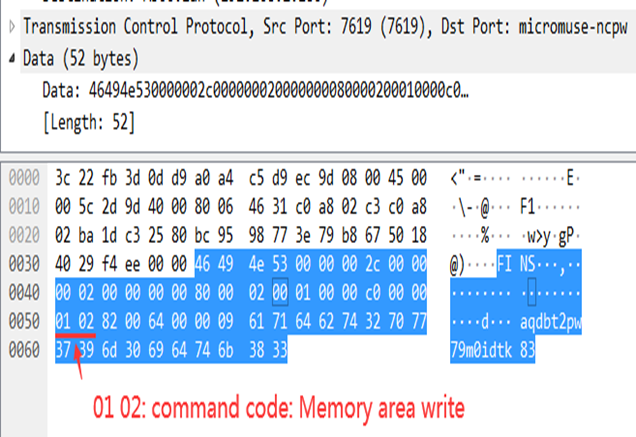
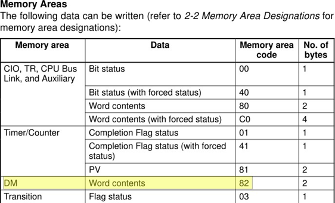

# 工业信息安全技能大赛2020_哈尔滨站

## 地址

https://www.wolai.com/ctfhub/a4zjRaM9ConBcj85php3WL

# Omron Fins

## WriteUp来源

来自`MO1N`战队

## 题目描述

> 当通过 OMRON FINS-Tcp 协议向内存写入字符串数据时，会神奇的发现要写入的字符串数据在数据流量包中发生了改变，请根据协议特点分析出原始要写入的字符串数据。flag{string}

## 题目考点

- 流量分析
- OMRON FINS-Tcp读写数据不同内存区域数据的格式
- 对Command Code掌握
  - `0x0101` - , "Memory Area Read
  - `0x0102` - Memory Area Write
  - `0x0103` - Memory Area Fill
  - `0x0104` - Multiple Memory Area Read

## 解题思路

OMRON FINS-Tcp 向地址为D100字符串写入数据：`qabd2twp970mdikt38`

### 流量分析

wireshark抓取流量包



```text
0000  50  e0  85  40  51  b9  a0  a4  c5  d9  ec  9d  08  00  45  00  P..@Q  E.
0010  00  5c  26  37  40  00  80  06  4d  99  c0  a8  02  c3  c0  a8  .\&7@...M.......
0020  02  b8  40  09  25  80  f6  21  29  39  cb  bd  9c  e7  50  18  ..@.%..!)9  P.
0030  40  14  96  ad  00  00  46  49  4e  53  00  00  00  2c  00  00  @.....FINS...,..
0040  00  02  00  00  00  00  80  00  02  00  01  00  00  c0  00  00  ................
0050  01  02  82  00  64  00  00  09  61  71  64  62  74  32  70  77  ....d...aqdbt2pw
0060  37  39  6d  30  69  64  74  6b  38  33              79m0idtk83

```

### **解析协议**

```text
FINS/TCP帧(16bytes):         46  49 4e  53 00 00 00 2c 00  00 00 02 00 00 00 00
FINS UDP/IP帧(10bytes):      80  00 02  00 01 00 00 c0 00  00
command format:        
          Command code:      01  02
          Memory area code:  82  
          Beginning address: 00  64 00
          No. of items:      00  09
          data:              61  71 64 62 74 32 70 77 37 39 6d 30 69 64 74 6b 38
                             aqdbt2pw79m
```

此时可以发现，流量包中的data数据 `aqdbt2pw79m0idtk83 `与写入的 `qabd2twp970mdikt38` 数据不一致，这是因为写入的内存区域 Data 类型为`Word contents`

如下图：



**Word contents**的格式为：

每个数据单元为2字节：第一字节：高8位，第二字节:低8位.如下图：


所以 `qabd2twp970mdikt38 `字符串写入内存后为 `aqdbt2pw79m0idtk83`

### Omron Fins协议详解

Omron Fins-Tcp是一个FINS/TCP头部(必选)，加上FINS/UDP报文(可选)

```text
          Fins over TCP
+--------------------------------+
|        Fins/TCP Header         | (16 Bytes)
+--------------------------------+
|    UDP/IP 帧 (not neccessary)  | (10 Bytes)
+--------------------------------+
| command format(not neccessary) |
+--------------------------------+


          Fins/TCP Header(16bytes)
0                                          31
+------------------------------------------+
|               Magic Bytes                | (4bytes)
+------------------------------------------+
|                  Length                  | (4bytes)
+------------------------------------------+
|                  Command                 | (4bytes)
+------------------------------------------+
|               Error Code                 | (4bytes)
+------------------------------------------+
Magic Bytes (4bytes)    其ASCII码(0x46494E53)刚好是FINS
Length      (4bytes)    Length = len(TCP_PAYLOAD) - len(MagicBytes) - len(Length)
                               = len(TCP_PAYLOAD) - 4 - 4
                               = len(TCP_PAYLOAD) - 8
Command     (4bytes)
Error
```

```text
UDP/IP 帧格式(10 Bytes):
    ICF、RSV、GCT、DNA、DA1、DA2、SNA、SA1、SA2、SID
        ICF 发送接收标志字节， 发送报文：0x80; 响应报文：0xc0 RSV 固定为 00
        GCT 固 定 为 02 DNA 目标网络号： 本地 00
        远程  01-7F
        DA1 目标节点号
        DA2 目标单元号
        对CPU来说，固定为 00 SNA 源网络号
        SA1 源节点号
        SA2 原单元号
        SID 服务ID
command format:
    Command code:(2 Bytes)
        { 0x0101, "Memory Area Read" },
        { 0x0102, "Memory Area Write" },
        { 0x0103, "Memory Area Fill" },
        { 0x0104, "Multiple Memory Area Read" }
    Memory area code    (1 Byte)
    Beginning address   (3 Bytes) 
    No. of items        (2 Bytes)
    Data:               (读写数据长度)

```

### 相关知识点


命令格式： 01+02+1字节存储区代码+3字节开始地址+2字节数量+第1字值+第2字值

## Flag

```text
flag{qabd2twp970mdikt38}
```

# dis

## WriteUp来源

来自`MO1N`战队

## 题目描述

> 某程序上残留下的一个程序字节码，请您帮助分析。flag格式为：flag{}。

## 题目考点

- pyc逆向

## 解题思路

逐条还原python语句

```python
a = raw_input("Input Your Password:")
a = '0x'+a.encode('hex')
a = int(a,16)
b = 65537
c = 108539847268573990275234024354672437246525085076605516960320005722741589898641
a=a%c
ans=1
while b!=0:
    if b&1:
        ans=(ans*a)%c
    b>>=1
    a=(a*a)%c
if ans == 19768389376732605541278069478730687959201475928791774076030532997986175692691:
    print 'correct'
else :
    print 'error'
```

分析后发现就是个RSA加密的过程

其中n可以被很容易的分解

解密一下就可以了

```python
import gmpy2
p = 325593180411801742356727264127253758939
q = 333360321402603178263879595968004169219
e = 65537
c = 19768389376732605541278069478730687959201475928791774076030532997986175692691
fi = (p-1)*(q-1)
n = p*q
d = gmpy2.invert(e,fi)
m = pow(c,d,n)
print hex(m)[2:].decode('hex')
```

## Flag

```text
flag{RSA_i5_Safe}
```

