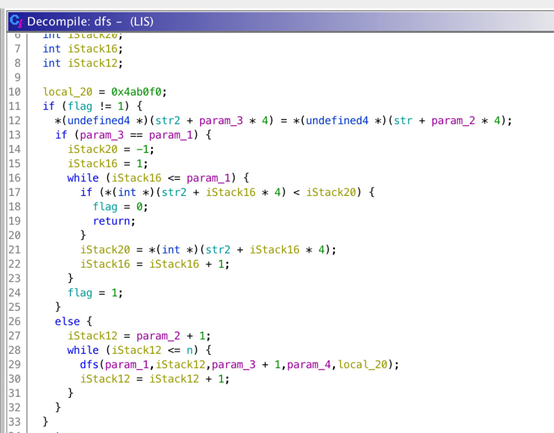
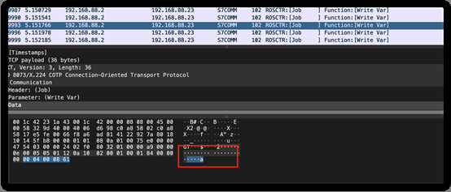

# 工业信息安全技能大赛2020_济南站

## 地址

https://www.wolai.com/ctfhub/aF5bWiCbuCN8B17AhaCz9m

# 协议精准定位分析

## WriteUp来源

来自`MO1N`战队

## 题目描述

> 企业自动化运维管理员最近发现某工控设备频繁出现可疑地流量，请您帮助他分析确认一下问题。Flag格式为：flag{}。

## 题目考点


## 解题思路

对流量包进行分析，发现有两个ip频繁的使用tcp协议在进行信息的传输。


追踪一下tcp流，查看一下详情。为了直观，在wireshark中转码


发现LSIS-XGT字样,发现是LSIS-XGT协议,

打开[协议规范说明书XGB_FEnet(080611).pdf](http://www.aspar.com.pl/katalogi/XGB_FEnet(080611).pdf)。

提取出发包内容来,发现发包有两种长度的包,收包也有两种长度的包,

```text
发
4c5349532d58475400000000a03300001600034758001400000001000600254d4232303004007d000000
4c5349532d58475400000000a03300001200034354001400000001000600254d423230300100

收
4c5349532d58475400110100a01100000a00034759001400080100000100
4c5349532d58475400110100a01100000d00034355001400080100000100010000
```

首先根据协议类型分析发送包的第一个包

`4c5349532d58475400000000a03300001600034758001400000001000600254d4232303004007d000000`

首先LSIS Header 长度为20个字节,

`4c5349532d58475400000000a033000016000347 `为header

再往后面两个字节`5800`表示写操作，往后两个字节`1400`表示数据类型,

再往后6个字节`000001000600 `表示`Reseverd area`, `Number of blocks` 和 `length of variables `可以先不关注

取最后一部分进行关注分析`254d4232303004007d000000`


解码,继续分析文档


其中前面的`254d42323030 `即 `%MB200`, 表示写入地址，`0400`表示写入数据长度，`7d000000` 四个字节正好是上面的写入长度

到这,这个协议其中一种发包情况就分析结束，其他的发包和回包都能通过协议手册进行分析。

此题的考点就在上述分析的这种类型的包内,而且写入的4个字节,后三个字节都是空的,

追踪流之后,可以将整个流的raw数据复制出来,然后,用脚本取出上面7d000000位置的数据来进行分析.


```Python
#coding:utf-8
import os
import base64

lines = open('./提取出的数据.txt').readlines()
flag = ''
for line in lines:
    line = line.strip()
    if len(line) == 84:
        t = line[76:78]
        x = int(t,16)
        y = chr(x)
        flag += y
    else:
        pass
    print(flag[::-1])
```

## Flag

```text
flag{c93650241853da240f9760531a79cbcf}
```

# 奇怪的声音

## WriteUp来源

来自`MO1N`战队

## 题目描述

> 某工控环境中泄露了某些奇怪的声音，你能获取到flag吗?Flag格式为：flag{}。

## 题目考点

- 隐写
- SSTV

## 解题思路

通过binwalk查看图片类型，使用-Me对文件进行分离


分离后发现出现几个文件


ICS.mp3，根据听到的声音猜测是SSTV编码，常见使用是在国际空间站进行图像传输的编码方式，使用的是彩色顺序制，将图像分解为扫描线后再将每条三基色单线，按照一定的次序，将每条三基色单线信号变换为不同的音频信号逐一发送出去，发送顺序一般为红色、蓝色和绿色，三基色中的每一种颜色在发送时都使用相同的速率，因而时间也是相等的，SCOTTIE和MARTIN也是这种方式，SSTV的YC制是为了缩短图片的传送时间出现的。典型的做法是将两路色差信号压缩成一个Y信号的周期来发送，也就是时间压缩，在电脑使用ROBOT36的方式转换SSTV。

|方式组|方式名|彩色类型|时间( 秒)|扫描线数|单像素占时间  (毫秒)|VIS|标题行|
|-|-|-|-|-|-|-|-|
|SCOTTIE|S1|RGB|110|240|432|60|16|
|S2|RGB|71|240|275|56|16||
|S3|RGB|55|240/2|432|52|8||
|S4|RGB|36|240/2|275|48|8||
|DX|RGB|269|240|1079|76|16||
|MARTIN|M1|RGB|114|240|454|44|16|
|M2|RGB|58|240|214|40|16||
|M3|RGB|57|240/2|454|36|8||
|M4|RGB|29|240/2|214|32|8||
|HQ1|Y+C/2|90|240|535|41|16||
|HQ2|Y+C/2|112|240|666|42|16||
|ROBOT  <br>BLACK-WHITE|8|BW|8|120|181|2|16|
|12|BW|12|120|275|6|16||
|24|BW|24|240|275|10|无||
|36|BW|36|240|431|14|无||
|ROBOT COLOUR|12|Y+R/B|12|120|183|0|16|
|24|Y+C/2|24|120|284|4|16||
|36|Y+R/B|36|240|275|8|16||
|72|Y+C/2|72|240|431|12|16||
|AVT|24|RGB|24|120|260|64|16|
|90|RGB|90|240|489|68|无||
|94|RGB|94|200|489|72|无||
|188|RGB|188|400|489|76|无||
|125|BW|125|400|489|80|16||
|PASOKON TV  <br>HIGH  <br>RESOLUTION|P3|RGB|203|16+480|208|113|16|
|P5|RGB|305|16+480|312|114|16||
|P7|RGB|406|16+480|416|115|16||
|PD|PD50|YC|51|240|286|93|16|
|PD90|YC|90|240|532|99|16||
|PD120|YC|126|480|190|95|16||
|PD160|YC|161|384|382|98|16||
|PD180|YC|187|480|286|96|16||
|PD240|YC|248|480|382|97|16||
|PD290|YC|290|600|286|94|16||
|WRAASE  <br>SC-1|24|RGB|24|120|||8|
|48|RGB|48|240|||16||
|96|RGB|96|240|||16||
|WRAASE  <br>SC-2|30|R/2+G+B/2|30|240/2|368|51|8|
|60|R/2+G+B/2|60|240|368|59|16||
|120|R/2+G+B/2|120|240|735|63|16||
|180|RGB|180|240|735|55|16||
|J.A.||||480||||
|PROSKAN|J120|RGB|120|240|||16|
|WINPIXPRO|GVA125|BW|125|480||||
|GVA125|RGB|125|240|||16||
|GVA250|RGB|250|480|||||
|MSCAN|TV1|||||||
|TV2||||||||


SCOTTIE2的方式组里RGB的扫描线数，单像素占时间为275，robot36进行对音频图像传输的解码，以下为解码后的图像


以下两份代码合并到一起

```Python
import numpy as np
import soundfile
from PIL import Image
from scipy.signal.windows import hann

from . import spec
from .common import log_message, progress_bar


def calc_lum(freq):
    """Converts SSTV pixel frequency range into 0-255 luminance byte"""

    lum = int(round((freq - 1500) / 3.1372549))
    return min(max(lum, 0), 255)


def barycentric_peak_interp(bins, x):
    """Interpolate between frequency bins to find x value of peak"""
    # Takes x as the index of the largest bin and interpolates the
    # x value of the peak using neighbours in the bins array
    # Make sure data is in bounds
    y1 = bins[x] if x <= 0 else bins[x-1]
    y3 = bins[x] if x + 1 >= len(bins) else bins[x+1]

    denom = y3 + bins[x] + y1
    if denom == 0:
        return 0  # erroneous
    return (y3 - y1) / denom + x


class SSTVDecoder(object):
    """Create an SSTV decoder for decoding audio data"""
    def __init__(self, audio_file):
        self.mode = None
        self._audio_file = audio_file
        self._samples, self._sample_rate = soundfile.read(self._audio_file)

        if self._samples.ndim > 1:  # convert to mono if stereo
            self._samples = self._samples.mean(axis=1)

    def __enter__(self):
        return self

    def __exit__(self, exc_type, exc_val, traceback):
        self.close()

    def __del__(self):
        self.close()

    def decode(self, skip=0.0):
        """Attempts to decode the audio data as an SSTV signal
        Returns a PIL image on success, and None if no SSTV signal was found
        """

        if skip > 0.0:
            self._samples = self._samples[round(skip * self._sample_rate):]

        header_end = self._find_header()

        if header_end is None:
            return None

        self.mode = self._decode_vis(header_end)

        vis_end = header_end + round(spec.VIS_BIT_SIZE * 9 * self._sample_rate)

        image_data = self._decode_image_data(vis_end)

        return self._draw_image(image_data)

    def close(self):
        """Closes any input files if they exist"""

        if self._audio_file is not None and not self._audio_file.closed:
            self._audio_file.close()

    def _peak_fft_freq(self, data):
        """Finds the peak frequency from a section of audio data"""

        windowed_data = data * hann(len(data))
        fft = np.abs(np.fft.rfft(windowed_data))

        # Get index of bin with highest magnitude
        x = np.argmax(fft)
        # Interpolated peak frequency
        peak = barycentric_peak_interp(fft, x)

        # Return frequency in hz
        return peak * self._sample_rate / len(windowed_data)

    def _find_header(self):
        """Finds the approx sample of the end of the calibration header"""

        header_size = round(spec.HDR_SIZE * self._sample_rate)
        window_size = round(spec.HDR_WINDOW_SIZE * self._sample_rate)

        # Relative sample offsets of the header tones
        leader_1_sample = 0
        leader_1_search = leader_1_sample + window_size

        break_sample = round(spec.BREAK_OFFSET * self._sample_rate)
        break_search = break_sample + window_size

        leader_2_sample = round(spec.LEADER_OFFSET * self._sample_rate)
        leader_2_search = leader_2_sample + window_size

        vis_start_sample = round(spec.VIS_START_OFFSET * self._sample_rate)
        vis_start_search = vis_start_sample + window_size

        jump_size = round(0.002 * self._sample_rate)  # check every 2ms

        # The margin of error created here will be negligible when decoding the
        # vis due to each bit having a length of 30ms. We fix this error margin
        # when decoding the image by aligning each sync pulse

        for current_sample in range(0, len(self._samples) - header_size,
                                    jump_size):
            # Update search progress message
            if current_sample % (jump_size * 256) == 0:
                search_msg = "Searching for calibration header... {:.1f}s"
                progress = current_sample / self._sample_rate
                log_message(search_msg.format(progress), recur=True)

            search_end = current_sample + header_size
            search_area = self._samples[current_sample:search_end]

            leader_1_area = search_area[leader_1_sample:leader_1_search]
            break_area = search_area[break_sample:break_search]
            leader_2_area = search_area[leader_2_sample:leader_2_search]
            vis_start_area = search_area[vis_start_sample:vis_start_search]

            # Check they're the correct frequencies
            if (abs(self._peak_fft_freq(leader_1_area) - 1900) < 50
               and abs(self._peak_fft_freq(break_area) - 1200) < 50
               and abs(self._peak_fft_freq(leader_2_area) - 1900) < 50
               and abs(self._peak_fft_freq(vis_start_area) - 1200) < 50):

                stop_msg = "Searching for calibration header... Found!{:>4}"
                log_message(stop_msg.format(' '))
                return current_sample + header_size

        log_message()
        log_message("Couldn't find SSTV header in the given audio file",
                    err=True)
        return None


```

```Python

    def _decode_vis(self, vis_start):
        """Decodes the vis from the audio data and returns the SSTV mode"""

        bit_size = round(spec.VIS_BIT_SIZE * self._sample_rate)
        vis_bits = []

        for bit_idx in range(8):
            bit_offset = vis_start + bit_idx * bit_size
            section = self._samples[bit_offset:bit_offset+bit_size]
            freq = self._peak_fft_freq(section)
            # 1100 hz = 1, 1300hz = 0
            vis_bits.append(int(freq <= 1200))

        # Check for even parity in last bit
        parity = sum(vis_bits) % 2 == 0
        if not parity:
            raise ValueError("Error decoding VIS header (invalid parity bit)")

        # LSB first so we must reverse and ignore the parity bit
        vis_value = 0
        for bit in vis_bits[-2::-1]:
            vis_value = (vis_value << 1) | bit

        if vis_value not in spec.VIS_MAP:
            error = "SSTV mode is unsupported (VIS: {})"
            raise ValueError(error.format(vis_value))

        mode = spec.VIS_MAP[vis_value]
        log_message("Detected SSTV mode {}".format(mode.NAME))

        return mode

    def _align_sync(self, align_start, start_of_sync=True):
        """Returns sample where the beginning of the sync pulse was found"""

        # TODO - improve this

        sync_window = round(self.mode.SYNC_PULSE * 1.4 * self._sample_rate)
        align_stop = len(self._samples) - sync_window

        if align_stop <= align_start:
            return None  # Reached end of audio

        for current_sample in range(align_start, align_stop):
            section_end = current_sample + sync_window
            search_section = self._samples[current_sample:section_end]

            if self._peak_fft_freq(search_section) > 1350:
                break

        end_sync = current_sample + (sync_window // 2)

        if start_of_sync:
            return end_sync - round(self.mode.SYNC_PULSE * self._sample_rate)
        else:
            return end_sync

    def _decode_image_data(self, image_start):
        """Decodes image from the transmission section of an sstv signal"""

        window_factor = self.mode.WINDOW_FACTOR
        centre_window_time = (self.mode.PIXEL_TIME * window_factor) / 2
        pixel_window = round(centre_window_time * 2 * self._sample_rate)

        height = self.mode.LINE_COUNT
        channels = self.mode.CHAN_COUNT
        width = self.mode.LINE_WIDTH
        # Use list comprehension to init list so we can return data early
        image_data = [[[0 for i in range(width)]
                       for j in range(channels)] for k in range(height)]

        seq_start = image_start
        if self.mode.HAS_START_SYNC:
            # Start at the end of the initial sync pulse
            seq_start = self._align_sync(image_start, start_of_sync=False)
            if seq_start is None:
                raise EOFError("Reached end of audio before image data")

        for line in range(height):

            if self.mode.CHAN_SYNC > 0 and line == 0:
                # Align seq_start to the beginning of the previous sync pulse
                sync_offset = self.mode.CHAN_OFFSETS[self.mode.CHAN_SYNC]
                seq_start -= round((sync_offset + self.mode.SCAN_TIME)
                                   * self._sample_rate)

            for chan in range(channels):

                if chan == self.mode.CHAN_SYNC:
                    if line > 0 or chan > 0:
                        # Set base offset to the next line
                        seq_start += round(self.mode.LINE_TIME *
                                           self._sample_rate)

                    # Align to start of sync pulse
                    seq_start = self._align_sync(seq_start)
                    if seq_start is None:
                        log_message()
                        log_message("Reached end of audio whilst decoding.")
                        return image_data

                pixel_time = self.mode.PIXEL_TIME
                if self.mode.HAS_HALF_SCAN:
                    # Robot mode has half-length second/third scans
                    if chan > 0:
                        pixel_time = self.mode.HALF_PIXEL_TIME

                    centre_window_time = (pixel_time * window_factor) / 2
                    pixel_window = round(centre_window_time * 2 *
                                         self._sample_rate)

                for px in range(width):

                    chan_offset = self.mode.CHAN_OFFSETS[chan]

                    px_pos = round(seq_start + (chan_offset + px *
                                   pixel_time - centre_window_time) *
                                   self._sample_rate)
                    px_end = px_pos + pixel_window

                    # If we are performing fft past audio length, stop early
                    if px_end >= len(self._samples):
                        log_message()
                        log_message("Reached end of audio whilst decoding.")
                        return image_data

                    pixel_area = self._samples[px_pos:px_end]
                    freq = self._peak_fft_freq(pixel_area)

                    image_data[line][chan][px] = calc_lum(freq)

            progress_bar(line, height - 1, "Decoding image...")

        return image_data

    def _draw_image(self, image_data):
        """Renders the image from the decoded sstv signal"""

        # Let PIL do YUV-RGB conversion for us
        if self.mode.COLOR == spec.COL_FMT.YUV:
            col_mode = "YCbCr"
        else:
            col_mode = "RGB"

        width = self.mode.LINE_WIDTH
        height = self.mode.LINE_COUNT
        channels = self.mode.CHAN_COUNT

        image = Image.new(col_mode, (width, height))
        pixel_data = image.load()

        log_message("Drawing image data...")

        for y in range(height):

            odd_line = y % 2
            for x in range(width):

                if channels == 2:

                    if self.mode.HAS_ALT_SCAN:
                        if self.mode.COLOR == spec.COL_FMT.YUV:
                            # R36
                            pixel = (image_data[y][0][x],
                                     image_data[y-(odd_line-1)][1][x],
                                     image_data[y-odd_line][1][x])

                elif channels == 3:

                    if self.mode.COLOR == spec.COL_FMT.GBR:
                        # M1, M2, S1, S2, SDX
                        pixel = (image_data[y][2][x],
                                 image_data[y][0][x],
                                 image_data[y][1][x])
                    elif self.mode.COLOR == spec.COL_FMT.YUV:
                        # R72
                        pixel = (image_data[y][0][x],
                                 image_data[y][2][x],
                                 image_data[y][1][x])
                    elif self.mode.COLOR == spec.COL_FMT.RGB:
                        pixel = (image_data[y][0][x],
                                 image_data[y][1][x],
                                 image_data[y][2][x])

                pixel_data[x, y] = pixel

        if image.mode != "RGB":
            image = image.convert("RGB")

        log_message("...Done!")
        return image


```


## Flag

```text
flag{no32dpi3194dof2}
```

# 司机的身份

## WriteUp来源

来自`MO1N`战队

## 题目描述

> 小明是一个卡车公司的管理员，他需要知道其中一辆卡车司机的身份信息，你能帮他找出来吗？Flag格式为：flag{}。

## 题目考点

- T808协议
- 新约加密

## 解题思路

根据题目的提示信息, 信息隐藏在司机信息中.

找到驾驶员身份信息采集上报报文,将报文内容复制出来.

将报文用`T808`软件进行解析, 将驾驶员姓名复制出来,进行后续解析.


驾驶员身份信息采集上报的消息ID:`0x0702`

|起始字节|字段|数据类型|描述|
|-|-|-|-|
|0|驾驶员姓名长度|BYTE||
|1|驾驶员姓名|STRING|驾驶员姓名,长度n|
|1+n|驾驶员身份证编码|STRING|长度20位|
|21+n|从业资格证编码|STRING|长度40位|
|61+n|发证机构名称长度|BYTE|长度m|
|61+n+m|发证机构名称|STRING|从业资格证发证机构名称|


主要分析在协议中驾驶员的信息，hint中有提示说想要获取驾驶员信息，所以这里只需要分析姓名等一些信息即可，正常人姓名一般不会有84位那么长，所以在流量中分析出协议即可看出端倪，

这里驾驶员姓名是16进制

```text
8af896b850e7964d543d8af89640646996b850e77f3d85a9985876a4802876a4773e52ab963f621176a46167963f4ea676a4621154c6515c964d56a47957610d76a48fe695cd773e76a496404ea6805e5ba354a48fe652ab85a956c9610d805e980876a4585e8fe676a48ae64ea652ab4ea676a495cd985876a454a44fee95cd85a956a45ba376a4621183e983e976a48fe6805e8ae65a464ea6805e76a4963f85a96240985859827a7a5982598256d176a456d1
```


对16进制转换成字符串即可查看到新佛经密码。

```text
諸隸僧降吽諸陀摩隸僧缽薩願皤耨皤眾劫阿我皤慧阿亦皤我哆兜降嚤祗愍皤迦闍眾皤陀亦聞宣咤迦劫薩囉愍聞須皤塞迦皤諦亦劫亦皤闍願皤咤修闍薩嚤宣皤我菩菩皤迦聞諦婆亦聞皤阿薩所願如空如如囑皤囑
```

根据题目可知为佛经解密，但是在与佛论禅的网站解密失败

我们已知有两个版本的与佛论禅，所以猜测为新约


根据解密结果分辨为base64


发现满足base32的特征


## Flag

```text
flag{Crypy01sFuN}
```

# 泄露的信号

## WriteUp来源

来自`MO1N`战队

## 题目描述

> 安全研究员研究工控设备发出的无线信号进行研究，发现了一些不一样的东西。Flag格式为：flag{}。

## 题目考点

- 频谱图分析

## 解题思路

将图片转化为信号在频谱图上呈现出来，考题难点在于修改信号文件的采样率，通过调整采样率显示出flag。

有两种解法

### 解法1

将图片转化为信号在频谱图上呈现出来，考题难点在于修改信号文件的采样率，通过调整采样率显示出flag。

### 解法2

1、可以使用查看频谱图的软件


## Flag

```text
flag{1cbnz723x81il1812ss2}
```

# 工控大楼的道闸怎么坏了

## WriteUp来源

来自`MO1N`战队

## 题目描述

> 某工控大楼道闸数据分析，你能获取到flag吗？Flag格式为：flag{}。

## 题目考点

- 无线信号分析

## 解题思路

无线信号分析题，`em1527`协议，考点主要在分析32位数据，而32位中8位的同步码位并不需要，所以还剩24位主要数据，而20位为固定码位、4位数据码位。

最后一位为下一帧的无线信号，所以在分析时坑就在这里


一帧信号的编码格式为 => `8位同步码 + 20位内码 + 4位数据码`

- 0码, 对应1个高电平+3个低电平

- 1码, 对应3个高电平+1个低电平

- 同步码, 对应1个高电平+31个低电平

也就是说，同步码=`10000000000000000000000000000000`，0码=`1000`，1码=`1110`


使用`urh`、`Audacity`、`inspectrum`、都可以看到分析出来的数据`101010110010110010000001`

只需要转换成16进制即可，而且文件名有提示iiiiicccccssssshhhhheeeeexxxxx就是ics hex一下。

## Flag

```text
flag{ab2c81}
```

# COTP

## WriteUp来源

来自`MO1N`战队

## 题目描述

> 某工程师在运维中发现了设备的某些异常，怀疑可能遭受到了黑客的攻击，请您通过数据包帮助运维人员确定出被遭到了攻击的数据包。Flag格式为：flag{hex的data数据包后90位}

## 题目考点

## 解题思路


## Flag

```text
flag{31312D31424535312D30584230203B56332E308240001505323B32383882410003000300A20000000072010000}
```

# ddddynamic

## WriteUp来源

来自`MO1N`战队

## 题目描述

> 某工控设备突然运行变慢，似乎是在计算着什么东西，请您帮助他进行分析。Flag格式为：flag{}。

## 题目考点

- mipsel逆向

## 解题思路

mipsel的程序，使用ghidra进行分析

提示说在很长时间以后会输出flag，猜测要进行算法的优化

观察solve函数与dfs函数




发现实质是一个最长上升子序列，自己进行优化算法即可

```c
#include <stdio.h>
#include <string.h>
int dp[10050];
int arr[10050], ans[15];
int n;

int max(int a, int b) {
    if (a >= b) {
        return a;
    } else {
        return b;
    }
}

int solve() {
    for (int i = 1; i <= n; i++) {
        arr[i] = rand() % 11;
        dp[i] = 1;
    }
    int maxx = 0;
    for (int i = 1; i <= n; i++) {
        for (int j = 1; j < i; j++) {
            if (arr[j] <= arr[i]) {
                dp[i] = max(dp[i], dp[j] + 1);
            }
        }
        maxx = max(maxx, dp[i]);
    }
    return maxx % 256 + 34;
}

int main() {
    srand(0x666c6167);
    n = 10000;
    for (int i = 1; i <= 10; i++) {
        ans[i] = solve();
        printf("%d ", ans[i]);
    }
    printf("\n");
    char output[18];
    output[0] = 'f';
    output[1] = 'l';
    output[2] = 'a';
    output[3] = 'g';
    output[4] = '{';
    for (int i = 5; i < 5 + 10; i++) {
        output[i] = ans[i - 4];
    }
    output[15] = '}';
    output[16] = '\x00';
    printf("%s", output);
    return 0;
}
```

## Flag

```text
flag{cZDdYCObrW}
```

# 某嵌入式设备固件升级包

## WriteUp来源

来自`MO1N`战队

## 题目描述

> 对于嵌入式设备，升级包中含有真正的固件，在漏洞挖掘之前有必要对固件进行一些处理，提高分析效率。对UpgradePackage.bin进行分析，列出固件符号表项数(4bytes)、bsolute__C14SequenceNumber函数所对应的文件偏移(4bytes)。flag{符号表项数+函数文件偏移}，为十六进制8字节数据\n注：不足四字节高位补0 ，例：symbol_item_counts：0x112233 补齐4字节：0x00112233。

## 题目考点

- 固件分析
- VxWorks

## 解题思路

### 固件分析

通过Binwalk进行自动分析可以发现，NOE 771模块的升级包NOE77101.bin中内嵌了一个使用zlib压缩的文件。 


通过调用Binwalk的-e参数进行自动提取后，Binwalk会把自动提取后的文件以偏移地址命名并存储在特定的目录中。


继续使用Binwalk对提取的385文件进行分析可以确认，该文件的确是我们所需要分析的VxWorks固件，因此提取的385文件也就是我们需要分析的固件文件了。 


### 分析固件内存加载地址

为了对VxWorks系统固件进行逆向分析，我们首先必须要知道固件在内存中的加载地址。加载地址的偏差会影响到一些绝对地址的引用例如跳转函数表、字符串表的引用等。

下图是VxWorks系统在PowerPC架构下的内存分布图，如图所示VxWorks的系统固件将会被加载到一个由BSP (Board Support Package)定义的内存地址中。


#### 分析固件头部的初始化代码，寻找加载地址的特征

在很多情况下我们拿到的固件是没有采用ELF格式封装的，这时就需要我们通过对固件的某些特征进行分析来判断具体的加载地址。还是以施耐德的NOE 711固件为例, 在具体分析某个固件时首先我们需要知道目标设备的CPU架构，具体可以如下图所示通过`binwalk -A`指令来对固件的CPU架构进行分析。


在得知目标CPU架构后就可以使用IDA加载固件并对其代码进行初步分析。 


下图是默认加载后的IDA界面，仅仅分析出了极少数的函数。接下来就需要根据固件头部的这段代码来寻找加载地址的特征。 


在固件头部有如下图所示的一段有趣的代码，在对r1和r3寄存器进行赋值后进行了跳转。


#### 指令解析 (lis:立即数载入并左移)

```NASM
lis r3,0x1234
addi r3,r3,0x5678 
```

PowerPC的每条指令都是32bit，除去指令和寄存器参数编码，只剩下16bit的长度描述立即数，如立即数加载指令`li`


这样立即数SIMM只有16位，所以需要两次加载，使用lis(立即数载入并左移)和addi(立即数加法)两条指令完成。

#### PowerPC寄存器

下图是PowerPC的寄存器用途说明，从图中可以看到R1寄存器是栈指针，而R3寄存器则是第一个参数。


现在回到我们之前看的固件头部代码处，这段代码相当于是先将栈地址设置为0x10000，将第一个参数(r3寄存器)设置为0x0，随后在栈上开辟0x10个字节的空间后跳转到当前地址+0x1cd34处执行。


根据VxWorks官网文档对对内存布局的描述，Initial Stack是usrInit函数的初始化栈。 


而usrInit函数则是VxWorks系统引导后运行的第一个函数，再结合之前我们分析的那段代码，可以基本确定在大部分情况下第一个跳转的地址就是usrInit这个函数的地址。


随后我们再回忆一下之前看到的VxWorks PowerPC内存布局图可以发现，初始化栈的地址同时也是固件的内存加载地址，因此r1寄存器指向的**0x10000**就是我们所寻找的固件加载地址。


在分析出固件加载地址后就可以使用新的加载地址重新加载固件进行分析了,通过ida修改加载基址


设置value:`0x10000`


### 利用符号表修复函数名

虽然IDA此时能够正确的识别函数及其调用关系，但依然无法自动识别出函数名，这对固件的分析工作造成了很大的阻碍。 此时可以查看固件在编译时是否编入了符号表，如固件编入了符号表那么我们就可以利用符号表中的内容来修复IDA中所显示的函数名。

通过使用binwalk可以帮助我们辅助分析VxWorks固件中是否编入了符号表，并识别出符号表在固件中的位置。如下图所示binwalk识别出的符号表地址在文件偏移**0x301E74**处。


如下图所示，VxWorks 5系列的符号表有他独特的格式，他以16个字节为一组数据，前4个字节是0x00，之后是`符号名字符串所在的内存地址，后4个字节是符号所在的内存地址`，最后4个字节是符号的类型，例如0x500为函数名。


函数名字符串内存地址：`0x0027655C` 

ROM**`:0x0027655C`** aADecodeinteger:.string "A_DecodeInteger" 

函数内存地址：`0x001FF058`


基于符号表的特征，我们能够轻松的获取到固件中符号表的起始及结束位置。

symbos_table_start = 0x301e60

symbol_table_end = 0x3293b0


此时我们就可以使用IDA的api来修复函数名，使用加载地址0x00重新加载固件后使用如下图所示的Python脚本即可进行修复。

```Python
# coding=utf-8
from idaapi import *
import time

# 符号表间隔
symbol_interval = 16

# 固件内存加载地址
load_address = 0x10000

#符号表在内存中的起始地址
symbos_table_start = 0x301e60 + load_address
# 符号表在内存中结尾地址
symbol_table_end =0x3293b0 + load_address
# 符号表项数
symbol_item_counts = 0x2755

# 在IDA 中rebase 程序到加载地址
# 修改基地址
rebase_program(load_address, 0x0008)

#调用IDA的自动分析功能
autoWait()

ea = symbos_table_start
while ea < symbol_table_end:
    offset = 4 # 每4个字节为一组数据

    # 将函数名指针位置的数据转化为字符串
    MakeStr(Dword(ea + offset),BADADDR)
    # 将函数名赋值给变量sName
    sName = GetString(Dword(ea + offset), -1, ASCSTR_C)
    print sName
    if sName:
        # 开始修复函数名
        eaFunc = Dword(ea + offset + 4)
        MakeName(eaFunc, sName)
        MakeCode(eaFunc)
        MakeFunction(eaFunc,BADADDR)
    ea += symbol_interval

```

完成函数名修复后的IDA界面如下图所示，通过修复符号表IDA识别出了8000多个函数。至此VxWorks系统固件的预处理工作就全部完成了，现在我们就可以根据函数名来对一些关键服务的代码进行静态分析了。


最终得出

symbol_table_start `= 0x00301e60`

symbol_table_end `= 0x003293b0`

symbol_item_counts `= 0x00002755`

offset_bsolute__C14SequenceNumber `= 0x0011fd38 - 0x10000 = 0x0010FD38`

`0x0011fd38`为函数内存地址， `0x10000`为固件加载地址， `0x0010FD38`为函数文件偏移

## Flag

```text
flag{000027550010FD38}
```

# 工业物联网智能网关数据分析

## WriteUp来源

来自`MO1N`战队

## 题目描述

> 某工控内网环境有台设备环境被破坏了,安全人员想通过当时抓的流量包进行溯源, 你能帮他发现什么东西么?Flag格式为：flag{}。

## 题目考点

- MQTT协议
- zip文件格式
- LSB隐写

## 解题思路

### 1. 分析流量包

对流量包进行分析，发现其中有mqtt协议的数据包。


MQTT是一个基于客户端-服务器的消息发布/订阅传输协议。MQTT协议是轻量、简单、开放和易于实现的，这些特点使它适用范围非常广泛。在很多情况下，包括受限的环境中，如：机器与机器（M2M）通信和物联网（IoT）。其在，通过卫星链路通信传感器、偶尔拨号的医疗设备、智能家居、及一些小型化设备中已广泛使用。

### 2. 过滤出MQTT

在wireshark中过滤一下mqtt协议相关的数据包进行分析。


过滤后，发现数据包存在异常。查看每条流量信息中的内容。

### 3. 找到可疑字符串

当查看到[d]的时候，出现了一串可疑的字符串


`pass_1s_ea4y`然而这并不是flag，在这里把它记录下来，留作后续使用。

### 4. 追踪流

继续按照同样的方法，追踪每条信息的分组字节流。


当分析到[f]这条流量信息的时候，里面的内容出现了`504B0304`字符串，显然这是一个zip压缩包的文件头。尝试提取字符串还原成压缩包。

### 5. 还原ZIP

显然，光是[f]里面的字符串不足以构成一个zip，但是确实是zip文件的16进制头。尝试用相同的方法找到zip的十六进制字符串的其他部分。既然在[f]中找到了头部，而flag中的f也是位于头部，猜想完整的zip是由[f],[l],[a],[g]中的数据信息构成。提取出其中的信息。


提取出字符串


### 6.保存zip文件

在winhex或hex fiend中还原为zip格式，保存为123.zip，成功还原出zip压缩包


### 7. 压缩包密码破解

打开压缩包提示需要密码，之前在[d]中，已经得到一个特殊的字符串，`pass_1s_ea4y`，尝试作为解压密码。成功解压，得到一张图片。

### 8. 修复图片

怀疑密码就藏在图片之中，得到的图片是半张二维码，尝试根据图片十六进制信息还原图片,查看图片的详细信息，将宽度和高度的像素值转换成对应的16进制数值，通过这个操作，当使用winhex打开图片时，可以比较快速的定位出代表长宽的区域，便于修改。


如上图，`130`对应为`0x82`，`260`对应为`0x104`，只需要在winhex中把`0082`改成`0104`，即可把高度也调成了260像素。


调整后，出现了一半的flag


### 9. 图片隐写分析

使用stegsolve打开图片。在red，green，blue为0的时候，存在显示异常。


### 10. LSB隐写分析

可以推测，应该是考察lsb隐写的相关知识,使用stegsolve分离出里面隐藏的信息。


lsb技术（LSB全称leastsignificant bit，是一种基于图片最低有效位修改储存信息的隐写方法），在里面隐藏着一张png的图片。点击下方的save bin按键，保存为后缀为png的文件。就可把隐藏的png提取出来。


### 11. 拼接二维码

现在我们已经得到了半个flag，并且得到了两个半张的二维码图片，尝试拼接二维码。


发现二维码经过了反色处理，使用PS（快捷键`Ctrl+I`），将二维码进行反色，恢复原来的样子。


### 12. 扫描二维码

使用QR Research进行扫码，可得到后半段flag。


## Flag

```text
flag{21png_LSB_is_easy}
```

# 被篡改的数据

## WriteUp来源

来自`MO1N`战队

## 题目描述

> 某黑客拿到上位机的权限后对工控设备存储的数据进行了大量的修改，请分析其攻击数据，并找到其中的flag信息。Flag格式为：flag{}。

## 题目考点

- 流量分析
- S7Comm协议分析

## 解题思路

### 1. S7Comm分析

S7Comm（S7 Communication）是西门子专有的协议，是西门子S7通讯协议簇里的一种。S7协议的TCP/IP实现依赖于面向块的ISO传输服务。S7协议被封装在TPKT和ISO-COTP协议中，这使得PDU（协议数据单元）能够通过TCP传送。它用于PLC编程，在PLC之间交换数据，从SCADA（监控和数据采集）系统访问PLC数据以及诊断目的。

### 2. 过滤S7Comm

在过滤器中输入S7Comm，过滤出S7Comm的数据，根据S7Comm的数据格式分析，S7Comm的PDU存在如下两个类型:


运行如下脚本：

```Python
import pyshark
def func_s7():
    try:
        captures = pyshark.FileCapture("")#这里为文件的路径
        func_codes = {}
        for c in captures:
            for pkt in c:
                if pkt.layer_name == "s7comm":
                    if hasattr(pkt, "param_func"):#param_func功能码字段
                        func_code = pkt.param_func
                        if func_code in func_codes:
                            func_codes[func_code] += 1
                        else:
                            func_codes[func_code] = 1
        print(func_codes)
    except Exception as e:
        print(e)
if __name__ == '__main__':
    func_s7()

```


执行后的如图所示，一共存在三种功能码：0x04(读取值 Read Var)出现3984次、0xf0(建立通信 Setup communication)出现2次、0x05(写入值 Write Var)出现4016次。

### 3. 功能码分析

因为异常数据很有可能被黑客写入设备，因此首先重点分析功能码为0x05的流量，在wireshark中过滤流量`s7comm.param.func ==0x05`，其中PDU为Job的数据包是有可能存在黑客写入的数据请求，于是人工审计PDU为Job的数据包。


### 4. 获取Flag

在19987包往后开始出现flag字样




依次提取出来即可

也可以使用脚本来提取

```Python
#!/usr/bin/python2.7.8
#encoding:utf-8

import pyshark

captures = pyshark.FileCapture("s702.pcapng")
list = []
for c in captures:
    for pkt in c:
        if pkt.layer_name == "s7comm" and hasattr(pkt, "param_func"):
            param_func = pkt.param_func
            try:
                if param_func=='0x00000005':
                    list.append(pkt.resp_data)
                else:
                    continue
            except Exception as e:
                print(e)
print (list)
```


## Flag

```text
flag{931377ad4a}
```

# IoT

## WriteUp来源

来自`MO1N`战队

## 题目描述

> 一台奇怪的单片机上运行着奇怪的程序，请您帮助调试相关程序。Flag格式为：flag{}

## 题目考点

- RISC-V逆向

## 解题思路

RISC-V是一个基于[精简指令集](https://baike.baidu.com/item/精简指令集)（RISC）原则的[开源](https://baike.baidu.com/item/开源)[指令集架构](https://baike.baidu.com/item/指令集架构)（ISA）。

与大多数指令集相比，RISC-V指令集可以自由地用于任何目的，允许任何人[设计](https://baike.baidu.com/item/设计)、制造和销售RISC-V[芯片](https://baike.baidu.com/item/芯片)和[软件](https://baike.baidu.com/item/软件)。虽然这不是第一个开源指令集，但它具有重要意义，因为其设计使其适用于现代计算设备（如仓库规模[云计算机](https://baike.baidu.com/item/云计算机)、高端[移动电话](https://baike.baidu.com/item/移动电话)和微小[嵌入式系统](https://baike.baidu.com/item/嵌入式系统)）。设计者考虑到了这些用途中的性能与功率效率。该指令集还具有众多支持的软件，这解决了新指令集通常的弱点。

IDA和ghidra无法直接加载，需要用新的LOADER

[https://github.com/bingseclab/ida_riscv](https://github.com/bingseclab/ida_riscv)

因为RISC-V的汇编并不好分析，选择qemu使用动态调试的方法，注意要使用gdb 8.0+才可以

通过动态调试分析后会发现实际是两个数组进行xor，解密即可

```python
cyt = [
    249, 149, 286, 132,  67,
    286, 328, 390, 356, 264,
    345, 222, 191, 120, 483,
    200, 340, 507, 158, 260
]

xor = [
    159, 249, 383, 227,  56,
    326, 295, 468, 315, 321,
    364, 129, 236,  72, 444,
    141, 309, 392, 231, 377
]

flag = ''
for i in range(len(xor)):
    flag += chr(xor[i]^cyt[i])
print(flag)
```

## Flag

```text
flag{XoR_I5_S0_Easy}
```