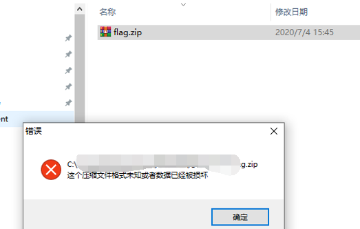
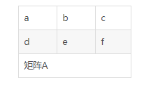
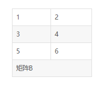
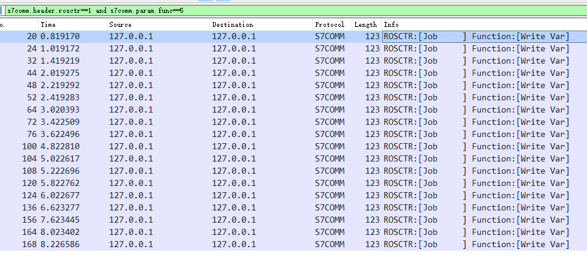

# 工业信息安全技能大赛2020_湖州站

## 地址

https://www.wolai.com/ctfhub/a4zjRaM9ConBcj85php3WL

# 加密后的企业数据

## WriteUp来源

来自`MO1N`战队

## 题目描述

> 工厂内部转发了一个文件，被检查后发现进行传输了企业敏感数据信息，您能帮助检查出传输的企业关键数据么？Flag格式为：flag{}.
Hint：获取到的rar中提示了密码生成方式，最后隐写方式为：0宽度隐写

## 题目考点

## 解题思路

拿到zip压缩包发现无法打开



查看十六进制 符合压缩包的特征，文件头的四字节符合zip特征，但往后符合RAR文件特征


修改文件头后保存rar格式

文件存在密码，压缩包的注释中有给出密码生成方式


编写解密脚本

```Python
import hashlib

def md5(s):
    return hashlib.md5(s.encode(encoding='GB18030')).hexdigest()

for i in range(0,9999999):
    pwd = str(i).rjust(7, '0')
    if "747fa0eb44e6ed5a349497" in md5(pwd):
        print(pwd) 
```

得到密码`5546023`

打开压缩包后发现


打开16进制发现不可显字符串，看到很多0宽度字符，符合0宽度隐写的特征


编写解密脚本

```Python
#!/usr/bin/env python3
#coding: utf-8
import zwsp_steg
# pip3 install zwsp-steg-py

with open("flag.txt", "r") as f:
    flag = f.read()
decoded = zwsp_steg.decode(flag) 
print(decoded) 
# b5e6a6572761cc9c5d8222682fdf5802
```

## Flag

```Python
flag{b5e6a6572761cc9c5d8222682fdf5802}
```

# MMS协议分析

## WriteUp来源

转自[https://www.hyluz.cn/?id=98](https://www.hyluz.cn/?id=98)

## 题目描述

> 某地市自动化网络安全专工对某变电站进行渗透测试，截获通信数据包，发现该场站某主机通过MMS协议进行数据通信。请尝试对截获数据包解析并找出隐藏flag信息，其中flag提交格式为:flag{}。Hint：请先进行凯撒再Hex解密。

## 题目考点

- MMS协议

## 解题思路

打开流量发现MMS协议


不懂协议，也看不懂它在做什么，过滤mms流量粗略地看一看有类似flag的东西

解密完发现部分有意义，最后把所有字母的ascii值-3即可

```Python
import string

flag_enc = "666f61677e494353667h756h7d646173617g"
flag_dec = ""
for c in flag_enc:
    if c in string.digits:
        flag_dec += c
    else:
        flag_dec += chr(ord(c)-3)
# 666c61677b494353667e756e7a646173617d
```

之后转ascii即可

## Flag

```Python
flag{ICSf~unzdasa}
```

# 不安全的无线协议

## WriteUp来源

来自`MO1N`战队

## 题目描述

> 某工控环境中使用了不安全的无线协议，安全人员捕获到相关无线信号，请分析名为POC的附件。flag格式为:flag{}。

## 题目考点

- 流量分析
- Pocsag协议

## 解题思路

Pocsag协议正相地址码为1234567

对pocsag编码进行解密，对照信息码字结构


使用urh对无线信号进行解析


可以看到前置码、sc、0为576+32+64位而1由位编号、地址码字、信息码字、在这里只需要将信息码字解析即可。

同步码字的16进制表示为(`7CD215D8 `),

空闲码字的16进制表示为(`7A89C197`)。

在地址码字中

- 第1位为`0`

- 第2~19位为`地址`

- 20和21位为`状态`

- 22~31位为`BCH校验`

- 第32位为`奇偶校验`

在信息码字中

- 第1位为`1`

- 第2~21位为`信息`

- 22~31位为`BCH校验`

- 第32位为`奇偶校验`

```text
00110110 00110110 00110110 01100011 00110110 00110001
00110110 00110111 00110111 01100010 00110100 00110010
00110110 00110001 00110110 00110100 00110110 01100100
00110011 00110000 00110011 00110000 00110110 00110100
00110111  01100100
```

共208=26*8位

而每一个信息码字里面可以传输20位，则需要3个信息码字方能将数据传输完整:

|位|0|1-20|21-30|31|
|-|-|-|-|-|
|码字1|1|0011 0110 0011 0110 0011|BCH(31,21)值|奇偶校验位|
|码字2|1|0110 0110 0011 0011 0110|BCH(31,21)值|奇偶校验位|
|码字3|1|0011 0001 0011 0110 0011|BCH(31,21)值|奇偶校验位|


在数据传输过程中，如果没有发生错误的话，我们应该接收到的内容应该是：

`1010  1001  1010  0000  1010  0100  1111  1001 数据 (1)`

将接收到的数据(1)与矩阵H进行乘法运算可以得到新矩阵R，称R为伴随式。`R ＝ D * H`

其中 D为数据(1)前31位的1行31列矩阵——奇偶校验位不参加运算 ， H为BCH(31,21)一致校验矩阵的转置矩阵


矩阵的转置矩阵等于原矩阵的行列元素相互交换，如果交换前矩阵元素为M*N，则转置后矩阵为N*M，示例如下:


BCH(31,21)一致校验矩阵为10行31列，则它的转置矩阵H为31行10列，D为1行31列。R＝D*H，则R为1行10列的矩阵。

矩阵乘法示例：






得到R后，我们就可以根据R矩阵来判断具体是哪一位或者哪二位出现的错误，错误的可能只是由1错为0或者相反，发现错误位后直接反转即可纠错。

由前面内容可以知道数据(1)是没有发生错误的，其伴随式R中的所有元素均为0，现将数据(1)第2位反转得到数据(2):

1110  1001  1010  0000  1010  0100  1111  1001 数据 (2)

R2 ＝ D2 *H，对数据(2)进行译码的结果为：0 1 1 1 0 1 1 0 1 0。可见结果与图3中的第二列一模一样，则可以数据(2)的第二位发生了错误，将其反转纠错。

发送的数据为:

```text
0011011000110110001101100110001100110110001100010011011000110111001101110110001000110100001100100011011000110001001101100011010000110110011001000011001100110000001100110011000000110110001101000011011101100100
```

16进制转换成字符串得到:`666c61677b4261646d3030647d`，再进行16进制转换字符串得到flag

## Flag

```text
flag{Badm00d}
```

# 工控协议数据分析

## WriteUp来源

转自[https://www.hyluz.cn/?id=98](https://www.hyluz.cn/?id=98)

## 题目描述

> 运维人员在某工控环境内网发现内网控制系统被攻破,附件为从现场抓取的报文, 请通过分析报文,得出黑客都获取到了哪些信息?flag格式为:flag{}。

## 题目考点

- 流量分析

- S7Comm协议分析

## 解题思路

Wireshark打开


发现部分S7COMM请求是带data的，data中含有bin数据，分析之后发现所有的`Job`中`Write Var`是含有flag的二进制的，把所有bin数据提取出来



```text
01100110
01101100
01100001
01100111
01111011
01100110
01101100
01100001
01100111
01011111
01101001
01110011
01011111
01101000
01100101
01110010
01100101
01111101
```

bin转ascii即可

## Flag

```text
flag{flag_is_here}
```