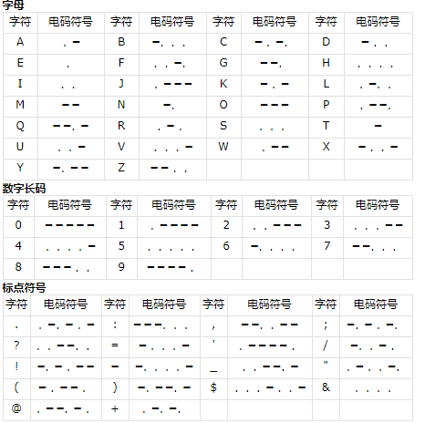
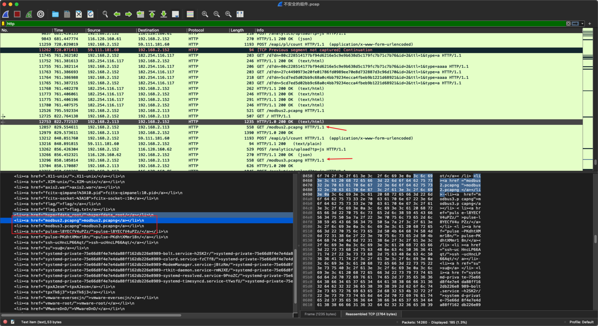

# 工业信息安全技能大赛2020_石家庄站

## 地址

https://www.wolai.com/ctfhub/mebd784o3doRSGoK8PfXp9

# 黑客的Fuzz

## WriteUp来源

来自`MO1N`战队

## 题目描述

> 某黑客拿到上位机的权限后对工控设备进行扫描fuzz攻击，请分析其攻击数据，并找到其中的flag信息。flag格式为：flag{}。
----本题由恒安嘉新贡献

## 题目考点

## 解题思路

使用s7comm协议对读数据包的地址进行提取分析

可以看到读取值16进制为`0x04`

功能码附录：

- `0x00` - CPU services CPU服务

- `0xf0` - Setup communication 建立通信

- `0x04` - Read Var 读取值

- `0x05` - Write Var 写入值

- `0x1a` - Request download 请求下载

- `0x1b` - Download block 下载块

- `0x1c` - Download ended 下载结束

- `0x1d` - Start upload 开始上传

- `0x1e` - Upload 上传

- `0x1f` - End upload 上传结束

- `0x28` - PI-Service 程序调用服务

- `0x29` - PLC Stop 关闭PLC


可以在wireshark中看到读取码0x04和地址码

需要将全部s7协议读取的地址码利用脚本读取出来得到以下文件

```Python
#!/usr/bin/python2.7.8
#encoding:utf-8

#此程序是s703流量的exp，对所有读数据包的地址进行提取分析其规律并查找flag，发现其地址是16进制的图片，将所有的地址取出后还原为图片，找到exif信息中的flag。
import pyshark
captures = pyshark.FileCapture("s703.pcapng")
list = []
for c in captures:
    for pkt in c:
        if pkt.layer_name == "s7comm" and hasattr(pkt, "param_func"):
            param_func = pkt.param_func
            try:
                if param_func=='0x00000004':
                    list.append(pkt.param_item_address)
                    print list
                else:
                    continue
            except Exception as e:
                print(e)

```


使用winhex查看图片中存在的字符串，是隐藏的flag。


## Flag

```text
flag{50f84daf3a6dfd6a9f20c9f8ef428942}
```

# 奇怪的声音

## WriteUp来源

来自`MO1N`战队

## 题目描述

> 某工控环境中又又又又泄露了某些奇怪的声音，你能获取到flag吗?flag格式为：flag{}。----本题由恒安嘉新贡献

## 题目考点

- 摩斯电码

## 解题思路

摩斯码识别，由于是倒放所以导致存在需要判断在摩斯码中是否存在错误电码的情况。



在识别过程中第一个摩斯码为`---.. -- ..... ..--- ---.. ..- -.- --... ....- .... --... -....`

而倒数第二位的`--...`并没有这个莫斯码，所以要将音频文件倒放。

倒放过来得到`....- ...-- .... -.... ...-- -.- -.. ..--- ---.. ..... -- ..---`

经过转换得到`43h63kd285m2`

## Flag

```text
flag{43h63kd285m2}
```

# 不安全的组件

## WriteUp来源

来自`MO1N`战队

## 题目描述

> 工控生产环境内网中使用了不安全的组件，致使黑客突破隔离内网进入工控环境，安全员捕获到相关流量，请分析相关流量。flag格式为：flag{}。----本题由恒安嘉新贡献

## 题目考点

## 解题思路

拿到pacp文件后，筛选http流量，发现存在modbus2和modbus3两个流量包



从HTTP流量中将modbus2.pcap和modbus3.pcap提取出来


筛选modbus流量，在modbus3.pcap里筛选出来写入成功的数据(响应时间大于0)


之后对每个数据转10进制数字，例如`0d69`转10进制为`3433`

```text
3433
0928
4338
0001
8445
6228
7119
5029
8777
7431
8527
4044
9263
3948
3215
0897
9

```

整串数字拼起来转换为16进制之后转换为字符串即为flag


## Flag

```text
flag{St0p_al1_machine_exp1osi0ns}
```

# 隐藏的木马文件

## WriteUp来源

来自`MO1N`战队

## 题目描述

> 小明在工业生产现场的数控机床上发现了一个插着的U盘，u盘中都是些图片和文档，细心的小明总觉得这个文件好像有点异常，作为安全运营人员你能发现这个u盘中是否蕴藏着什么秘密呢？flag格式为：flag{}。------本题由恒安嘉新贡献

## 题目考点

- NTFS流隐写

## 解题思路

ntfs流隐写。NTFS文件系统支持给每个文件添加任意隐藏的数据，所以越来越多威胁采用这个特性隐藏自身。本题就是针对这个特性，对flag进行隐藏。

在解题过程中合理使用工具，因为题目中提到被植入木马病毒，并且所给出的都是些图片以及文本信息。那么合理使用一些ntfs流木马查杀的工具，如scanntfs，NtfsStreamsEditor2等，可以发现正常文件中异常的ntfs流。


查看或导出隐藏的信息进行分析，编写脚本对隐藏的信息进行解密。


编写脚本对这些base64编码进行解密。得到flag。

```text

```


## Flag

```text
flag{8aseIsC0ol}
```