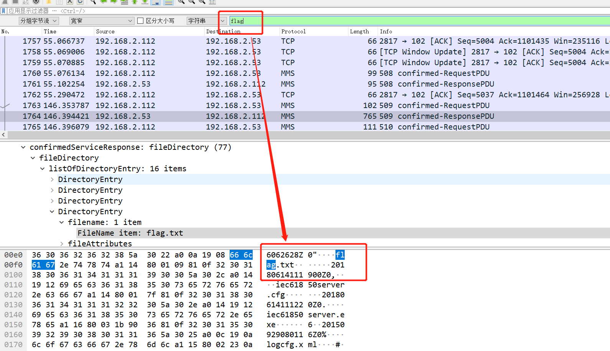
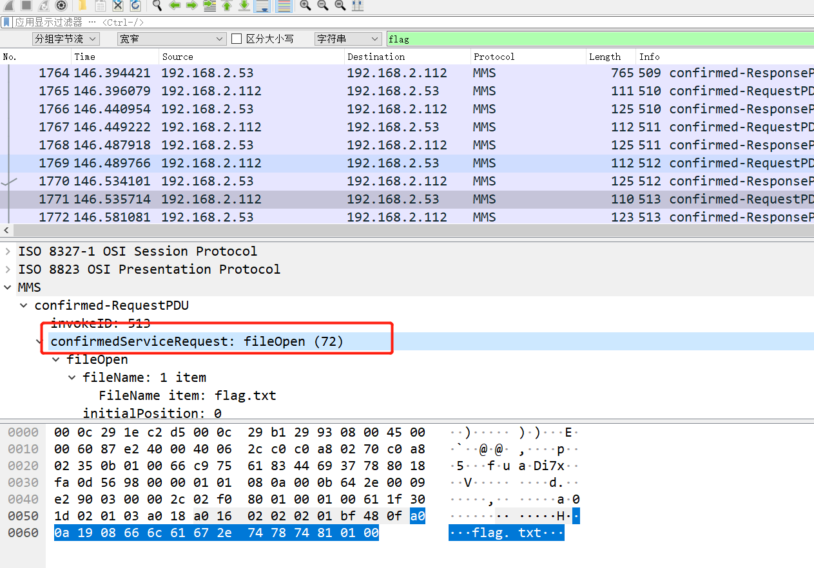
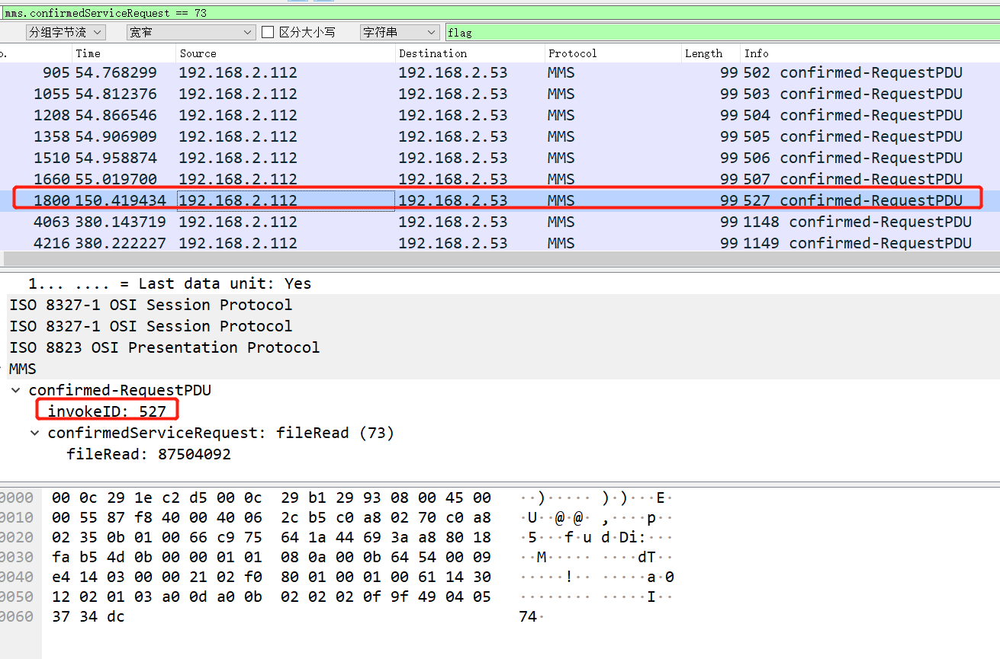
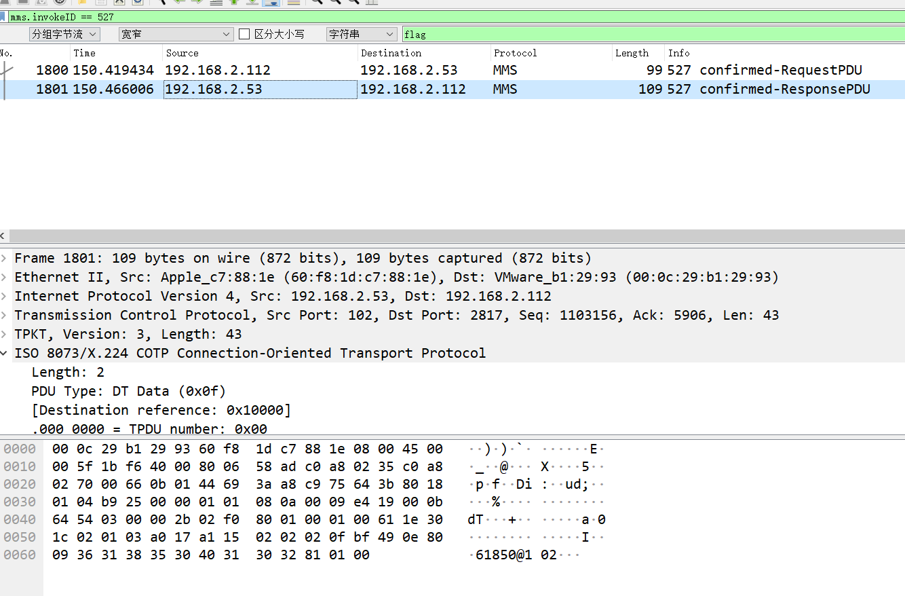

# 01

## 题目描述
---
```

```

## 题目来源
---


## 主要知识点
---


## 题目分值
---


## 部署方式
---


## 解题思路
---

搜索flag，看到有flag.txt



继续查找，发现`fileOpen`、`fileRead`操作的记录

```
mms.confirmedServiceRequest == 72
```



> 根据 fileOpen 为 72 来看，73 应该为 fileRead，74 应该为 fileWrite，75 应该为 fileClose

可以看到读取flag的数据包为1771、1798、1813、4034，分别查看这几个文件的内容

查看所有文件读取操作时，发现在4个打开文件数据包中的间隔空间内只有一个读取包。

```
mms.confirmedServiceRequest == 73
```



根据invokeID 继续查看内容

```
mms.invokeID == 527
```



发现其 fileData 内容为：363138353040313032
对应的 ASCII 内容为： 61850@102 ，得到flag

网上有大哥给出了查询脚本

```python
import pyshark

def flag():
    try:
        captures = pyshark.FileCapture("question_1531222544_JYvFGmLP49PFC0R2.pcap")
        flag_frsm = False
        flag_frsm_id = None
        flag_read = False
        for capture in captures:
            for pkt in capture:
                if pkt.layer_name == "mms":
                    # file open
                    if hasattr(pkt, "confirmedservicerequest") and int(pkt.confirmedservicerequest) == 72:
                        if hasattr(pkt, "filename_item"):
                            filename_items = pkt.filename_item.fields
                            for f in filename_items:
                                file_name = str(f.get_default_value())
                                if file_name == "flag.txt":
                                    flag_frsm = True
                    if hasattr(pkt, "confirmedserviceresponse") and int(pkt.confirmedserviceresponse) == 72 and flag_frsm:
                        # print(pkt.field_names)
                        if hasattr(pkt, "frsmid"):
                            flag_frsm_id = pkt.frsmid
                        flag_frsm = False
                    # file read
                    if hasattr(pkt, "confirmedservicerequest") and int(pkt.confirmedservicerequest) == 73 and flag_frsm_id:
                        if hasattr(pkt, "fileread"):
                            if str(pkt.fileread) == str(flag_frsm_id):
                                flag_read = True
                        flag_frsm_id = None
                    if hasattr(pkt, "confirmedserviceresponse") and int(pkt.confirmedserviceresponse) == 73 and flag_read:
                        if hasattr(pkt, "filedata"):
                            data = str(pkt.filedata).replace(":", "")
                            # print(hex_to_ascii(data))
                            print(data)
                        flag_read = False
    except Exception as e:
        print(e)


def hex_to_ascii(data):
    data = data.decode("hex")
    flags = []
    for d in data:
        _ord = ord(d)
        if (_ord > 0) and (_ord < 128):
            flags.append(chr(_ord))
    return ''.join(flags)


if __name__ == '__main__':
    flag()
```


## 参考
---
