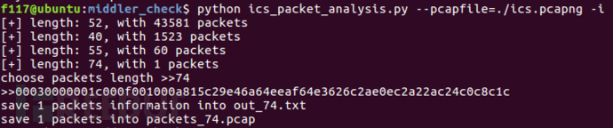
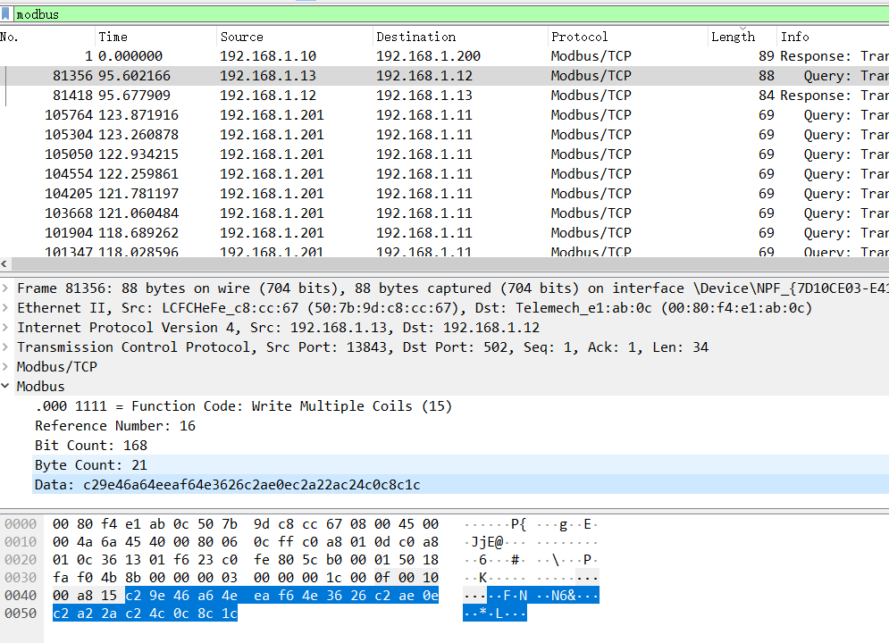

# 题目名称

## 题目描述
---
```

```

## 题目来源
---


## 主要知识点
---


## 题目分值
---


## 部署方式
---


## 解题思路
---


先过滤出属于工控业务的流量包，在wireshark中直接进行端口过滤，命令为tcp.port in {102 502};

数据包中存在大量重传的包，怀疑有中间人攻击的可能，编写脚本，判断是否存在中间人攻击行为；

python ./check_middler.py  pcapfile

排除S7comm中存在flag的可能；

根据modbus协议数据包中出现的非常见功能码，判断并找出异常数据包；

python ./ics_packet_analysis.py --pcapfile=./ics.pcapng -i



对异常数据包的data字段进行解密。



c29e46a64eeaf64e3626c2ae0ec2a22ac24c0c8c1c

解码

> 将data中每一个16进制数转换成二进制并将二进制序列倒序排列并得出倒序的数值，最后将这个数值转换成字符串

```python
#!/usr/bin/python
#coding:utf-8

coils_bytes = 'c29e46a64eeaf64e3626c2ae0ec2a22ac24c0c8c1c'.decode('hex')
print len(coils_bytes)
flag = ''
for data in coils_bytes:
    #print int('{:08b}'.format(ord(data)))
    #print int('{:08b}'.format(ord(data)), 2)
    #print int('{:08b}'.format(ord(data))[::-1])
    #print int('{:08b}'.format(ord(data))[::-1], 2)
	#print int('{:08b}'.format(ord(data)),2),int('{:08b}'.format(ord(data))[::-1], 2)
	flag += chr(int('{:08b}'.format(ord(data))[::-1], 2))
print flag
```


CyberWorldCupCETC2018

## 参考
---
