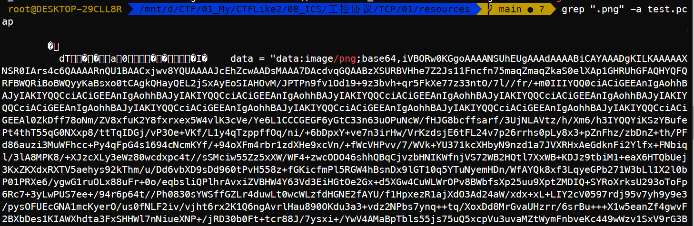
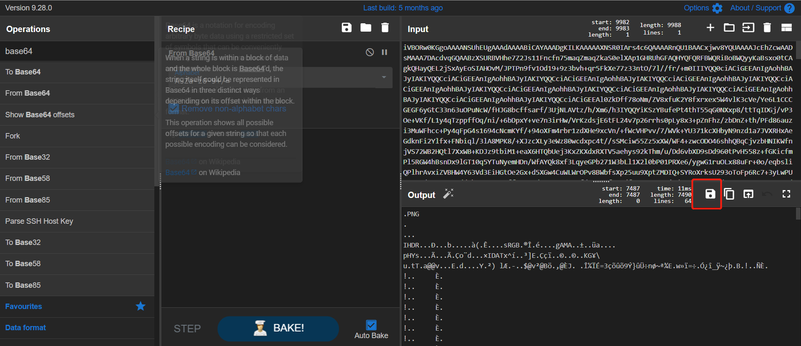

# 题目名称

## 题目描述
---
```
工业网络中存在异常，尝试通过分析PCAP流量包，分析出流量数据中的异常点，并拿到FLAG。
```

## 题目来源
---


## 主要知识点
---


## 题目分值
---


## 部署方式
---


## 解题思路
---

打开流量包，发现存在PRES、TCP、COTP、MMS协议的流量，使用各种方法都没有获得有效的flag

在linux使用grep进行包的关键字符串抓取

```
grep "flag" -a test.pcap
```



使用CyberChef将Base64解码，并保存文件



得到文件


## 参考
---
