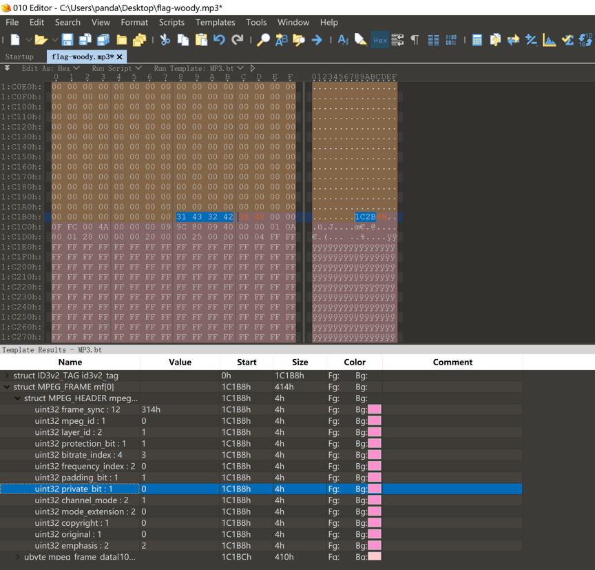
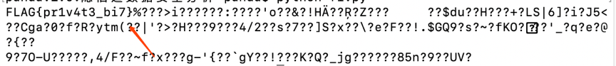

# 题目名称

## 题目描述
---
```

```

## 题目来源
---


## 主要知识点
---


## 题目分值
---


## 部署方式
---


## 解题思路
---

而当你用 010editor 打开该 Mp3 文件，并按照提示安装插件后，发现：



存在一个private bit，因此，只需要提取每一个 mf组中的该字节，组合起来，就是答案。

使用脚本

```python
# coding:utf-8
import re
import binascii

n = 115130
result = ''
fina = ''
file = open('flag-woody.mp3','rb')
while n < 2222222 :
    file.seek(n,0)
    n += 1044
    file_read_result = file.read(1)
    read_content = bin(ord(file_read_result))[-1]
    result = result + read_content
textArr = re.findall('.{'+str(8)+'}', result)
textArr.append(result[(len(textArr)*8):])
for i in textArr:
    fina = fina + hex(int(i,2))[2:].strip('\n')
fina = fina.decode('hex')
print fina
```

得到flag



## 参考
---
