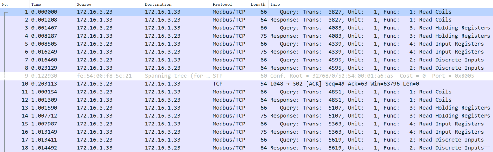
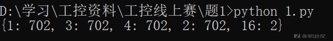
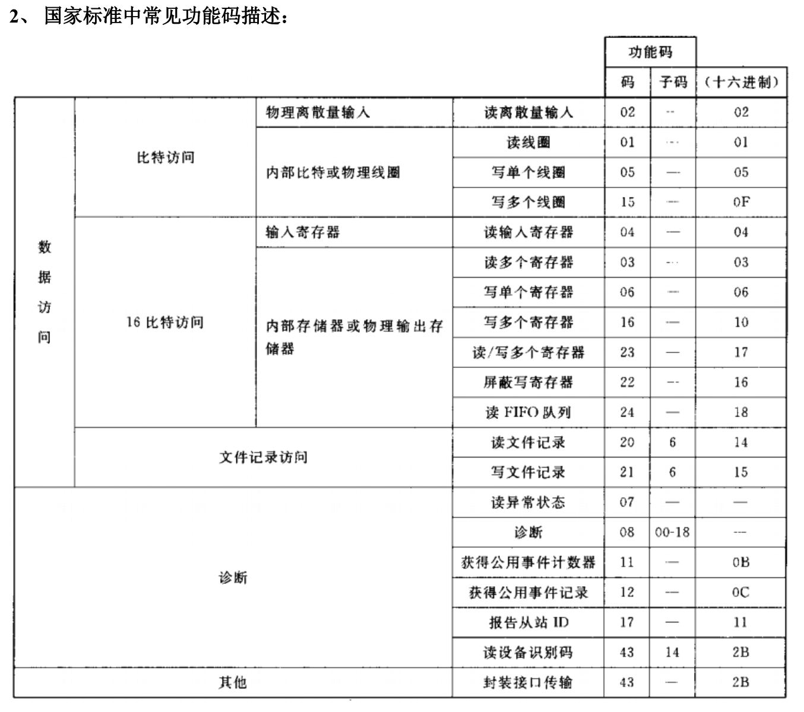

# Modbus协议

## 题目描述
---
> 黑客通过外网进入一家工厂的控制网络，之后对工控网络中的操作员站系统进行了攻击，最终通过工控协议破坏了正常的业务。我们得到了操作员站在攻击前后的网络流量数据包，我们需要分析流量中的蛛丝马迹，找到FLAG,flag形式为 flag{}


## 题目来源
---
纵横网络靶场社区 https://game.fengtaisec.com/

## 主要知识点
---
Modbus

## 题目分值
---
10

## 部署方式
---


## 解题思路
---

首先打开流量包，数据包都是关于Modbus/TCP的流量。



运行脚本，分析流量包中Modbus/TCP的协议功能码，脚本和运行结果如下：

```python
import pyshark
def get_code():
     captures = pyshark.FileCapture("question_1564353677_modbus1.pcap")
     func_codes = {}
     for c in captures:
         for pkt in c:
             if pkt.layer_name == "modbus":
                 func_code = int(pkt.func_code)
                 if func_code in func_codes:
                     func_codes[func_code] += 1
                 else:
                     func_codes[func_code] = 1
     print(func_codes)
if __name__ == '__main__':
    get_code()
```



根据modbus的常见功能码



根据[modbus常见功能码分析](https://wenku.baidu.com/view/8e6cc5f9b4daa58da1114a20.html)，分析结果我们可以知道

`1`（读取线圈状态）

`2`（读取输入内容）

`3`（读多个寄存器）

`4`（读输入寄存器）

四个功能码都出现了702次，唯独16（预置多个寄存器）功能码只出现了两次，所以猜测与16功能码相关的流量可能存在关键数据，于是运行脚本分析与16功能码相关的流量，提取其中的数据，脚本和运行结果如下：

```python
import pyshark

def find_flag():
    cap = pyshark.FileCapture("question_1564353677_modbus1.pcap")
    idx = 1
    for c in cap:
        for pkt in c:
            func_code = int(pkt.func_code)
            if pkt.layer_name == "modbus" and if func_code == 16:
                payload = str(c["TCP"].payload).replace(":", "")
                print(hex_to_ascii(payload))
                print("{0} *".format(idx))
        idx += 1
def hex_to_ascii(payload):
    data = payload
    flags = []
    for d in data:
        _ord = ord(d)
        if (_ord > 0) and (_ord < 128):
            flags.append(chr(_ord))
    return ''.join(flags)

if __name__ == '__main__':
    find_flag()
```


提出的数据存在一个16进制字符串`00000000003901100001001932005400680065004d006f006400620075007300500072006f0074006f0063006f006c0049007300460075006e006e00790021`，将16进制字符串在线转换对应的ASII码，得到`TheModbusProtocolIsFunny!`，提交成功，Flag为`TheModbusProtocolIsFunny!`。

## Flag
---
flag{TheModbusProtocolIsFunny!}

## 参考
---
