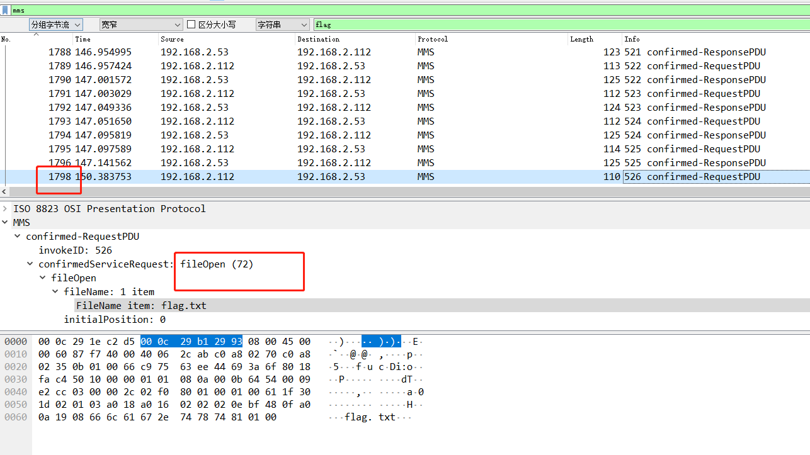
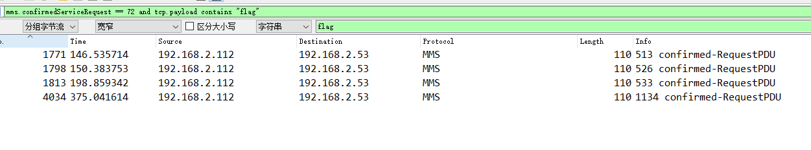
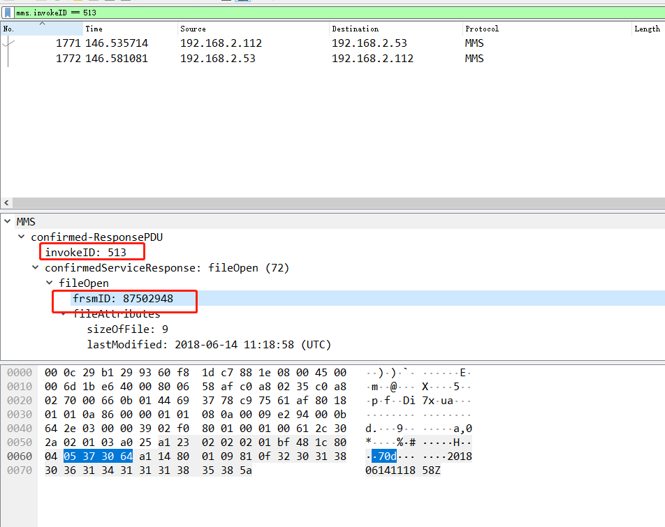
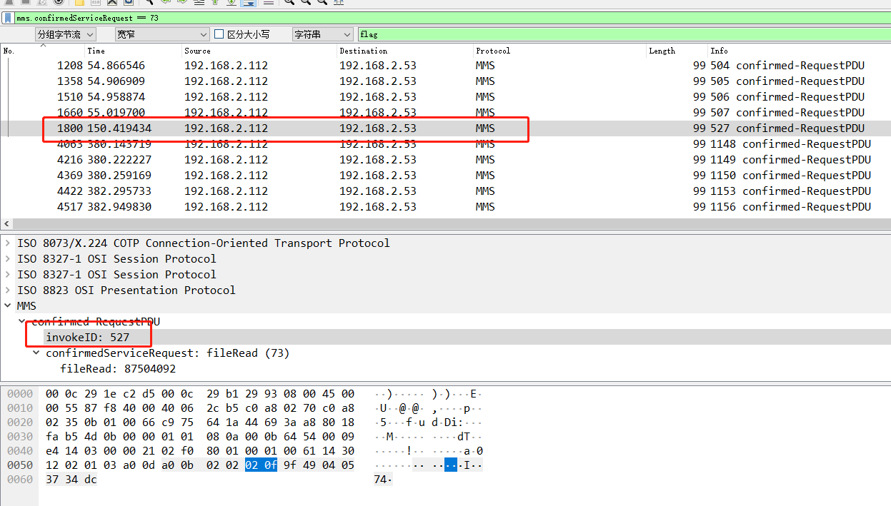

# MMS协议分析

## 题目描述
---
> 工业网络中存在的异常，尝试通过分析PACP流量包，分析出流量数据中的异常点，并拿到FLAG，flag形式为 flag{}。

## 题目来源
---
纵横网络靶场社区 https://game.fengtaisec.com/

## 主要知识点
---
MMS

## 附件
---
attachment_1579250236_test.zip

## 题目分值
---
10

## 部署方式
---

## 解题思路
---

搜索到有flag.txt，是mms的fileopen操作，

使用`mms.confirmedServiceRequest == 72 and tcp.payload contains "flag"`筛选流量，1771、1793、1813、4034四个包都是

4个包的invokeid分别是 513 526 533 1134

`mms.invokeID == 513`

`mms.frsmID == 87502948`

87502948 87504092 109401892

那么下来找fileread操作，`mms.confirmedServiceRequest == 73`可以看到所有的fileread包，在以上四个包之间的只有1800包是读文件的返回包。 

`mms.invokeID == 527`

根据invoekID读取查询结果，数据包在1800，在1801发现一个图片，抠出来查看是flag

## Flag
---
flag{ICS-mms104}

## 参考
---
