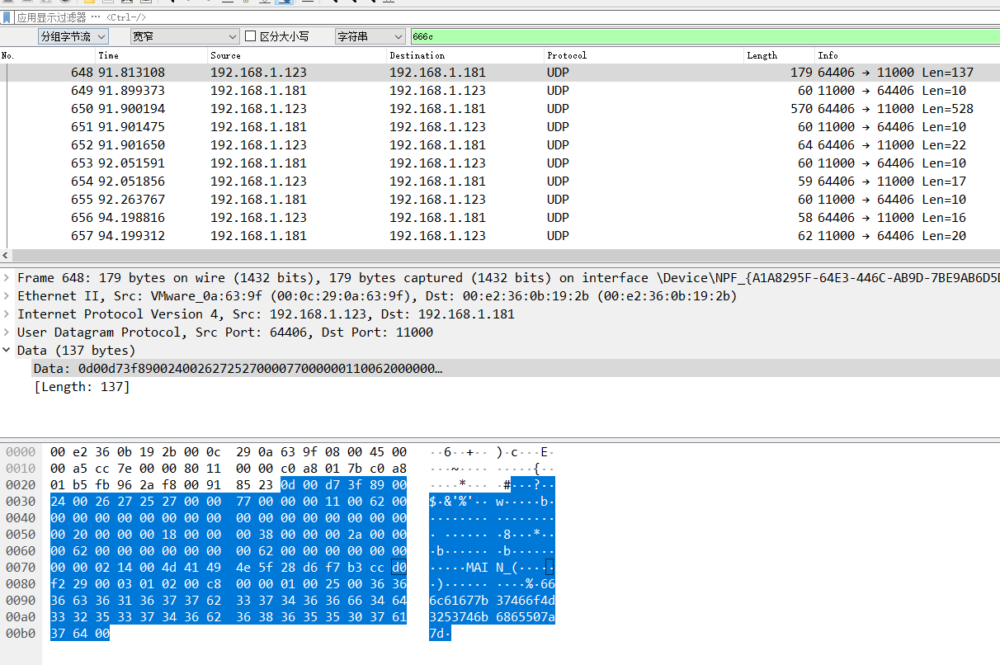

# 大工UDP协议

## 题目描述
---
> 在进行工业企业检查评估工作中，发现了疑似感染恶意软件的上位机。现已提取出上位机通信流量，尝试分析出异常点，获取FLAG，flag形式为 flag{}。

## 题目来源
---
纵横网络靶场社区 https://game.fengtaisec.com/

## 主要知识点
---

## 附件
---

## 题目分值
---
10

## 部署方式
---

## 解题思路
---

搜索`666c`字符串，可以找到如下数据

hex转码即为flag

666c61677b37466f4d3253746b6865507a7d

## Flag
---
flag{7FoM2StkhePz}

## 参考
---
