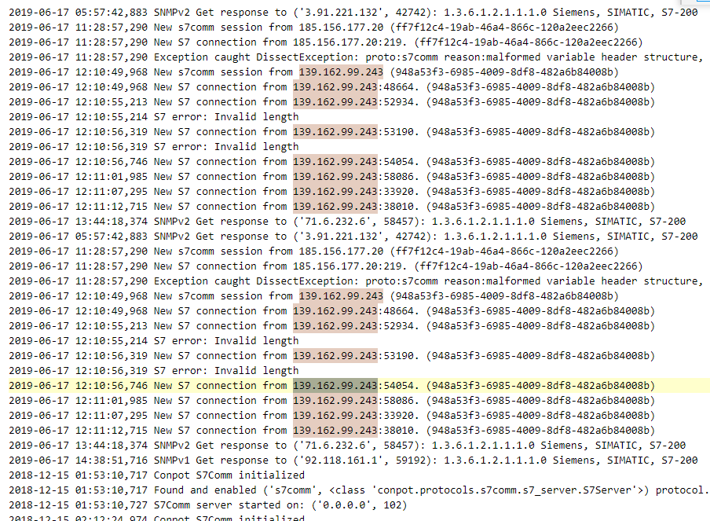

# 工控蜜罐日志分析

## 题目描述
---
> 工控安全分析人员在互联网上部署了工控仿真蜜罐，通过蜜罐可抓取并分析互联网上针对工业资产的扫描行为，将存在高危扫描行为的IP加入防火墙黑名单可有效减少工业企业对于互联网的攻击面。分析出日志中针对西门子私有通信协议扫描最多的IP，分析该扫描组织,Flag为该IP的域名,，flag形式为 flag{}。

## 题目来源
---
纵横网络靶场社区 https://game.fengtaisec.com/

## 主要知识点
---

## 附件
---

## 题目分值
---
20

## 部署方式
---

## 解题思路
---

提取所有跟s7相关的日志，肉眼可见的是IP`139.162.99.243`次数最多

## Flag
---

flag{scan-42.security.ipip.net}

## 参考
---
