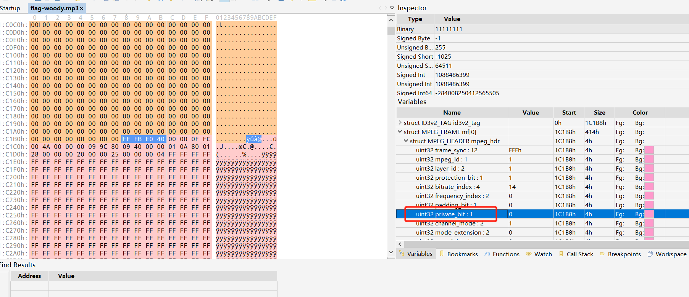
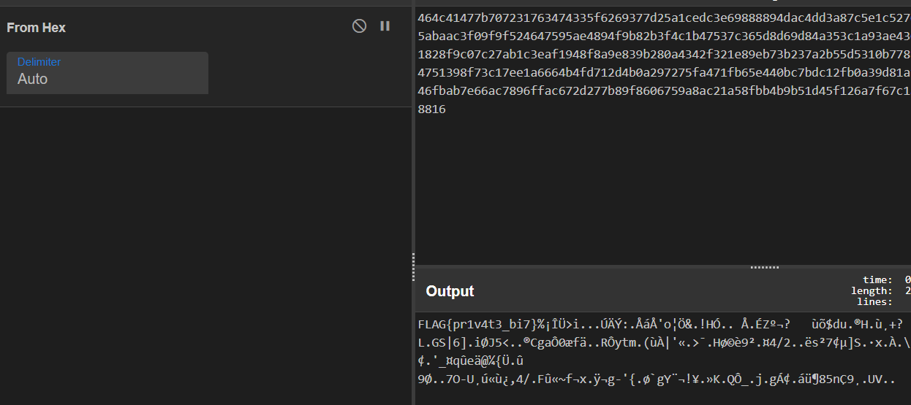

# 隐信道数据安全分析

## 题目描述
---
> 安全分析人员截获间谍发的秘密邮件，该邮件只有一个MP3文件，安全人员怀疑间谍通过某种private的方式将信息传递出去，尝试分析该文件，获取藏在文件中的数据？flag形式为 flag{}。

## 题目来源
---
纵横网络靶场社区 https://game.fengtaisec.com/

## 主要知识点
---


## 附件


## 题目分值

---
20

## 部署方式
---


## 解题思路
---

题目提示文件使用了private加密信息，在010Editor中打开mp3文件，发现存在private bit，因此，只需要提取每一个mf组中的该字节，组合起来，就是答案。可以从图中看到 ms 开始位为1 C1B8H，即第115128字节



`12+1+2+1+4+2+1+1+2+2+1+1+2=32`，即总共4字节，private_bit 为24，所在的字节为第3个字节因此要从前一个，即第二个字节开始提取内容，该字节对应的地址为 115130观察每一个mf组，大小都为414h，即1044字节，因此可以得到以下脚本：

```Python
# coding:utf-8
import re
import binascii
n = 115130
result = ''
fina = ''
file = open('flag-woody.mp3','rb')
while n < 2222222 :
    file.seek(n,0)
    n += 1044
    file_read_result = file.read(1)
    read_content = bin(ord(file_read_result))[-1]
    result = result + read_content
textArr = re.findall('.{'+str(8)+'}', result)
textArr.append(result[(len(textArr)*8):])
for i in textArr:
    fina = fina + hex(int(i,2))[2:].strip('\n')
fina = fina#.decode('hex')
print (fina)
```

将得到的字符串`464c41477b707231763474335f6269377d25a1cedc3e69888894dac4dd3a87c5e1c5276fa6d626832148d39288a0c596c95abaac3f09f9f524647595ae4894f9b82b3f4c1b47537c365d8d69d84a353c1a93ae436761d430e666e4111752d479746d1828f9c07c27ab1c3eaf1948f8a9e839b280a4342f321e89eb73b237a2b55d5310b77811c0975cfc1365e146f6c9212e244751398f73c17ee1a6664b4fd712d4b0a297275fa471fb65e440bc7bdc12fb0a39d81a1d374f2d55b8faabf9bf2c342f1046fbab7e66ac7896ffac672d277b89f8606759a8ac21a58fbb4b9b51d45f126a7f67c1a297e1fcb638356ec739b89555568816`转换对应的ASCII码，得到Flag



## Flag
---
flag{pr1v4t3_bi7}

## 参考
---
