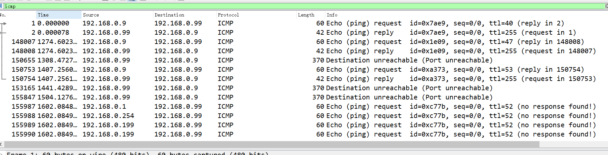

# 工控安全取证

## 题目描述
---
> 有黑客入侵工控设备后在内网发起了大量扫描，而且扫描次数不止一次。
请分析日志，指出对方第4次发起扫描时的数据包的编号，flag形式为 flag{}

## 题目来源
---
纵横网络靶场社区 https://game.fengtaisec.com/

## 主要知识点
---

## 附件
---

## 题目分值
---
20

## 部署方式
---

## 解题思路
---
修改附件后缀名为`pcap`，使用wireshark打开

要找第4次发起扫描时的数据包的编号，已知在发起扫描时，一般都要进行存活测试，即发起ICMP请求，所以找到第四次ICMP请求发送

115989

## Flag
---
flag{155989}

## 参考
---
