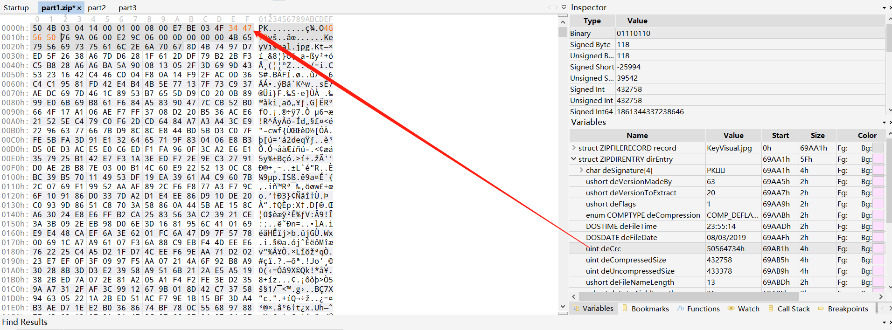
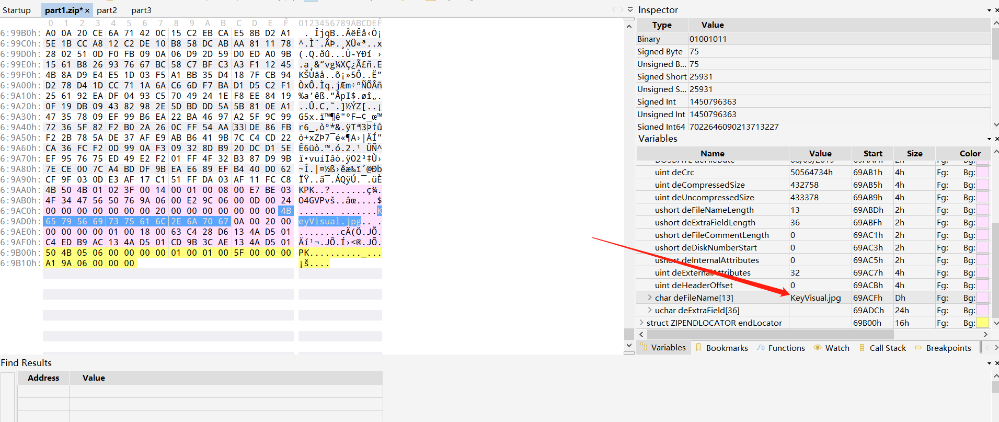
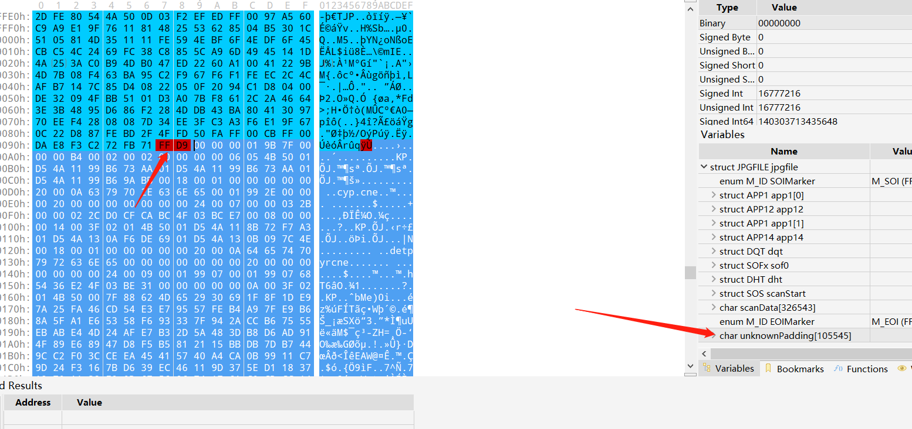
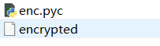
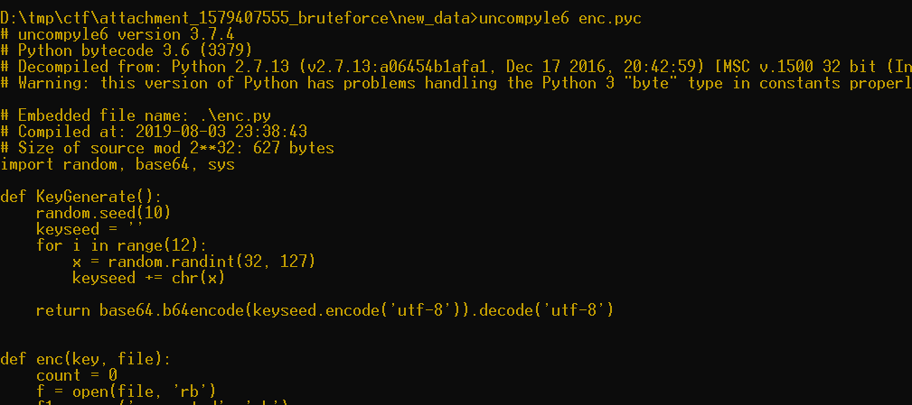
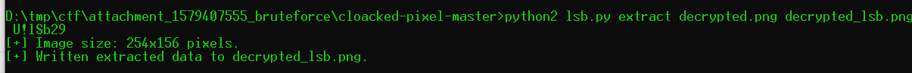
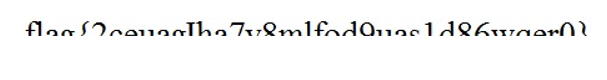

# 奇怪的文件

## 题目描述
---
> 在上位机中发现奇怪的文件，你能发现其中的秘密吗？flag形式为 flag{}

## 题目来源
---
纵横网络靶场社区 https://game.fengtaisec.com/

## 主要知识点
---
- ZIP文件格式
- ZIP密码爆破
- pyc反编译
- LSB加密隐写

## 附件
---


## 题目分值
---
20

## 部署方式
---


## 解题思路
---

附件为3个part。查看头似乎为zip压缩包。

首先给每个part添加`504b`之后拼接到一起得到加密的zip压缩包，但是压缩包显然是有问题的

把压缩包拖入010editor

对照part1和part2之后发现。part1缺少了CRC校验数据，part2缺少了文件名


给part1.zip中补上crc校验数据



给part1.zip中补上文件名



然后使用大写小写数字爆破zip密码。爆破出来密码为`GyxXaq9`

之后解压得到一张图片，在图片尾部发现一段数据



把这段数据单独拉出来，翻到末尾看起来像是一个倒序的zip文件（倒着查看为504b0304），写程序恢复为正常的文件。

```python
#!/usr/bin/env python3
# 读文件
with open("KeyVisual_unkonw_data.bin", "rb") as f:
    data = f.read()

# 写文件
with open("new_data.zip", "wb") as f:
    f.write(data[::-1])
```

解压新得到的压缩包后，里面是一个pyc和密文



反编译pyc，`uncompyle6 enc.pyc`



```python
# uncompyle6 version 3.7.4
# Python bytecode 3.6 (3379)
# Decompiled from: Python 2.7.13 (v2.7.13:a06454b1afa1, Dec 17 2016, 20:42:59) [MSC v.1500 32 bit (Intel)]
# Warning: this version of Python has problems handling the Python 3 "byte" type in constants properly.

# Embedded file name: .\enc.py
# Compiled at: 2019-08-03 23:38:43
# Size of source mod 2**32: 627 bytes
import random, base64, sys

def KeyGenerate():
    random.seed(10)
    keyseed = ''
    for i in range(12):
        x = random.randint(32, 127)
        keyseed += chr(x)

    return base64.b64encode(keyseed.encode('utf-8')).decode('utf-8')


def enc(key, file):
    count = 0
    f = open(file, 'rb')
    f1 = open('encrypted', 'wb')
    for now in f:
        for nowByte in now:
            newByte = nowByte ^ ord(key[(count % len(key))])
            count += 1
            f1.write(bytes([newByte]))


if __name__ == '__main__':
    key = KeyGenerate()
    enc(key, sys.argv[1])
# okay decompiling enc.pyc
```

因为key生成函数中定义了种子始终为`10`，所以加解密使用的key都一样，为`aSRWXWkhOlteQ3M0`

查看算法为异或，即加解密使用的算法应当一样，直接再次调用加密函数即可解密

```Python
#!/usr/bin/env python
import random
import base64

def KeyGenerate():
    random.seed(10)
    keyseed = ''
    for i in range(12):
        x = random.randint(32, 127)
        keyseed += chr(x)
    return base64.b64encode(keyseed.encode('utf-8')).decode('utf-8')

def dec(key):
    count = 0
    f = open('encrypted', 'rb')
    f1 = open('decrypted', 'wb')
    for now in f:
        for nowByte in now:
            newByte = nowByte ^ ord(key[count % len(key)])
            count += 1
            f1.write(bytes([newByte]))

if __name__ == '__main__':
    key = KeyGenerate()
    dec(key)
```

解密出的文件为一个png图片 `decrypted.png`

使用[https://github.com/livz/cloacked-pixel](https://github.com/livz/cloacked-pixel)中的工具对隐写密码爆破。最终爆破出的密码为`U!lSb29`



得到图片



使用字体宋体，字号大约20左右，肉眼识别获得完整flag


## Flag
---
flag{2ceuagIha7v8mlfod9uas1d86wqer0}


## 参考
---
