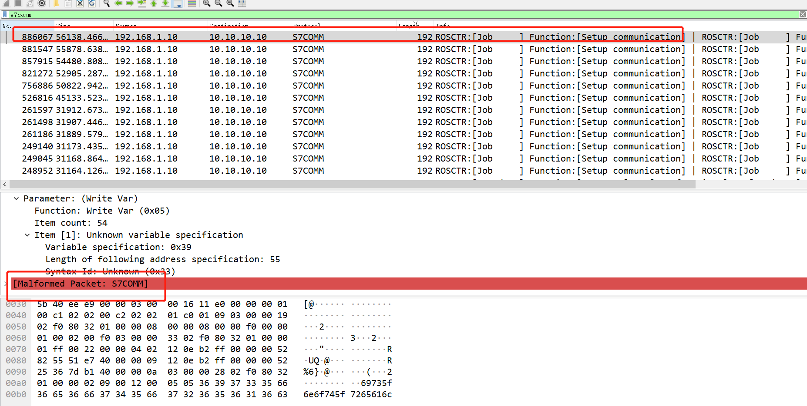

# S7COMM协议分析

## 题目描述
---
> 某10段工控网络中，工业协议中存在异常数据。请通过流量中的数据找寻 flag，flag形式为 flag{}。

## 题目来源
---
纵横网络靶场社区 https://game.fengtaisec.com/

## 主要知识点
---

## 附件
---

## 题目分值
---
30

## 部署方式
---

## 解题思路
---

筛选`s7comm`，排序数据包，第一个就是异常包

69735f6e6f745f7265616c

is_not_real

## Flag
---
flag{is_not_real}

## 参考
---
