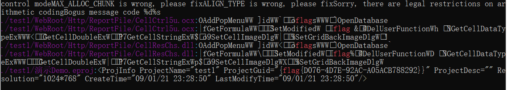

# 组态软件分析

## 题目描述
---
> 一些组态软件中进行会配置连接很多PLC设备信息。我们在SCADA 工程中写入了flag字段，请获取该工程flag，flag形式为 flag{}。

## 题目来源
---
纵横网络靶场社区 https://game.fengtaisec.com/

## 主要知识点
---


## 附件
---


## 题目分值
---
20

## 部署方式
---


## 解题思路
---

附件打开后是`PCZ`文件，使用力控恢复工程，将工程使用grep搜索flag

```bash
grep -ar "flag" ./test1
```




## Flag
---
flag{D076-4D7E-92AC-A05ACB788292}

## 参考
---
